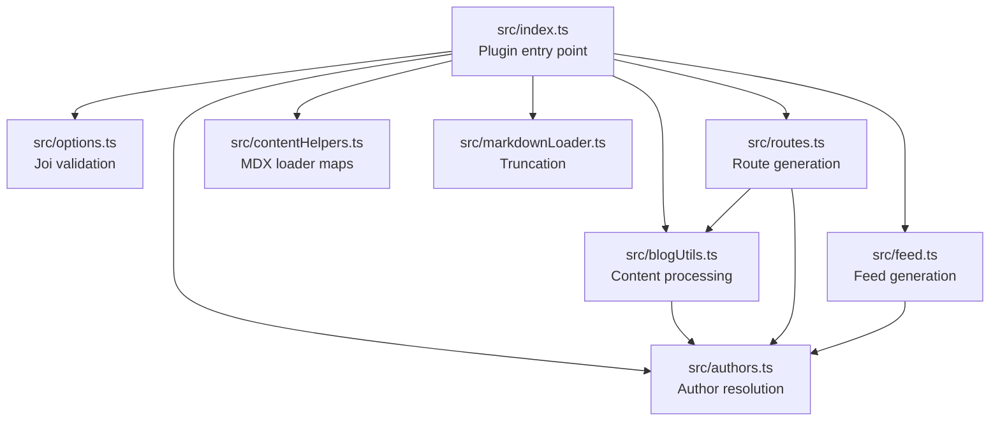
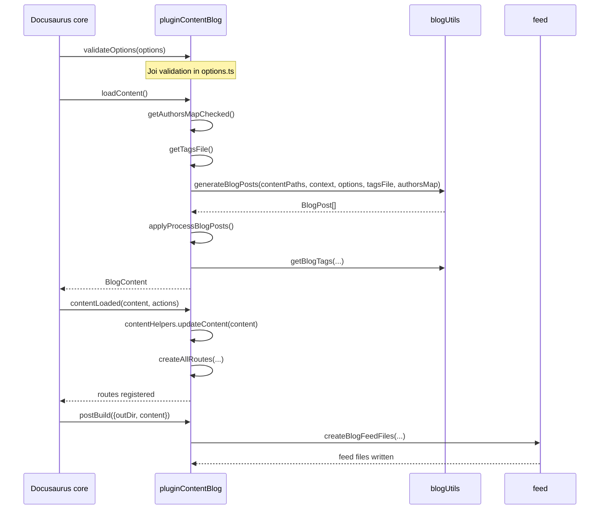

# Blog internals

This document describes the implementation of`@docusaurus/plugin-content-blog`, located in`packages/docusaurus-plugin-content-blog/src`. It covers the modules, data flow, route generation, MDX loader, feed generation, and extension points behind Docusaurus blogs.

## Architecture at a glance

The blog plugin is a single default export from`src/index.ts`:

```ts
export default async function pluginContentBlog(
  context: LoadContext,
  options: PluginOptions,
): Promise<Plugin<BlogContent>>
```

The plugin lifecycle is split across these phases:

1. **Option validation** in`src/options.ts`
2. **Content loading** in`src/index.ts` and`src/blogUtils.ts`
3. **Route generation** in`src/routes.ts`
4. **Webpack configuration** in`src/index.ts` and`src/markdownLoader.ts`
5. **Feed generation** in`src/feed.ts`
6. **Translation** in`src/translations.ts`

The following diagram shows how the modules interconnect:



### Package layout

| File | Responsibility |
| --- | --- |
|`src/index.ts` | Plugin entry point, lifecycle methods, MDX loader setup |
|`src/blogUtils.ts` | Source file processing, date handling, pagination, tag aggregation |
|`src/authors.ts` | Author resolution and grouping |
|`src/routes.ts` | Route configuration generation |
|`src/feed.ts` | RSS, Atom, and JSON feed generation |
|`src/contentHelpers.ts` | Mutable maps used by the MDX loader |
|`src/markdownLoader.ts` | Webpack loader for truncating MDX content |
|`src/options.ts` | Default options and Joi validation |

## Plugin lifecycle

The following sequence diagram shows how Docusaurus core drives the plugin lifecycle from content loading through build:



### Hash router limitation

`src/index.ts` disables feed generation when the experimental hash router is configured:

```ts
const router = siteConfig.future.experimental_router;
const isBlogFeedDisabledBecauseOfHashRouter =
  router === 'hash' && !!options.feedOptions.type;
if (isBlogFeedDisabledBecauseOfHashRouter) {
  logger.warn(
    `${PluginName} feed feature does not support the Hash Router. Feeds won't be generated.`,
  );
}
```

The`isBlogFeedDisabledBecauseOfHashRouter` guard is checked in both`postBuild` and`injectHtmlTags`.

###`getPathsToWatch`

The plugin watches author map files, tag files, and all blog source files matching the configured`include` patterns:

```ts
getPathsToWatch() {
  const {include} = options;
  const contentMarkdownGlobs = getContentPathList(contentPaths).flatMap(
    (contentPath) => include.map((pattern) => `${contentPath}/${pattern}`),
  );

  const tagsFilePaths = getTagsFilePathsToWatch({
    contentPaths,
    tags: options.tags,
  });

  return [
    authorsMapFilePath,
    ...tagsFilePaths,
    ...contentMarkdownGlobs,
  ].filter(Boolean) as string[];
},
```

###`getTranslationFiles`

Delegates to`getTranslationFiles(options)` from`src/translations.ts`.

###`translateContent`

Applies translations to loaded content:

```ts
translateContent({content, translationFiles}) {
  return translateContent(content, translationFiles);
}
```

## Data flow

The main data flow starts in`src/index.ts`.

###`loadContent`

```ts
const {authorsMap, tagsFile} = await combinePromises({
  authorsMap: getAuthorsMapChecked(),
  tagsFile: getTagsFile({contentPaths, tags: options.tags}),
});

let blogPosts = await generateBlogPosts(
  contentPaths,
  context,
  options,
  tagsFile,
  authorsMap,
);
blogPosts = await applyProcessBlogPosts({
  blogPosts,
  processBlogPosts: options.processBlogPosts,
});
```

After generating`blogPosts`, the plugin:

1. Calls`reportUntruncatedBlogPosts` to warn about missing truncation markers.
2. Filters unlisted posts with`shouldBeListed`.
3. Returns an empty`BlogContent` if no posts exist.
4. Computes`prevItem` and`nextItem` metadata for listed posts:

```ts
listedBlogPosts.forEach((blogPost, index) => {
  const prevItem = index > 0 ? listedBlogPosts[index - 1] : null;
  if (prevItem) {
    blogPost.metadata.prevItem = {
      title: prevItem.metadata.title,
      permalink: prevItem.metadata.permalink,
    };
  }

  const nextItem =
    index < listedBlogPosts.length - 1
      ? listedBlogPosts[index + 1]
      : null;
  if (nextItem) {
    blogPost.metadata.nextItem = {
      title: nextItem.metadata.title,
      permalink: nextItem.metadata.permalink,
    };
  }
});
```

5. Aggregates tags with`getBlogTags`:

```ts
const blogTags: BlogTags = getBlogTags({
  blogPosts,
  postsPerPageOption,
  blogDescription,
  blogTitle,
  pageBasePath,
});
```

6. Returns the`BlogContent` object:

```ts
return {
  blogTitle,
  blogDescription,
  blogSidebarTitle,
  blogPosts,
  blogTags,
  blogTagsListPath,
  authorsMap,
};
```

###`contentLoaded`

```ts
async contentLoaded({content, actions}) {
  contentHelpers.updateContent(content);
  await createAllRoutes({
    baseUrl,
    content,
    actions,
    options,
    aliasedSource,
  });
}
```

`updateContent` populates the source-to-post and source-to-permalink maps before routes are built. The`aliasedSource` function creates virtual module paths rooted at`~blog`:

```ts
const aliasedSource = (source: string) =>
  `~blog/${posixPath(path.relative(pluginDataDirRoot, source))}`;
```

###`configureWebpack`

The webpack configuration:

- Registers the`~blog` alias:

```ts
resolve: {
  alias: {
    '~blog': pluginDataDirRoot,
  },
},
```

- Adds an MDX loader rule for`.md` and`.mdx` files inside the blog content directories.

###`postBuild`

If the blog has posts and feed options are enabled,`postBuild` calls`createBlogFeedFiles`:

```ts
async postBuild({outDir, content}) {
  if (
    !content.blogPosts.length ||
    !options.feedOptions.type ||
    isBlogFeedDisabledBecauseOfHashRouter
  ) {
    return;
  }

  await createBlogFeedFiles({
    blogPosts: content.blogPosts,
    options,
    outDir,
    siteConfig,
    locale: currentLocale,
    contentPaths,
  });
},
```

###`injectHtmlTags`

If feeds are enabled,`injectHtmlTags` exposes feed link tags through`createFeedHtmlHeadTags`:

```ts
injectHtmlTags({content}) {
  if (
    !content.blogPosts.length ||
    !options.feedOptions.type ||
    isBlogFeedDisabledBecauseOfHashRouter
  ) {
    return {};
  }

  return {headTags: createFeedHtmlHeadTags({context, options})};
},
```

## Blog source processing

The core source processing logic lives in`src/blogUtils.ts`.

###`generateBlogPosts`

Signature:

```ts
export async function generateBlogPosts(
  contentPaths: BlogContentPaths,
  context: LoadContext,
  options: PluginOptions,
  tagsFile: TagsFile | null,
  authorsMap?: AuthorsMap,
): Promise<BlogPost[]>
```

Algorithm:

1. If`contentPaths.contentPath` does not exist, return`[]`:

```ts
if (!(await fs.pathExists(contentPaths.contentPath))) {
  return [];
}
```

2. Use`Globby(include, {cwd: contentPaths.contentPath, ignore: exclude})` to find source files.
3. Process each file in parallel with`Promise.all` through`doProcessBlogSourceFile`, which wraps`processBlogSourceFile` with an error message that includes the failed file path:

```ts
async function doProcessBlogSourceFile(blogSourceFile: string) {
  try {
    return await processBlogSourceFile(
      blogSourceFile,
      contentPaths,
      context,
      options,
      tagsFile,
      authorsMap,
    );
  } catch (err) {
    throw new Error(
      `Processing of blog source file path=${blogSourceFile} failed.`,
      {cause: err},
    );
  }
}
```

4. Filter out`undefined` values returned for draft posts:

```ts
const blogPosts = (
  await Promise.all(blogSourceFiles.map(doProcessBlogSourceFile))
).filter(Boolean) as BlogPost[];
```

5. Sort descending by`metadata.date`:

```ts
blogPosts.sort(
  (a, b) => b.metadata.date.getTime() - a.metadata.date.getTime(),
);
```

6. Reverse if`options.sortPosts === 'ascending'`:

```ts
if (options.sortPosts === 'ascending') {
  return blogPosts.reverse();
}
```

###`processBlogSourceFile`

This private function transforms a single source file into a`BlogPost`.

Steps:

1. Resolve the localized content folder with`getFolderContainingFile`:

```ts
const blogDirPath = await getFolderContainingFile(
  getContentPathList(contentPaths),
  blogSourceRelative,
);
```

2. Join the source directory and relative file name:

```ts
const blogSourceAbsolute = path.join(blogDirPath, blogSourceRelative);
```

3. Parse the markdown file with`parseBlogPostMarkdownFile`, which reads the file, calls`parseMarkdownFile` with`removeContentTitle: true`, validates front matter through`validateBlogPostFrontMatter`, and logs an error with the file path on failure.

4. Compute`aliasedSource` with`aliasedSitePath`:

```ts
const aliasedSource = aliasedSitePath(blogSourceAbsolute, siteDir);
```

5. Read last update data with`readLastUpdateData`:

```ts
const lastUpdate = await readLastUpdateData(
  blogSourceAbsolute,
  options,
  frontMatter.last_update,
  vcs,
);
```

6. Check draft and unlisted status with`isDraft` and`isUnlisted`:

```ts
const draft = isDraft({frontMatter});
const unlisted = isUnlisted({frontMatter});

if (draft) {
  return undefined;
}
```

7. Warn about the deprecated`id` front matter field:

```ts
if (frontMatter.id) {
  logger.warn`name=${'id'} header option is deprecated in path=${blogSourceRelative} file. Please use name=${'slug'} option instead.`;
}
```

8. Parse the file name date and slug with`parseBlogFileName`:

```ts
const parsedBlogFileName = parseBlogFileName(blogSourceRelative);
```

9. Resolve the final date with`getBlogPostDate`:

```ts
const date = await getBlogPostDate({
  frontMatterDate: frontMatter.date,
  filenameDate: parsedBlogFileName.date,
  filePath: blogSourceAbsolute,
  vcs,
});
```

10. Compute title with a three-tier fallback:

```ts
const title = frontMatter.title ?? contentTitle ?? parsedBlogFileName.text;
```

11. Compute description:

```ts
const description = frontMatter.description ?? excerpt ?? '';
```

12. Compute slug:

```ts
const slug = frontMatter.slug ?? parsedBlogFileName.slug;
```

13. Compute permalink:

```ts
const permalink = normalizeUrl([baseUrl, routeBasePath, slug]);
```

14. Compute tags base route path:

```ts
const tagsBaseRoutePath = normalizeUrl([
  baseUrl,
  routeBasePath,
  tagsRouteBasePath,
]);
```

15. Resolve authors with`getBlogPostAuthors` and check for author problems with`reportAuthorsProblems`.

16. Resolve tags with`normalizeTags`:

```ts
const tags = normalizeTags({
  options,
  source: blogSourceRelative,
  frontMatterTags: frontMatter.tags,
  tagsBaseRoutePath,
  tagsFile,
});
```

17. Return:

```ts
return {
  id: slug,
  metadata: {
    permalink,
    editUrl: getBlogEditUrl(),
    source: aliasedSource,
    title,
    description,
    date,
    tags,
    readingTime: showReadingTime
      ? options.readingTime({
          content,
          frontMatter,
          defaultReadingTime,
          locale: i18n.currentLocale,
        })
      : undefined,
    hasTruncateMarker: truncateMarker.test(content),
    authors,
    frontMatter,
    unlisted,
    lastUpdatedAt: lastUpdate.lastUpdatedAt,
    lastUpdatedBy: lastUpdate.lastUpdatedBy,
  },
  content,
};
```

###`getBlogEditUrl`

The edit URL supports both string and function forms:

```ts
function getBlogEditUrl() {
  const blogPathRelative = path.relative(
    blogDirPath,
    path.resolve(blogSourceAbsolute),
  );

  if (typeof editUrl === 'function') {
    return editUrl({
      blogDirPath: posixPath(path.relative(siteDir, blogDirPath)),
      blogPath: posixPath(blogPathRelative),
      permalink,
      locale: i18n.currentLocale,
    });
  } else if (typeof editUrl === 'string') {
    const isLocalized = blogDirPath === contentPaths.contentPathLocalized;
    const fileContentPath =
      isLocalized &&
      options.editLocalizedFiles &&
      contentPaths.contentPathLocalized
        ? contentPaths.contentPathLocalized
        : contentPaths.contentPath;

    const contentPathEditUrl = normalizeUrl([
      editUrl,
      posixPath(path.relative(siteDir, fileContentPath)),
    ]);

    return getEditUrl(blogPathRelative, contentPathEditUrl);
  }
  return undefined;
}
```

###`parseBlogFileName`

The date extraction regex is:

```ts
const DATE_FILENAME_REGEX =
  /^(?<folder>.*)(?<date>\d{4}[-/]\d{1,2}[-/]\d{1,2})[-/]?(?<text>.*?)(?:\/index)?.mdx?$/;
```

If the file name contains a date, the date is parsed as UTC by appending`Z`:

```ts
const date = new Date(`${dateString!}Z`);
```

The slug is built from folder and remaining text:

```ts
const slug = `/${slugDate}/${folder!}${text!}`;
```

For file names without a date, the slug is derived from the file name minus`.md`/`.mdx` and optional`/index`:

```ts
const text = blogSourceRelative.replace(/(?:\/index)?\.mdx?$/, '');
const slug = `/${text}`;
```

###`getBlogPostDate`

Date resolution order:

1. Front matter`date`, normalized with`parseFrontMatterDate`
2. File name date
3. VCS file creation info
4. File system`birthtime` fallback

```ts
if (frontMatterDate) {
  return parseFrontMatterDate(frontMatterDate);
} else if (filenameDate) {
  return filenameDate;
}

const result = await vcs.getFileCreationInfo(filePath);
if (result == null) {
  return (await fs.stat(filePath)).birthtime;
}
return new Date(result.timestamp);
```

###`parseFrontMatterDate`

String dates without timezone are treated as UTC by appending`Z`. Dates with timezone suffixes (detected via regex`/[t \t]\d.*(?:z|[+-]\d{1,2}(?::?\d{2})?)$/i`) are parsed as-is:

```ts
export function parseFrontMatterDate(date: string | Date): Date {
  if (typeof date === 'string') {
    const dateString = date.trim();
    const hasTimeZone = /[t \t]\d.*(?:z|[+-]\d{1,2}(?::?\d{2})?)$/i.test(
      dateString,
    );
    return new Date(hasTimeZone ? dateString : `${dateString}Z`);
  }
  return date;
}
```

###`applyProcessBlogPosts`

This function applies the`processBlogPosts` extension point:

```ts
export async function applyProcessBlogPosts({
  blogPosts,
  processBlogPosts,
}: {
  blogPosts: BlogPost[];
  processBlogPosts: PluginOptions['processBlogPosts'];
}): Promise<BlogPost[]> {
  const processedBlogPosts = await processBlogPosts({blogPosts});

  if (Array.isArray(processedBlogPosts)) {
    return processedBlogPosts;
  }

  return blogPosts;
}
```

If`processBlogPosts` returns an array, that array becomes the new blog posts list. Otherwise, the original list is preserved.

###`reportUntruncatedBlogPosts`

Warns about blog posts missing truncation markers unless`onUntruncatedBlogPosts: 'ignore'` is configured:

```ts
export function reportUntruncatedBlogPosts({
  blogPosts,
  onUntruncatedBlogPosts,
}: {
  blogPosts: BlogPost[];
  onUntruncatedBlogPosts: PluginOptions['onUntruncatedBlogPosts'];
}): void {
  const untruncatedBlogPosts = blogPosts.filter(
    (p) => !p.metadata.hasTruncateMarker,
  );
  if (onUntruncatedBlogPosts !== 'ignore' && untruncatedBlogPosts.length > 0) {
    const message = logger.interpolate`Docusaurus found blog posts without truncation markers:
- ${untruncatedBlogPosts
      .map((p) => logger.path(aliasedSitePathToRelativePath(p.metadata.source)))
      .join('\n- ')}

We recommend using truncation markers (code=${`<!-- truncate -->`} or code=${`{/* truncate */}`}) in blog posts to create shorter previews on blog paginated lists.
Tip: turn this security off with the code=${`onUntruncatedBlogPosts: 'ignore'`} blog plugin option.`;
    logger.report(onUntruncatedBlogPosts)(message);
  }
}
```

## Pagination and tags

###`paginateBlogPosts`

Signature:

```ts
export function paginateBlogPosts({
  blogPosts,
  basePageUrl,
  blogTitle,
  blogDescription,
  postsPerPageOption,
  pageBasePath,
}: {
  blogPosts: BlogPost[];
  basePageUrl: string;
  blogTitle: string;
  blogDescription: string;
  postsPerPageOption: number | 'ALL';
  pageBasePath: string;
}): BlogPaginated[]
```

Behavior:

-`postsPerPageOption === 'ALL'` uses all posts on one page:

```ts
const postsPerPage =
  postsPerPageOption === 'ALL' ? totalCount : postsPerPageOption;
```

- Page count is at least 1:

```ts
const numberOfPages = Math.max(1, Math.ceil(totalCount / postsPerPage));
```

- Page 0 uses`basePageUrl`.
- Pages greater than 0 use:

```ts
normalizeUrl([basePageUrl, pageBasePath, `${page + 1}`])
```

- Each page receives`previousPage` and`nextPage` permalinks:

```ts
metadata: {
  permalink: permalink(page),
  page: page + 1,
  postsPerPage,
  totalPages: numberOfPages,
  totalCount,
  previousPage: page !== 0 ? permalink(page - 1) : undefined,
  nextPage: page < numberOfPages - 1 ? permalink(page + 1) : undefined,
  blogDescription,
  blogTitle,
},
```

###`getBlogTags`

Tags are grouped with`groupTaggedItems`, filtered by visibility, paginated, and returned as`BlogTags`:

```ts
const groups = groupTaggedItems(
  blogPosts,
  (blogPost) => blogPost.metadata.tags,
);
return _.mapValues(groups, ({tag, items: tagBlogPosts}) => {
  const tagVisibility = getTagVisibility({
    items: tagBlogPosts,
    isUnlisted: (item) => item.metadata.unlisted,
  });
  return {
    inline: tag.inline,
    label: tag.label,
    permalink: tag.permalink,
    description: tag.description,
    items: tagVisibility.listedItems.map((item) => item.id),
    pages: paginateBlogPosts({
      blogPosts: tagVisibility.listedItems,
      basePageUrl: tag.permalink,
      ...params,
    }),
    unlisted: tagVisibility.unlisted,
  };
});
```

Each tag result includes the tag's inline status, label, permalink, description, listed post IDs, paginated tag pages, and unlisted status.

## Author resolution

Author logic is in`src/authors.ts`.

###`getBlogPostAuthors`

Signature:

```ts
export function getBlogPostAuthors(params: AuthorsParam): Author[]
```

`AuthorsParam` contains:

```ts
type AuthorsParam = {
  frontMatter: BlogPostFrontMatter;
  authorsMap: AuthorsMap | undefined;
  baseUrl: string;
};
```

Resolution behavior:

1. Legacy front matter fields are detected first:

```ts
const name = frontMatter.author;
const title = frontMatter.author_title ?? frontMatter.authorTitle;
const url = frontMatter.author_url ?? frontMatter.authorURL;
const imageURL = normalizeImageUrl({
  imageURL: frontMatter.author_image_url ?? frontMatter.authorImageURL,
  baseUrl,
});
```

Legacy