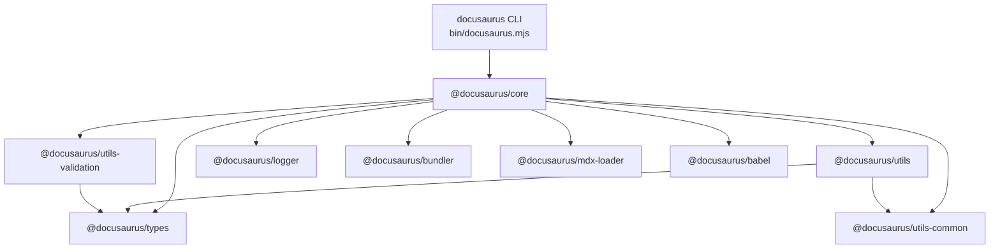
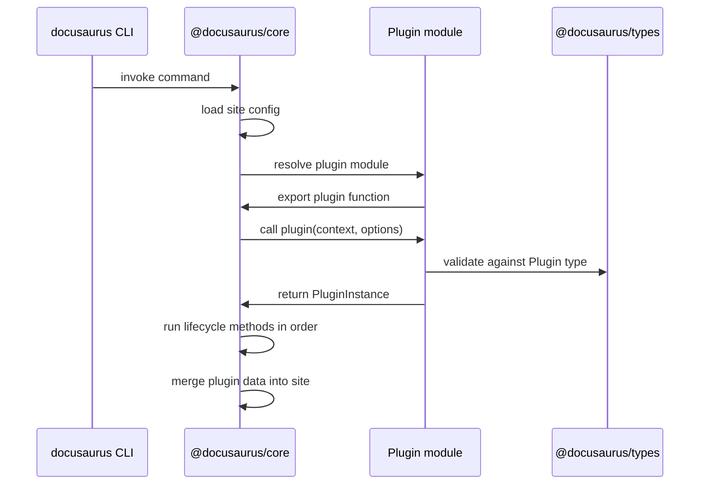
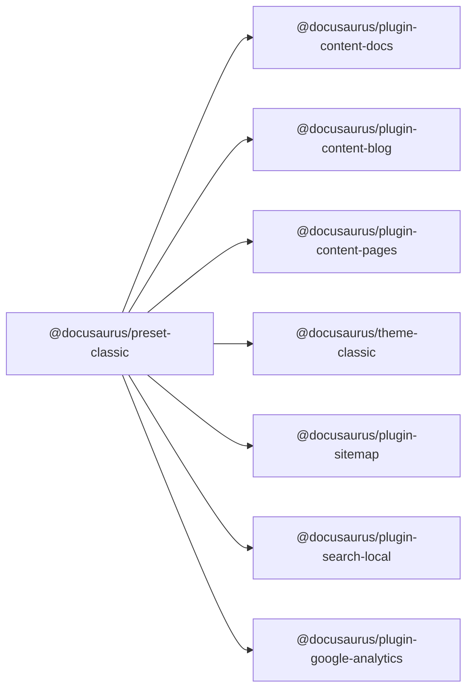

# Docusaurus API reference

## Overview

Docusaurus exposes a modular API surface across several npm packages. This reference covers the core package contracts, type definitions, plugin and preset lifecycles, and client-side runtime APIs that plugin developers and contributors use to extend Docusaurus.

The API spans three primary layers:

| Layer | Packages | Purpose |
|-------|----------|---------|
| **Core runtime** |`@docusaurus/core` | CLI entry point, build orchestration, site lifecycle |
| **Type contracts** |`@docusaurus/types` | Shared TypeScript interfaces for configuration, plugins, presets |
| **Node utilities** |`@docusaurus/utils`,`@docusaurus/utils-common`,`@docusaurus/utils-validation`,`@docusaurus/logger` | Filesystem helpers, parsing, validation, logging |

The following architecture diagram shows how these packages relate to one another at runtime:



## Package:`@docusaurus/core`

### Identity and entry point

`@docusaurus/core` is the main Docusaurus package. It ships the CLI binary and orchestrates site loading, plugin execution, bundling, and serving.

```json
{
  "name": "@docusaurus/core",
  "version": "4.0.0",
  "bin": {
    "docusaurus": "bin/docusaurus.mjs"
  },
  "engines": {
    "node": ">=24.21"
  }
}
```

The`bin/docusaurus.mjs` entry point exposes the`docusaurus` command. All CLI commands (`build`,`serve`,`start`,`swizzle`,`write-translations`,`deploy`,`clear`) are registered through`@docusaurus/core`.

### Runtime dependencies

The package depends on several internal Docusaurus workspace packages:

| Dependency | Purpose |
|------------|---------|
|`@docusaurus/babel` | Babel preset for transpiling site and plugin code |
|`@docusaurus/bundler` | Bundler abstraction (webpack/rspack) for static generation |
|`@docusaurus/logger` | Consistent console output and diagnostics |
|`@docusaurus/mdx-loader` | MDX compilation pipeline |
|`@docusaurus/utils` | Node filesystem and path utilities |
|`@docusaurus/utils-common` | Shared utilities usable in browser and Node |
|`@docusaurus/utils-validation` | Schema validation using Joi |

External dependencies enable webpack bundling (`webpack`,`webpack-dev-server`,`html-webpack-plugin`), routing (`react-router`,`react-router-config`,`react-router-dom`), and progress UI (`boxen`,`cli-table3`).

### Peer dependencies

```json
{
  "peerDependencies": {
    "@docusaurus/faster": "workspace:*",
    "@mdx-js/react": "^3.1.1",
    "react": "^19.3.0",
    "react-dom": "^19.3.0"
  },
  "peerDependenciesMeta": {
    "@docusaurus/faster": {
      "optional": true
    }
  }
}
```

- **`@docusaurus/faster`** is optional and may be provided by users who opt into faster build mode.
- **`@mdx-js/react`** is required for MDX page rendering.
- **React 19** is the minimum supported React version.

## Package:`@docusaurus/types`

### Identity

`@docusaurus/types` contains the shared TypeScript definitions consumed by all Docusaurus packages. It exposes no runtime code—only type declarations at`src/index.d.ts`.

```json
{
  "name": "@docusaurus/types",
  "version": "4.0.0",
  "types": "./src/index.d.ts"
}
```

### Type category dependencies

The package's dependencies indicate which ecosystems the types cover:

| Dependency | Covered area |
|------------|--------------|
|`@mdx-js/mdx` | MDX compilation result and options types |
|`@types/mdast` | Markdown abstract syntax tree nodes |
|`@types/history` | Browser history interface for routing |
|`@types/react` | React component props and element types |
|`commander` | CLI command option types |
|`joi` | Validation schema types |
|`react-helmet-async` | Document head management types |
|`utility-types` | Type-level utilities such as`DeepPartial` |
|`webpack` | Bundler configuration types |
|`webpack-merge` | Configuration merging types |

### React peer requirement

```json
{
  "peerDependencies": {
    "react": "^19.3.0",
    "react-dom": "^19.3.0"
  }
}
```

Types that reference React components or hooks require consumers to install React 19 or newer.

## Package:`@docusaurus/utils`

### Identity

`@docusaurus/utils` provides Node-only utility functions for Docusaurus packages: file discovery, path normalization, Markdown parsing, YAML loading, and command execution.

```json
{
  "name": "@docusaurus/utils",
  "version": "4.0.0",
  "main": "./lib/index.js",
  "types": "./lib/index.d.ts",
  "engines": {
    "node": ">=24.21"
  }
}
```

### Functional dependency map

| Dependency | Utility area |
|------------|--------------|
|`@11ty/gray-matter` | Front matter parsing for Markdown files |
|`github-slugger` | Anchor ID generation from headings |
|`jiti` | Runtime TypeScript/ESM config loading |
|`js-yaml` | YAML serialization and parsing |
|`micromatch` | Glob matching for file discovery |
|`p-queue` | Rate-limited async task execution |
|`resolve-pathname` | URL path normalization |
|`tinyglobby` | Fast glob matching |
|`file-loader`,`url-loader` | Static asset resolution during build |
|`execa` | Subprocess execution for CLI commands |

`@docusaurus/utils` depends on`@docusaurus/types` and`@docusaurus/utils-common`, making it a central integration point for Node-side plugin development.

## Plugin API

Docusaurus plugins are JavaScript modules that export a lifecycle object. Plugins extend site behavior by hooking into the build process, content loading, and UI theming.

### Plugin shape

A plugin exports a function that receives the parsed plugin options and returns a plugin instance with lifecycle methods. The`name` property is required when the plugin option object does not already identify the plugin.

```ts
// Example plugin contract
type Plugin<T = unknown> = (
  context: LoadContext,
  options: T,
) => PluginInstance;

interface PluginInstance {
  name?: string;
  // Lifecycle methods...
}
```

The`LoadContext` type, exposed by`@docusaurus/types`, contains`siteDir`,`siteConfig`,`generatedFilesDir`,`baseUrl`,`i18n`, and other build-time context.

### Lifecycle execution flow



### Core lifecycle contracts

The plugin lifecycle follows a deterministic order during`build` and`start`:

1. **`getPathsToWatch`** – returns file globs that trigger rebuild or reload
2. **`loadContent`** – reads source files and returns raw content
3. **`contentLoaded`** – receives content and mutates site data (routes, global data)
4. **`postBuild`** – runs after the site has been emitted
5. **`configureWebpack`** – returns webpack configuration to merge or mutate
6. **`configurePostCss`** – returns PostCSS plugins for CSS processing
7. **`getThemePath`** – returns a filesystem path to theme components
8. **`getClientModules`** – returns browser-side module paths to inject
9. **`translateContent`** – returns translation messages for content
10. **`injectHtmlTags`** – returns head/body tags for generated HTML

## Preset API

Presets are bundles of plugins and theme configurations distributed as a single npm package. A preset exports an array where the first element is a plugin module path and the second is its options object.



A preset module exports a function that returns`{ themes, plugins }`. Each key maps to an array of`[modulePath, options]` tuples.

```ts
// Preset return shape
interface Preset {
  themes: [string, unknown][];
  plugins: [string, unknown][];
}
```

The`@docusaurus/core` package is responsible for resolving presets, flattening their themes and plugins, and merging them with user-defined plugins from`docusaurus.config.js`.

## Client-side APIs

Docusaurus exposes browser-runtime modules that plugins can import to interact with the live site. These modules are injected via`getClientModules` during plugin setup.

### Core client modules

| Module | Purpose |
|--------|---------|
|`@docusaurus/ExecutionEnvironment` | Detects whether code is running in browser or server |
|`@docusaurus/useDocusaurusContext` | React hook returning the full site context |
|`@docusaurus/useBaseUrl` | Resolves asset URLs against the configured`baseUrl` |
|`@docusaurus/useGlobalData` | Accesses plugin global data populated during`contentLoaded` |
|`@docusaurus/router` | Thin wrapper over React Router for navigation |
|`@docusaurus/Interpolate` | Component for interpolating translated strings |

### React version requirement

Because Docusaurus 4.0 uses React 19, client-side components must be compatible with React 19 APIs. All client modules are imported through the module type aliases provided by`@docusaurus/module-type-aliases` and validated by`@docusaurus/types`.

## Related topics

- System Architecture
- Plugins
- Themes
- Site Building & Bundling Internals
- CSS Optimization Internals
- Logging & Diagnostics Internals
- TypeScript Module Aliases Internals