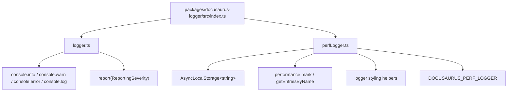
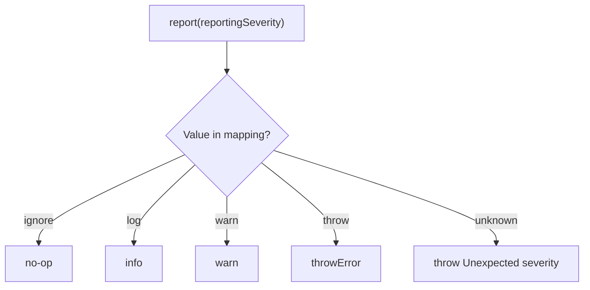
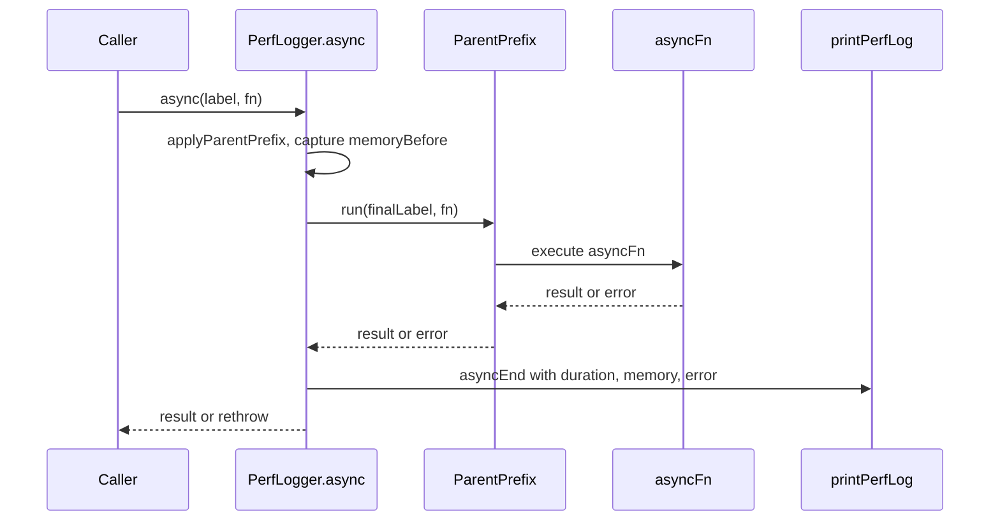
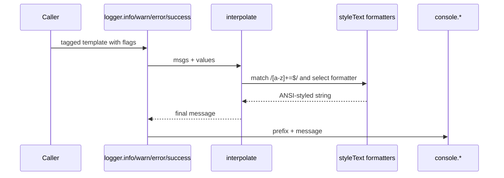

# Logging and diagnostics internals

This page describes the implementation behind Docusaurus logging and diagnostics: the`docusaurus-logger` package. It covers the logger singleton, the opt-in performance logger, message formatting, reporting severities, data flow, and the APIs available to callers.

For user-facing behavior and CLI output, see Logging & Diagnostics.

## Package layout



| File | Responsibility |
| --- | --- |
|`packages/docusaurus-logger/src/index.ts` | Entry point. Exports the default logger, a named`logger` export, and`PerfLogger`. |
|`packages/docusaurus-logger/src/logger.ts` | Core logger: message formatting, interpolation, console output, and severity reporting. |
|`packages/docusaurus-logger/src/perfLogger.ts` | Opt-in performance and memory diagnostics logger. |

The entry point exports both a default and a named`logger` to avoid ESM interop problems in`core .mjs` CLI code and`create-docusaurus`:

```ts
import OriginalLogger from './logger';

export default OriginalLogger;
export const logger = OriginalLogger;
export {PerfLogger} from './perfLogger';
```

## Core logger module

`packages/docusaurus-logger/src/logger.ts` is a singleton that wraps Node.js console methods with ANSI styling. It imports`styleText` from`node:util` and`ReportingSeverity` from`@docusaurus/types`.

### Styled primitives

The logger defines reusable formatting helpers:

| Helper | Style | Example output shape |
| --- | --- | --- |
|`logger.path(value)` | cyan, underlined, quoted |`"some/path"` |
|`logger.url(value)` | cyan, underlined |`https://example.com` |
|`logger.name(value)` | blue, bold |`MyPlugin` |
|`logger.code(value)` | cyan, with backticks |```someCode``` |
|`logger.subdue(value)` | gray | de-emphasized text |
|`logger.num(value)` | yellow | numeric value |
|`logger.red`,`yellow`,`green`,`cyan`,`bold`,`dim` | direct styles | styled string |

These helpers use Node's`styleText`:

```ts
const Prefixes = {
  success: styleText(['green', 'bold'], '[SUCCESS]'),
  info: styleText(['cyan', 'bold'], '[INFO]'),
  warning: styleText(['yellow', 'bold'], '[WARNING]'),
  error: styleText(['red', 'bold'], '[ERROR]'),
};
```

### Tagged template interpolation

The`interpolate` function supports tagged-template syntax with inline formatting flags. The flag is extracted from each template segment by matching`/[a-z]+=$/`.

```ts
function interpolate(
  msgs: TemplateStringsArray,
  ...values: InterpolatableValue[]
): string
```

Supported flags:

| Flag | Formatter |
| --- | --- |
|`path=` |`path` |
|`url=` |`url` |
|`number=` |`num` |
|`name=` |`name` |
|`subdue=` |`subdue` |
|`code=` |`code` |

Example from the source:

```ts
logger.info`Processing path=${somePath}`
```

The value after`path=` is passed to`path`, producing a cyan-underlined quoted path. If no flag is present, the raw value is returned unchanged. Array values are rendered as newline-prefixed bullet items:

```ts
res += Array.isArray(value)
  ? `\n- ${value.map((v) => format(v)).join('\n- ')}`
  : format(value);
```

An unknown flag throws:

```text
Bad Docusaurus logging message. This is likely an internal bug, please report it.
```

### Message stringification

`stringify` normalizes values before console output:

```ts
function stringify(msg: unknown): string {
  if (String(msg) === '[object Object]') {
    return JSON.stringify(msg);
  }
  if (msg instanceof Date) {
    return msg.toUTCString();
  }
  return String(msg);
}
```

### Console output methods

Each severity method has an overload for plain messages and tagged templates:

```ts
function info(msg: unknown): void;
function info(
  msg: TemplateStringsArray,
  ...values: [InterpolatableValue, ...InterpolatableValue[]]
): void;
```

| Method | Output target | Prefix |
| --- | --- | --- |
|`success` |`console.log` |`[SUCCESS]` |
|`info` |`console.info` |`[INFO]` |
|`warn` |`console.warn` |`[WARNING]` |
|`error` |`console.error` |`[ERROR]` |

`warn` additionally wraps the full message in yellow, and`error` wraps the full message in red.

### Severity reporting

`logger.report` converts a`ReportingSeverity` value from`@docusaurus/types` into a concrete logging function:

```ts
function report(reportingSeverity: ReportingSeverity): typeof success
```



The mapping is explicit:

```ts
const reportingMethods = {
  ignore: () => {},
  log: info,
  warn,
  throw: throwError,
};
```

If`reportingSeverity` is not one of`ignore`,`log`,`warn`, or`throw`, the function throws:

```text
Unexpected "reportingSeverity" value: <value>.
```

As noted in the source, the logger has no logging-level filters yet, so severities mostly differ by output method and color, except`throw`, which aborts by throwing.

## Performance logger module

`packages/docusaurus-logger/src/perfLogger.ts` provides diagnostic timing and memory information. It is disabled by default and gated by an environment variable:

```ts
const PerfDebuggingEnabled: boolean =
  process.env.DOCUSAURUS_PERF_LOGGER === 'true';
```

When disabled,`PerfLogger` returns no-op methods except`async`, which passes through to the supplied function:

```ts
return {
  start: noop,
  end: noop,
  log: noop,
  async: async (_label, asyncFn) => asyncFn(),
};
```

### Measurement model



The public shape is defined as:

```ts
type PerfLoggerAPI = {
  start: (label: string) => void;
  end: (label: string) => void;
  log: (message: string) => void;
  async: <Result>(
    label: string,
    asyncFn: () => Result | Promise<Result>,
  ) => Promise<Result>;
};
```

### Parent stack tracking

Nested performance labels use`AsyncLocalStorage<string>` to show the parent chain:

```ts
const ParentPrefix = new AsyncLocalStorage<string>();

function applyParentPrefix(label: string) {
  const parentPrefix = ParentPrefix.getStore();
  return parentPrefix ? `${parentPrefix} > ${label}` : label;
}
```

In the`async` path, the final label is run through`ParentPrefix.run(finalLabel, ...)`, so child operations display as`Parent > Child`.

### Start, end, and log

`start` calls`performance.mark` and stores memory usage in the mark detail:

```ts
const start: PerfLoggerAPI['start'] = (label) =>
  performance.mark(label, {
    detail: {
      memoryUsage: getMemory(),
    },
  });
```

`end` reads the first mark by name with`performance.getEntriesByName(label, 'mark')`, clears all marks for that label, then calculates elapsed time:

```ts
const startMark = readMark(label);
const duration = performance.now() - startMark.startTime;
```

If no start mark exists,`readMark` throws:

```text
No performance start mark for label=<label>
```

`log` prints the current memory snapshot without requiring a`start`/`end` pair:

```ts
console.log(
  `${PerfPrefix} ${applyParentPrefix(label)} - ${formatMemoryCurrent()}`,
);
```

### Thresholds and formatting

Output is suppressed below a minimum duration:

```ts
const Thresholds = {
  min: 5,
  yellow: 100,
  red: 1000,
};
```

`printPerfLog` returns early when`duration < Thresholds.min`. Duration colors are:

| Duration | Format |
| --- | --- |
|`> 1000 ms` | red seconds, e.g.`1.23 seconds!` |
|`> 100 ms` | yellow milliseconds |
| otherwise | green milliseconds |

Memory is formatted in megabytes using`bytes / 1024 / 1024`, with`heapUsed` and`heapTotal` deltas:

```ts
const formatBytesToMb = (bytes: number) =>
  logger.cyan(`${(bytes / 1024 / 1024).toFixed(0)}mb`);
```

Before reading memory statistics,`getMemory` attempts an explicit garbage collection via`globalThis.gc?.()`. This only works when Node.js is launched with`--expose-gc`:

```ts
function getMemory(): NodeJS.MemoryUsage {
  globalThis.gc?.();
  return process.memoryUsage();
}
```

## Data flow summary



1. A caller invokes a logger method either with a plain value or a tagged template.
2. Plain values go through`stringify`.
3. Tagged templates go through`interpolate`.
4.`interpolate` extracts formatting flags such as`path=`,`number=`, and`code=`.
5. The selected style formatter wraps the value with ANSI styling.
6. The severity method prepends`[INFO]`,`[WARNING]`,`[ERROR]`, or`[SUCCESS]`.
7. The final string is written to the corresponding`console` method.

## Extension points

### Importing the logger singleton

Callers can import the default or named export from the package entry point. The source entry point intentionally exposes both:

```ts
export default OriginalLogger;
export const logger = OriginalLogger;
```

This provides a consistent singleton across CommonJS and ESM consumers.

### Adding formatting flags

New tagged-template flags are added by extending the switch in`interpolate` in`packages/docusaurus-logger/src/logger.ts`:

```ts
switch (flag[0]) {
  case 'path=':
    return path;
  case 'url=':
    return url;
  case 'number=':
    return num;
  // add a new case here
}
```

### Enabling performance diagnostics

Performance diagnostics are an opt-in extension point controlled entirely by`DOCUSAURUS_PERF_LOGGER=true`. No code change is required to collect timings; enabled code paths are already present behind the no-op implementation.

### Extending severity reporting

`report` accepts`ReportingSeverity` from`@docusaurus/types`. Adding a new severity requires both changing that type and adding an entry to the`reportingMethods` object in`logger.ts`.

## Limitations

- The provided source does not include package metadata, so the published npm package name and export map are not verified here.
- The core logger intentionally has no log-level filtering yet; severity mainly changes console method and colors.
- The`PerfLogger` error status only prints`[KO]` in red; successful operations do not print`[OK]`.
-`globalThis.gc?.()` memory measurement is a no-op unless Node.js runs with`--expose-gc`.

## Related

- Logging & Diagnostics
- How to debug errors with detailed context
- How to measure build performance and memory usage
- How to receive warnings for configuration issues
- How to view build progress and status messages