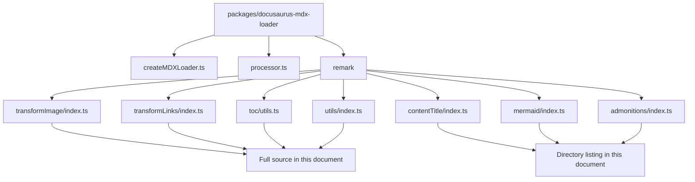
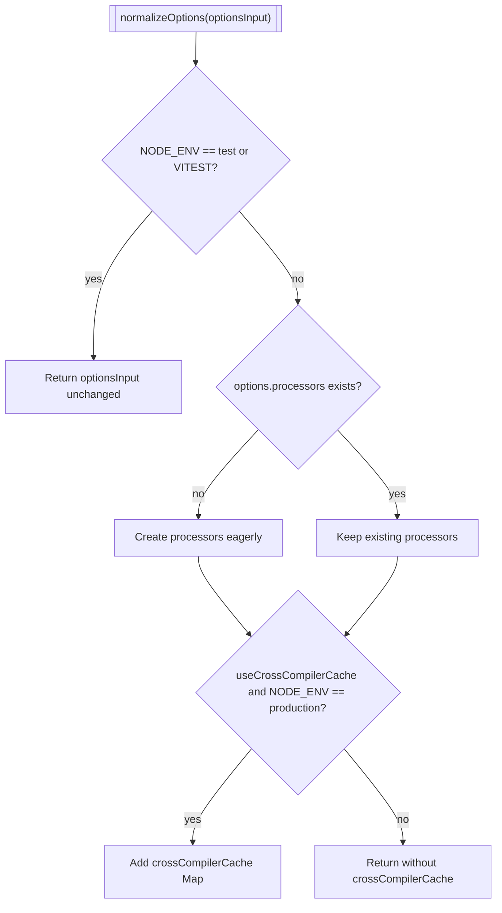
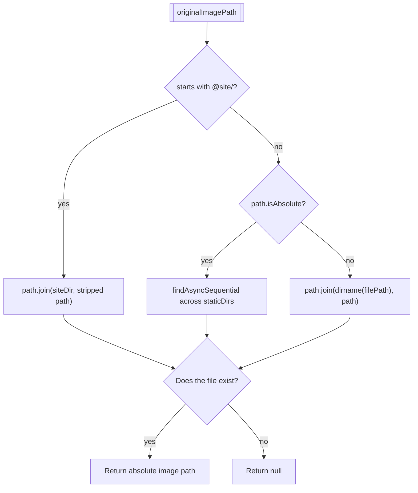

# MDX and markdown authoring internals

This document describes the internals of MDX and Markdown authoring in Docusaurus, focused on the`packages/docusaurus-mdx-loader` package. Developers extending Markdown processing, debugging asset resolution, or integrating custom remark/rehype plugins need to understand these modules, services, data flows, APIs, and extension points.

For the author-facing features this pipeline supports, see MDX & Markdown Authoring. For how this loader fits into the overall compile pipeline, see Site Building & Bundling Internals.

## Package and processing overview

The`docusaurus-mdx-loader` package hosts the Webpack-facing loader entry point plus the remark transformer plugins used during Docusaurus compilation.

Primary source files:

| File | Responsibility |
| --- | --- |
|`packages/docusaurus-mdx-loader/src/createMDXLoader.ts` | Creates the Webpack loader item and loader rule |
|`packages/docusaurus-mdx-loader/src/processor.ts` | Factory for processor instances, referenced from`createMDXLoader` |
|`packages/docusaurus-mdx-loader/src/remark/transformImage/index.ts` | Rewrites Markdown images into Webpack`require()` calls |
|`packages/docusaurus-mdx-loader/src/remark/transformLinks/index.ts` | Rewrites asset-like Markdown links into Webpack`require()` calls |
|`packages/docusaurus-mdx-loader/src/remark/toc/utils.ts` | Generates the table of contents export |
|`packages/docusaurus-mdx-loader/src/remark/utils/index.ts` | Shared node-mutation and AST helpers |
|`packages/docusaurus-mdx-loader/src/remark/contentTitle/index.ts` | Content title plugin source, present in the package listing |
|`packages/docusaurus-mdx-loader/src/remark/mermaid/index.ts` | Mermaid plugin source, present in the package listing |
|`packages/docusaurus-mdx-loader/src/remark/admonitions/index.ts` | Admonitions plugin source, present in the package listing |

The following diagram shows the package layout and which parts are documented from full source versus package listings only:



## MDX loader creation

Location:`packages/docusaurus-mdx-loader/src/createMDXLoader.ts`

### Loader item

`createMDXLoaderItem(options)` returns a Webpack`RuleSetUseItem`:

```ts
export function createMDXLoaderItem(
  options: Options & CreateOptions,
): RuleSetUseItem {
  return {
    loader: require.resolve('./index'),
    options: normalizeOptions(options),
  };
}
```

`require.resolve('./index')` points the Webpack rule at the package's main loader entry point.

### Loader rule

`createMDXLoaderRule({ include, options })` produces the Webpack rule that matches`.md` and`.mdx` files:

```ts
return {
  test: /\.mdx?$/i,
  include,
  use: [createMDXLoaderItem(options)],
};
```

The`include` argument is a Webpack`RuleSetRule['include']` value. Integrating plugins control which source directories are compiled through this rule.

### Option normalization

`normalizeOptions` applies two behaviors that matter for build environments:

```ts
function normalizeOptions(optionsInput: Options & CreateOptions): Options {
  if (process.env.NODE_ENV === 'test' || process.env.VITEST) {
    return optionsInput;
  }

  let options = optionsInput;

  if (!options.processors) {
    options = {...options, processors: createProcessors({options})};
  }

  if (options.useCrossCompilerCache && process.env.NODE_ENV === 'production') {
    options = {
      ...options,
      crossCompilerCache: new Map(),
    };
  }

  return options;
}
```

The following diagram shows the normalization decisions:



Key behaviors:

- In`test` or`VITEST` environments, processor creation is skipped. This prevents eager construction when integration tests build a loader item manually.
- When`options.processors` is not supplied,`createProcessors({options})` is called eagerly. The source comment notes that lazy creation interferes with Rsdoctor's ability to measure`mdx-loader` performance.
- When`useCrossCompilerCache` is`true` and`NODE_ENV` is`production`, a`Map` is created as`crossCompilerCache`. This lets client and server MDX compilers share compilation results.
- In development mode, the cache is intentionally not created.

`CreateOptions` supplies the optional`useCrossCompilerCache` flag.

## Remark transformer plugin shape

The transformer plugin sources available in this excerpt follow the unified plugin shape:

```ts
import type {Plugin, Transformer} from 'unified';
import type {Root} from 'mdast';

const plugin: Plugin<PluginOptions[], Root> = function plugin(options): Transformer<Root> {
  return async (root, vfile) => {
    // Collect async promises while visiting nodes.
    // Await all promises before returning.
  };
};
```

The plugins operate on the MDAST`Root` tree and receive the`vfile` object as the second argument. Both the image and link transformers use`vfile.path` as the current source file path and`vfile.data.compilerName` to determine whether the current compiler is the server compiler.

### File loader utilities

Both image and link transformers obtain loaders through`getFileLoaderUtils`:

```ts
const fileLoaderUtils = getFileLoaderUtils(
  vfile.data.compilerName === 'server',
);

const context: Context = {
  ...options,
  filePath: vfile.path!,
  inlineMarkdownImageFileLoader:
    fileLoaderUtils.loaders.inlineMarkdownImageFileLoader,
  onBrokenMarkdownImages,
};
```

The boolean argument differentiates client from server transformations. The resulting loader names are inserted into the`require()` strings embedded in the rewritten AST.

## Image transformation

Location:`packages/docusaurus-mdx-loader/src/remark/transformImage/index.ts`

This plugin rewrites Markdown`image` nodes into MDX JSX`` elements whose`src` is a Webpack`require()` expression. Webpack can then resolve and emit the image asset at build time.

### Plugin options

```ts
export type PluginOptions = {
  staticDirs: string[];
  siteDir: string;
  onBrokenMarkdownImages: MarkdownConfig['hooks']['onBrokenMarkdownImages'];
};
```

`onBrokenMarkdownImages` can be a string such as`throw`,`warn`, or`ignore`, or a function. The transformer normalizes both forms into an invokable function.

### Context

The transformer builds a per-file`Context`:

```ts
type Context = {
  staticDirs: PluginOptions['staticDirs'];
  siteDir: PluginOptions['siteDir'];
  onBrokenMarkdownImages: OnBrokenMarkdownImagesFunction;
  filePath: string;
  inlineMarkdownImageFileLoader: string;
};
```

`filePath` comes from`vfile.path`;`inlineMarkdownImageFileLoader` is the Webpack loader name gathered by`getFileLoaderUtils`.

### Broken image reporting

`asFunction` converts the user-provided hook option into an invokable function. If the option is a string, it creates a logger-based reporter:

```ts
return ({sourceFilePath, url: imageUrl, node}) => {
  const relativePath = toMessageRelativeFilePath(sourceFilePath);
  if (imageUrl) {
    logger.report(
      onBrokenMarkdownImages,
    )`Markdown image with URL code=${imageUrl} in source file path=${relativePath}${formatNodePositionExtraMessage(
      node,
    )} couldn't be resolved to an existing local image file.${extraHelp}`;
  } else {
    logger.report(
      onBrokenMarkdownImages,
    )`Markdown image with empty URL found in source file path=${relativePath}${formatNodePositionExtraMessage(
      node,
    )}.${extraHelp}`;
  }
};
```

If the option is a function, the plugin invokes it directly but first passes`sourceFilePath` through`toMessageRelativeFilePath`.

### Local image path resolution

`getLocalImageAbsolutePath(originalImagePath, {siteDir, filePath, staticDirs})` implements three resolution strategies:

1. **`@site/` alias**: joins the path with`siteDir`. The alias is stripped before joining, and the resulting path must exist.
2. **Absolute path**: searches each entry in`staticDirs` sequentially using`findAsyncSequential(possiblePaths, fs.pathExists)`.
3. **Relative path**: resolves against the directory of the current file using`path.dirname(filePath)`.

All three branches return`null` when the file does not exist.

The following diagram shows the image resolution decision flow:



### Image node processing

`processImageNode` performs these checks before transforming a node:

1. Empty URL: falls through to the broken image hook.
2. Non-local URL: skips transformation. The`pathname://` protocol is an escape hatch; it is removed from the URL so the image is not passed through Webpack.
3. Local URL path: decodes the pathname with`decodeURIComponent`, then resolves the absolute local image file path. If resolution fails, the broken image hook is invoked. Otherwise,`toImageRequireNode` rewrites the node.

### AST transformation

`toImageRequireNode` changes the original Markdown`image` node into an`mdxJsxTextElement` named`img`. The generated attributes are:

-`alt`: from`node.alt`, HTML-escaped.
-`src`: a`require()` expression built by`assetRequireAttributeValue`.
-`title`: from`node.title`, HTML-escaped.
-`width` and`height`: populated from`imageSizeFromFile(imagePath)` when a valid image can be read.

The`src` expression string is built as:

```ts
let relativeImagePath = posixPath(
  path.relative(path.dirname(context.filePath), imagePath),
);
relativeImagePath = `./${relativeImagePath}`;

const parsedUrl = parseURLOrPath(node.url);
const hash = parsedUrl.hash ?? '';
const search = parsedUrl.search ?? '';
const requireString = `${context.inlineMarkdownImageFileLoader}${
  escapePath(relativeImagePath) + search
}`;
```

The final`src` value is`require("${requireString}").default` plus the original hash when present.

## Link transformation

Location:`packages/docusaurus-mdx-loader/src/remark/transformLinks/index.ts`

This plugin rewrites asset-like Markdown links into MDX JSX`<a>` elements whose`href` is a Webpack`require()` expression. It intentionally does not rewrite route links such as those pointing to`.md` or`.html` files.

### Plugin options and context

`PluginOptions` mirrors the image options, with`onBrokenMarkdownLinks` instead of`onBrokenMarkdownImages`. The`Context` type adds`inlineMarkdownLinkFileLoader` to`PluginOptions`.

### Asset detection

`processLinkNode` first parses the URL. If it is not a local URL, the function returns and leaves the link untouched. For local URLs, it checks:

```ts
const hasSiteAlias = localUrlPath.pathname.startsWith('@site/');
const hasAssetLikeExtension =
  path.extname(localUrlPath.pathname) &&
  !localUrlPath.pathname.match(/\.(?:mdx?|html)(?:#|$)/);
if (!hasSiteAlias && !hasAssetLikeExtension) {
  return;
}
```

A link is only treated as an asset when either:

- It uses the`@site/` alias, or
- It has a file extension that is not`.md`,`.mdx`, or`.html`.

Route paths that merely resemble filenames are intentionally left alone to avoid false positives.

### Local asset path resolution

`getLocalFileAbsolutePath` parallels the image resolver, with one difference: it uses`isExistingFile`, which calls`fs.stat` and verifies the result is a file.

### AST transformation

`toAssetRequireNode` transforms a Markdown`link` node into an`mdxJsxTextElement` named`a`. The rewritten node:

- Sets`target="_blank"`.
- Sets`data-noBrokenLinkCheck` to the expression`true`, preventing Docusaurus's broken link checker from scanning the generated asset URL.
- Sets`href` to`require("${requireString}").default` with any hash appended.
- Copies`node.title` into`title` and retains the original`children`.

The`requireString` construction is:

```ts
const relativeAssetPath = `./${posixPath(
  path.relative(path.dirname(context.filePath), assetPath),
)}`;

const parsedUrl = parseURLOrPath(node.url);
const hash = parsedUrl.hash ?? '';
const search = parsedUrl.search ?? '';

const requireString = `${
  path.extname(relativeAssetPath) === '.json'
    ? `${relativeAssetPath.replace('.json', '.raw')}!=`
    : ''
}${context.inlineMarkdownLinkFileLoader}${
  escapePath(relativeAssetPath) + search
}`;
```

The JSON branch replaces`.json` with`.raw` and adds`!=`. The source comment explains that this is a hack to prevent Webpack from using its built-in JSON loader.

## Table of contents generation

Location:`packages/docusaurus-mdx-loader/src/remark/toc/utils.ts`

The TOC utilities operate on the MDAST and ESTree levels, generating exports that the MDX runtime can consume.

### Import inspection

The module exposes helpers to locate and manage MDX import declarations:

-`getImportDeclarations(program)` filters`ImportDeclaration` nodes from an ESTree`Program`.
-`isMarkdownImport(node)` returns`true` when the import source ends with`.md` or`.mdx`.
-`findDefaultImportName(importDeclaration)` returns the local name of an`ImportDefaultSpecifier`.
-`findNamedImportSpecifier(importDeclaration, localName)` returns a matching`ImportSpecifier` when present.

### Adding TOC slice imports

`addTocSliceImportIfNeeded` ensures an imported Markdown document exposes a named TOC slice import. It mutates the existing import declaration:

```ts
importDeclaration.specifiers.push({
  type: 'ImportSpecifier',
  imported: {type: 'Identifier', name: tocExportName},
  local: {type: 'Identifier', name: tocSliceImportName},
});
```

This creates an import of the form:

```ts
import Partial, {toc as __tocPartial} from 'partial';
```

### Named export detection

`isNamedExport(node, exportName)` verifies that a node:

1. Has type`mdxjsEsm`.
2. Carries an ESTree`Program` with exactly one body entry.
3. Contains an`ExportNamedDeclaration`.
4. Declares a`VariableDeclaration`.
5. Uses an`Identifier` whose name matches`exportName`.

### TOC export AST generation

`createTOCExportNodeAST({tocExportName, tocItems})` generates an`mdxjsEsm` node with an ESTree program that exports a`const` array:

```ts
export const toc = [
  // heading objects or spread elements referencing imported TOC slices
];
```

Each`TOCItem` is either:

- A **heading**, represented as`{value, id, level}`, where`value` is the HTML rendering of the heading and`id` comes from`heading.data.id`.
- A **slice**, represented as a spread of an imported identifier.

The`createTOCHeadingAST` helper uses`valueToEstree` to embed the rendered heading into the ESTree AST.

The generator sets`mdxjsEsm.value` to an empty string. The source comment references GitHub pull request 9684 and explains that the empty string avoids emitting unwanted raw text into the compiled output.

### Heading HTML serialization

`toHeadingHTMLValue(node)` serializes phrasing content into HTML for the TOC. It supports these node types:

| Node type | Output |
| --- | --- |
|`mdxJsxTextElement` | HTML serialization via`mdxJsxTextElementToHtml` |
|`text` | HTML-escaped text |
|`heading` | Serialized children |
|`inlineCode` |`<code>` wrapping the escaped value |
|`emphasis` |`<em>` wrapping serialized children |
|`strong` |`<strong>` wrapping serialized children |
|`delete` |`<del>` wrapping serialized children |
|`link` | Serialized children without the anchor |
| Any other node |`toString(node)` from`mdast-util-to-string` |

`mdxJsxTextElementToHtml` supports only tag name and`className`/`class` attributes. If the element is an`img`, it returns an empty string because images should not contribute to heading TOC text. The source comments note that this is a workaround and not fully reliable.

## Shared transformation utilities

Location:`packages/docusaurus-mdx-loader/src/remark/utils/index.ts`

###`transformNode`

`transformNode(node, newNode)` mutates the original node in place to become the new node:

```ts
export function transformNode<NewNode extends Node>(
  node: Node,
  newNode: NewNode,
): NewNode {
  Object.keys(node).forEach((key) => {
    delete node[key];
  });
  Object.keys(newNode).forEach((key) => {
    node[key] = newNode[key];
  });
  return node as NewNode;
}
```

This is the standard mechanism by which the image and link plugins convert Markdown nodes into MDX JSX elements. No new node is inserted; the original node object is rewritten.

###`assetRequireAttributeValue`

`assetRequireAttributeValue(requireString, hash)` creates an`mdxJsxAttributeValueExpression` representing:

```ts
require("${requireString}").default${hash && ` + '${hash}'`}
```

The generated ESTree AST is a`BinaryExpression` with a`MemberExpression` (`require(...).default`) on the left and a string literal hash on the right. If no hash is present, the binary expression side is absent.

### Position formatting

`formatNodePosition` returns a position string when the node has`position.start`.`formatNodePositionExtraMessage` wraps