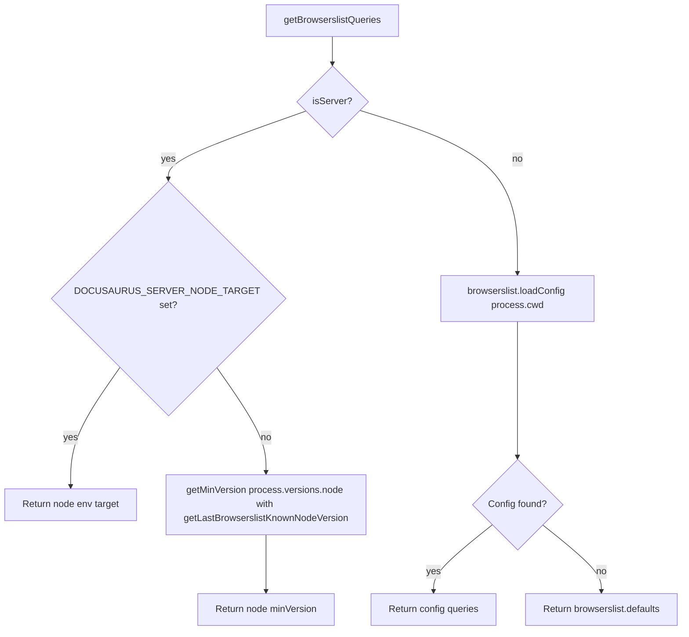
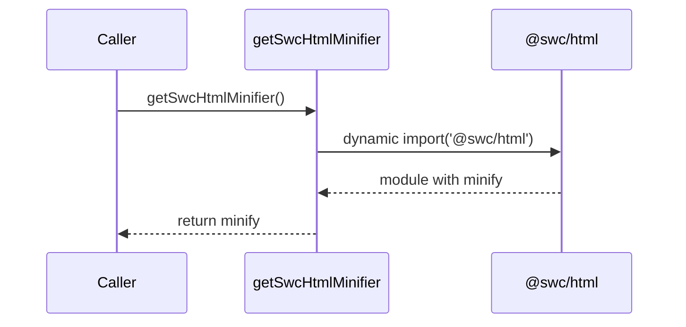
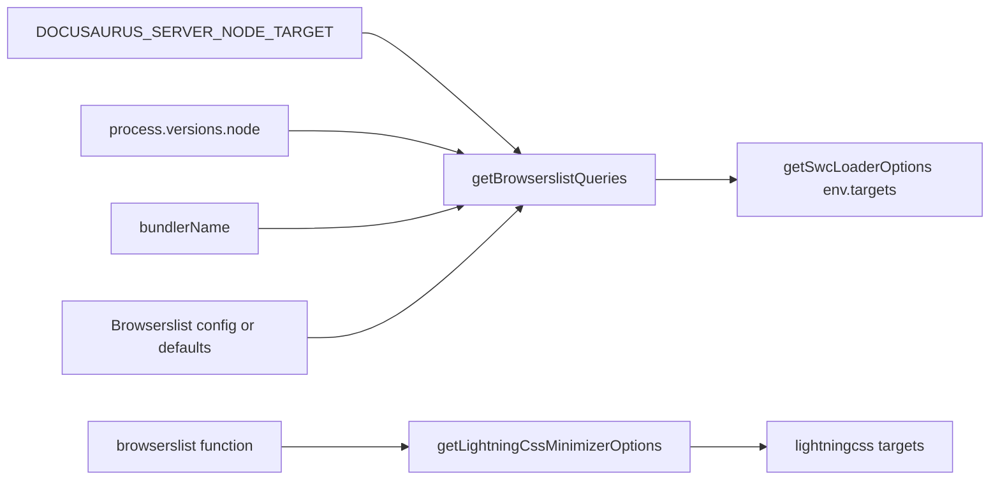

# Performance optimization internals

This page documents the implementation behind Docusaurus performance optimization as found in`packages/docusaurus-faster/src/index.ts`. The package`@docusaurus/faster` provides fast bundler primitives, SWC configuration helpers, and Lightning CSS minimizer options for Docusaurus builds.

## Package layout

The provided source snapshot contains one module:

| Path | Purpose |
| --- | --- |
|`packages/docusaurus-faster/src/index.ts` | Public API surface for fast build tooling |

The module depends on:

-`@rspack/core` for the Rspack bundler
-`@rspack/dev-server` for the Rspack dev server
-`@swc/core` for SWC options types
-`@swc/html` for HTML minification
-`lightningcss` for Lightning CSS transformation and minimizer targets
-`browserslist` for browser target resolution
-`semver` for Node version comparison
-`@docusaurus/types` for the`CurrentBundler` type

## Public API surface

### Exported values

```ts
export const swcLoader = require.resolve('swc-loader');
```

`swcLoader` is the resolved module path of`swc-loader`. It is exported so Docusaurus bundler code can pass it directly as a loader without resolving it separately.

```ts
export const rspack = Rspack;
export const rspackDevServer = RspackDevServer;
```

`rspack` and`rspackDevServer` re-export the`@rspack/core` and`@rspack/dev-server` modules. Consumers can import them from`@docusaurus/faster` instead of depending on Rspack directly.

### Exported option builders

| Function | Return type | Purpose |
| --- | --- | --- |
|`getSwcLoaderOptions` |`SwcOptions` | Builds SWC loader options for server or client compilation |
|`getSwcHtmlMinifier` |`Promise<SwcHtmlMinifier>` | Lazily loads and returns the`@swc/html` minifier |
|`getSwcJsMinimizerOptions` |`JsMinifyOptions` | Builds SWC JavaScript minifier options |
|`getBrowserslistQueries` |`string[]` | Resolves Browserslist queries for server or client |
|`getLightningCssMinimizerOptions` |`LightningCssMinimizerOptions` | Builds Lightning CSS minimizer options with current Browserslist targets |

## SWC loader options

`getSwcLoaderOptions` accepts the following parameters:

```ts
{
  isServer: boolean;
  bundlerName: CurrentBundler['name'];
}
```

It returns an`SwcOptions` object with three top-level properties:

```ts
{
  env: {
    targets: getBrowserslistQueries({ isServer, bundlerName }),
  },
  jsc: {
    parser: {
      syntax: 'typescript',
      tsx: true,
    },
    transform: {
      react: {
        runtime: 'automatic',
      },
    },
  },
}
```

The loader is configured to:

- Parse TypeScript and TSX through`syntax: 'typescript'` and`tsx: true`
- Use React automatic JSX runtime through`runtime: 'automatic'`
- Target the Browserslist queries returned by`getBrowserslistQueries`

The`bundlerName` parameter is used only when resolving the last known Node version in`getLastBrowserslistKnownNodeVersion`.

## Browserslist query resolution

`getBrowserslistQueries` is the central helper for deciding which browsers and Node.js versions a build targets.

```ts
getBrowserslistQueries({
  isServer,
  bundlerName,
}: {
  isServer: boolean;
  bundlerName: CurrentBundler['name'];
}): string[]
```

### Server builds

When`isServer` is`true`, the function returns a Node.js target:

1. If`process.env.DOCUSAURUS_SERVER_NODE_TARGET` is set, it returns that value directly as`node <value>`.
2. Otherwise, it computes the minimum of the currently running Node version and the last Node version known to Browserslist:
   -`process.versions.node`
   -`getLastBrowserslistKnownNodeVersion(bundlerName)`
3. It returns`node <minVersion>`.

`getLastBrowserslistKnownNodeVersion` is internal and not exported. For`bundlerName === 'rspack'`, it returns the hardcoded value`'22.0.0'`. For other bundlers, it returns`browserslist.nodeVersions.at(-1)!`.

### Client builds

When`isServer` is`false`, the function loads Browserslist configuration from the current working directory:

```ts
const queries = browserslist.loadConfig({path: process.cwd()}) ?? [
  ...browserslist.defaults,
];
```

If no Browserslist config is found, it falls back to`browserslist.defaults`.

The following diagram shows the branches in`getBrowserslistQueries`:



## SWC JavaScript minimizer options

`getSwcJsMinimizerOptions` returns fixed SWC JavaScript minifier options:

```ts
{
  ecma: 2020,
  compress: {
    ecma: 5,
  },
  module: true,
  mangle: true,
  safari10: true,
  format: {
    ecma: 5,
    comments: false,
    ascii_only: true,
  },
}
```

The source comment states that these options are similar to the options used in Docusaurus core`minification.ts`. The goal of the fast minifier is to be faster, not to fine-tune minification output.

## SWC HTML minifier

`getSwcHtmlMinifier` lazily imports`@swc/html` and returns its`minify` function.

```ts
type SwcHtmlMinifier = (typeof import('@swc/html'))['minify'];

export async function getSwcHtmlMinifier(): Promise<SwcHtmlMinifier> {
  const {minify} = await import('@swc/html');
  return minify;
}
```

The lazy import is intentional:

- It is not needed for the dev server, so loading it lazily is more performant.
- It temporarily works around a StackBlitz playground issue and an upstream SWC issue.

The following sequence diagram shows the lazy loading flow:



## Lightning CSS minimizer options

`getLightningCssMinimizerOptions` builds options suitable for`css-minimizer-webpack-plugin` using Lightning CSS.

```ts
type LightningCssMinimizerOptions = Omit<
  lightningcss.TransformOptions<never>,
  'filename' | 'code'
>;

export function getLightningCssMinimizerOptions(): LightningCssMinimizerOptions {
  const queries = browserslist();
  return {targets: lightningcss.browserslistToTargets(queries)};
}
```

It:

1. Resolves the current Browserslist queries with`browserslist()`
2. Converts those queries to Lightning CSS targets with`lightningcss.browserslistToTargets`
3. Returns`{ targets }`

The type is derived locally because Lightning CSS does not expose a type for`css-minimizer-webpack-plugin` setup.

## Data flow

The following diagram shows how configuration flows into SWC and Lightning CSS options:



`getBrowserslistQueries` feeds the SWC loader targets. Lightning CSS uses its own`browserslist()` call and does not share the resolved queries from`getBrowserslistQueries`.

## Extension points

### Server node target override

Set`DOCUSAURUS_SERVER_NODE_TARGET` to force the server build to target a specific Node.js version.

```bash
DOCUSAURUS_SERVER_NODE_TARGET=20.0.0 docusaurus build
```

The resulting server query is:

```ts
[`node ${process.env.DOCUSAURUS_SERVER_NODE_TARGET}`]
```

### Browserslist-based client targets

The client SWC target and Lightning CSS targets are driven by the Browserslist configuration in`process.cwd()`. Add or modify a Browserslist config file such as`.browserslistrc` or a`browserslist` field in`package.json` to change which browsers are supported.

### Bundler-specific behavior

`getBrowserslistQueries` accepts`bundlerName` typed as`CurrentBundler['name']`. This allows the package to special-case Rspack behavior. Currently, Rspack uses the hardcoded last known Node version`'22.0.0'` because Rspack does not expose its Browserslist data.

### Direct option consumption

All option builders are exported and return plain objects. Docusaurus build code or custom bundler setup can consume them directly when configuring SWC, Lightning CSS, or Rspack.

## Related pages

- Performance Optimization
- Site Building & Bundling Internals
- How to enable faster build mode
- How to use SWC minifier for JS
- How to use Lightning CSS minifier for CSS
- How to use Rspack bundler for faster builds