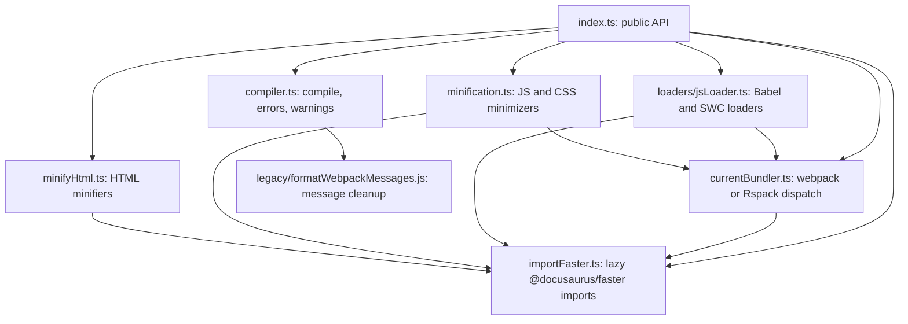
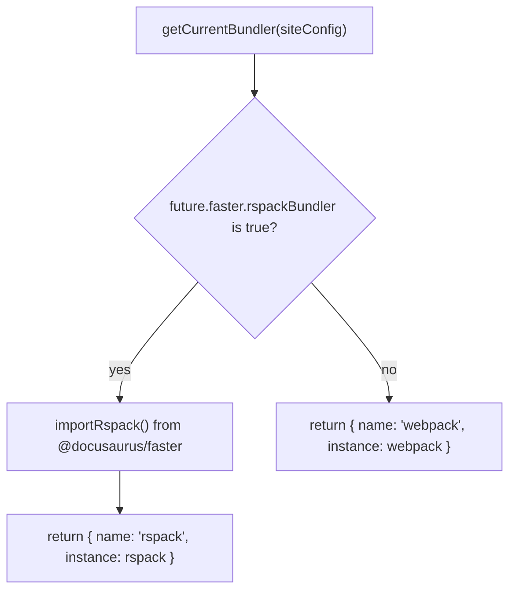

# Site building and bundling internals

This document describes the internal architecture of`@docusaurus/bundler`, the package that compiles Docusaurus sites into static HTML, CSS, and JavaScript bundles. It covers the modules, APIs, data flow, and extension points behind Site Building & Bundling.

## Overview

`@docusaurus/bundler` provides a bundler-agnostic compilation layer that supports two engines:

- **webpack**, the default engine, always available through the`webpack` dependency
- **Rspack**, an opt-in, faster engine that requires the`@docusaurus/faster` package

The package is a collection of factory and utility functions. It does not run the build by itself. Instead, Docusaurus core calls these functions during build setup to obtain loaders, plugins, minimizers, and a`compile` wrapper. Every public function is re-exported from`packages/docusaurus-bundler/src/index.ts`.

The package ships under`packages/docusaurus-bundler/src/` with this layout:

| File | Responsibility |
|------|----------------|
|`index.ts` | Public API surface; re-exports all functions |
|`compiler.ts` | Compilation lifecycle, error and warning formatting |
|`currentBundler.ts` | Bundler selection and plugin factory dispatch |
|`minification.ts` | JS and CSS minimizer creation |
|`minifyHtml.ts` | HTML minification with Terser or SWC |
|`loaders/jsLoader.ts` | JS loader selection: Babel, SWC, Rspack SWC |
|`importFaster.ts` | Lazy loading of the`@docusaurus/faster` package |
|`legacy/formatWebpackMessages.js` | Legacy Create React App error formatter |

The following diagram shows the dependency relationships between these modules:



## Bundler selection

`packages/docusaurus-bundler/src/currentBundler.ts` is the central abstraction that chooses between webpack and Rspack. The selection is based on the`future.faster.rspackBundler` flag in`docusaurus.config.js`.

###`getCurrentBundler`

```typescript
export async function getCurrentBundler({
  siteConfig,
}: {
  siteConfig: SiteConfigSlice;
}): Promise<CurrentBundler>
```

`SiteConfigSlice` is a minimal type that reads only`future.faster.rspackBundler`. The function returns a`CurrentBundler` object with:

-`name`: either`"webpack"` or`"rspack"`
-`instance`: the webpack module or the lazily imported Rspack module

For Rspack, the instance comes from`importRspack()` in`importFaster.ts`. For webpack, the function returns the statically imported`webpack` module.



###`getCurrentBundlerAsRspack`

This helper narrows a`CurrentBundler` value to the Rspack module. It throws an error if the current bundler is not Rspack:

```typescript
export function getCurrentBundlerAsRspack({
  currentBundler,
}: {
  currentBundler: CurrentBundler;
}): FasterModule['rspack']
```

## Plugin factories

`currentBundler.ts` exposes four plugin factories. Each one returns the correct plugin class for the active bundler.

###`getCSSExtractPlugin`

Returns`MiniCssExtractPlugin` for webpack or`CssExtractRspackPlugin` for Rspack:

```typescript
export async function getCSSExtractPlugin({
  currentBundler,
}: {
  currentBundler: CurrentBundler;
}): Promise<typeof MiniCssExtractPlugin>
```

The Rspack variant is accessed as`currentBundler.instance.CssExtractRspackPlugin`. The type error is suppressed with`@ts-expect-error` because the property exists only in Rspack.

###`getCopyPlugin`

Returns`CopyPlugin` from webpack or`CopyRspackPlugin` from Rspack:

```typescript
export async function getCopyPlugin({
  currentBundler,
}: {
  currentBundler: CurrentBundler;
}): Promise<typeof webpack.CopyPlugin>
```

###`getProgressBarPlugin`

Returns`WebpackBar` for webpack. For Rspack, it defines a`CustomRspackProgressPlugin` class that extends`rspack.ProgressPlugin` and customizes the progress bar output:

```typescript
class CustomRspackProgressPlugin extends rspack.ProgressPlugin {
  constructor({name, color = 'green'}: {name?: string; color?: string}) {
    super({
      prefix: name,
      template: `● {prefix:.bold} {bar:50.${color}/white.dim} ({percent}%) {wide_msg:.dim}`,
      progressChars: '██',
    });
  }
}
```

## Compilation lifecycle

`packages/docusaurus-bundler/src/compiler.ts` contains the`compile` function, which wraps the underlying webpack or Rspack compiler and manages error reporting, warning output, and cleanup.

###`compile`

```typescript
export function compile({
  configs,
  currentBundler,
}: