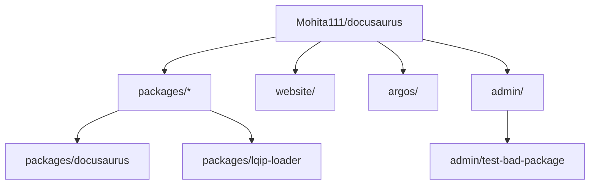
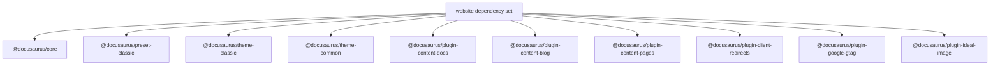
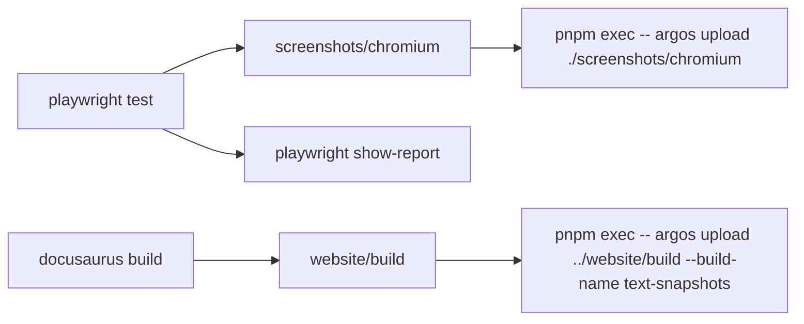
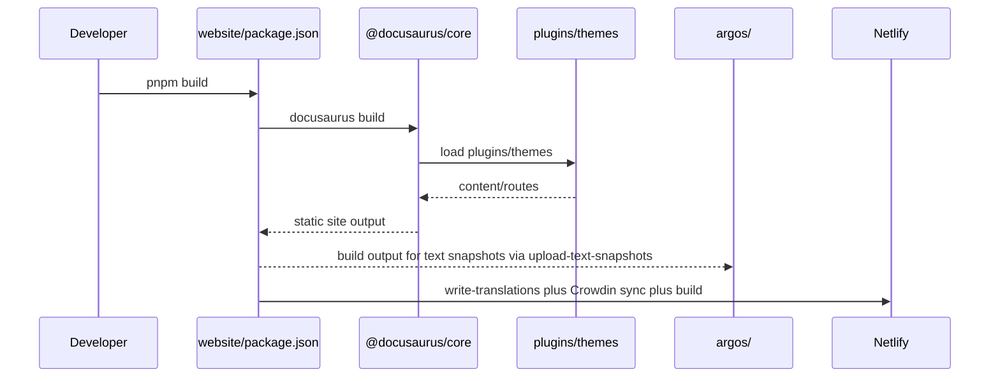

# System architecture

Docusaurus is a pnpm-based monorepo with four main consumer areas:

-`packages/*`, publishable`@docusaurus/*` packages
-`website/`, the dogfooded Docusaurus website and integration surface
-`argos/`, visual regression tooling
-`admin/`, repository maintenance fixtures

All first-party Docusaurus packages referenced from`website/` and`@docusaurus/core` use the`workspace:*` protocol for local resolution.

## Repository topology

The following diagram shows the four main monorepo areas and the packages that are directly evidenced by the provided`package.json` files.



```text
Mohita111/docusaurus/
├── packages/
│   └── docusaurus/          # @docusaurus/core
├── packages/
│   └── lqip-loader/         # @docusaurus/lqip-loader
├── website/                 # Docusaurus website app
├── argos/                   # Visual regression runner
└── admin/
    └── test-bad-package/    # Dependency validation fixture
```

This topology is inferred from the provided`package.json` files and their`repository.directory` declarations.

## Package graph

The website is the main consumer of the Docusaurus package ecosystem. The following diagram shows the primary first-party packages declared in`website/package.json`.



The full first-party website dependency set is:

```text
website
├── @docusaurus/core
├── @docusaurus/preset-classic
├── @docusaurus/theme-classic
├── @docusaurus/theme-common
├── @docusaurus/plugin-client-redirects
├── @docusaurus/plugin-content-blog
├── @docusaurus/plugin-content-docs
├── @docusaurus/plugin-content-pages
├── @docusaurus/plugin-google-gtag
├── @docusaurus/plugin-ideal-image
├── @docusaurus/plugin-pwa
└── @docusaurus/plugin-rsdoctor
```

Additional shared packages declared by`website/package.json`:

-`@docusaurus/logger`
-`@docusaurus/types`
-`@docusaurus/utils`
-`@docusaurus/utils-common`
-`@docusaurus/utils-validation`
-`@docusaurus/remark-plugin-npm2yarn`
-`@docusaurus/theme-live-codeblock`
-`@docusaurus/theme-mermaid`

## Core package:`@docusaurus/core`

`packages/docusaurus/package.json` defines the main CLI and runtime.

- Package name:`@docusaurus/core`
- Version:`4.0.0`
- License: MIT
- CLI entry point:`bin/docusaurus.mjs`
- Node engine requirement:`>=24.21`

```json
"bin": {
  "docusaurus": "bin/docusaurus.mjs"
}
```

The core package depends on internal Docusaurus layers, including:

| Dependency | Role |
| --- | --- |
|`@docusaurus/babel` | Build-time JavaScript compilation |
|`@docusaurus/bundler` | Webpack bundling integration |
|`@docusaurus/logger` | Logging |
|`@docusaurus/mdx-loader` | MDX content loading |
|`@docusaurus/utils` | Shared utilities |
|`@docusaurus/utils-common` | Shared runtime utilities |
|`@docusaurus/utils-validation` | Configuration and schema validation |

Core also declares peer dependencies:

```json
"peerDependencies": {
  "@docusaurus/faster": "workspace:*",
  "@mdx-js/react": "^3.1.1",
  "react": "^19.3.0",
  "react-dom": "^19.3.0"
}
```

`@docusaurus/faster` is optional:

```json
"peerDependenciesMeta": {
  "@docusaurus/faster": {
    "optional": true
  }
}
```

### Core build process

Core compilation uses TypeScript project references followed by a file-copy step.

```json
"scripts": {
  "build": "tsc --build && node ../../admin/scripts/copyUntypedFiles.js",
  "watch": "run-p -c copy:watch build:watch",
  "build:watch": "tsc --build --watch",
  "copy:watch": "node ../../admin/scripts/copyUntypedFiles.js --watch"
}
```

### Core runtime dependencies

Core pulls in Webpack, React Router, MDX/React tooling, and server utilities.

```json
"html-webpack-plugin": "^5.6.8",
"webpack": "^5.111.0",
"webpack-dev-server": "^6.0.0",
"webpack-merge": "^6.0.1",
"react-router": "^5.3.4",
"react-router-config": "^5.1.1",
"react-router-dom": "^5.3.4",
"react-loadable": "npm:@docusaurus/react-loadable@6.0.0",
"react-helmet-async": "npm:@slorber/react-helmet-async@1.3.0"
```

CLI command parsing is handled by Commander:

```json
"commander": "^15.0.0"
```

## Website application

`website/package.json` is the main integration target for Docusaurus. It is private and not published.

### Application scripts

The website uses the Docusaurus CLI directly:

```json
"scripts": {
  "docusaurus": "docusaurus",
  "start": "docusaurus start",
  "build": "docusaurus build",
  "swizzle": "docusaurus swizzle",
  "deploy": "docusaurus deploy",
  "serve": "docusaurus serve"
}
```

Additional test and localization scripts include:

-`test:swizzle:eject:js`
-`test:swizzle:eject:ts`
-`test:swizzle:wrap:js`
-`test:swizzle:wrap:ts`
-`write-translations`:`docusaurus write-translations`
-`write-heading-ids`:`docusaurus write-heading-ids`

The website also supports alternate configuration files through dedicated scripts:

```json
"start:blogOnly": "cross-env pnpm start --config=docusaurus.config-blog-only.js",
"build:blogOnly": "cross-env pnpm build --config=docusaurus.config-blog-only.js"
```

Crowdin translation scripts use`@crowdin/cli` and the Crowdin API client:

```json
"netlify:crowdin:downloadTranslations": "pnpm netlify:crowdin:wait && pnpm --dir .. crowdin:download:website",
"netlify:crowdin:uploadSources": "pnpm --dir .. crowdin:upload:website"
```

### Build optimization scripts

The website includes fast-build, bundle analysis, and profiling entry points:

```json
"build:fast": "cross-env BUILD_FAST=true pnpm build --locale en",
"build:fast:rsdoctor": "cross-env BUILD_FAST=true RSDOCTOR=true pnpm build --locale en",
"profile:bundle:cpu": "DOCUSAURUS_EXIT_AFTER_BUNDLING=true node --cpu-prof --cpu-prof-dir .cpu-prof ./node_modules/.bin/docusaurus build --locale en",
"profile:bundle:samply": "./profileSamply.sh"
```

### Website dependency stack

The website declares React 19 and Webpack 5:

```json
"react": "^19.3.0",
"react-dom": "^19.3.0",
"webpack": "^5.111.0"
```

It also uses Workbox for PWA support:

```json
"workbox-routing": "^7.4.1",
"workbox-strategies": "^7.4.1"
```

### Browser targets

The website declares separate browser target sets for production and development builds:

```json
"browserslist": {
  "production": [
    ">0.5%",
    "not dead",
    "not op_mini all"
  ],
  "development": [
    "last 1 chrome version",
    "last 1 firefox version",
    "last 1 safari version"
  ]
}
```

## Visual regression tooling

`argos/package.json` defines the visual diff pipeline.

```json
"name": "argos",
"version": "4.0.0",
"description": "Argos visual diff tests",
"private": true
```

The following diagram shows the screenshot and upload workflow.



### Screenshot and upload pipeline

The workflow consists of three commands:

1. Capture screenshots with Playwright
2. Upload the Chromium screenshot directory to Argos
3. Upload built HTML text snapshots from the website

```json
"scripts": {
  "screenshot": "playwright test",
  "upload": "pnpm exec -- argos upload ./screenshots/chromium",
  "upload-text-snapshots": "pnpm exec -- argos upload \"../website/build\" --build-name text-snapshots --files styles.css --files \"docs/**/*.html\" --files \"blog/**/*.html\"",
  "report": "playwright show-report"
}
```

Argos dependencies:

```json
"@argos-ci/cli": "^6.9.2",
"@argos-ci/playwright": "^7.5.0",
"@playwright/test": "^1.63.0",
"cheerio": "^1.2.0"
```

The`upload-text-snapshots` command targets the website build output at`../website/build`. It uploads`styles.css` and HTML files under`docs/**/*.html` and`blog/**/*.html`.

## LQIP loader

`packages/lqip-loader/package.json` defines the Low Quality Image Placeholders loader.

```json
"name": "@docusaurus/lqip-loader",
"version": "4.0.0",
"description": "Low Quality Image Placeholders (LQIP) loader for webpack.",
"main": "lib/index.js"
```

It is a public package:

```json
"publishConfig": {
  "access": "public"
}
```

Dependencies:

```json
"@docusaurus/logger": "workspace:*",
"file-loader": "^6.2.0",
"lodash": "^4.18.1",
"sharp": "^0.35.1",
"tslib": "^2.8.1"
```


## Dependency validation fixture

`admin/test-bad-package/package.json` is a private fixture with deliberately older React and MDX versions:

```json
{
  "name": "test-bad-package",
  "version": "4.0.0",
  "private": true,
  "dependencies": {
    "@mdx-js/react": "1.0.1",
    "react": "16.14.0",
    "react-dom": "16.14.0"
  }
}
```

This package appears intended for compatibility or failure-path tests in the admin tooling, based on its name and dependency versions.

## Cross-package conventions

All first-party packages share these conventions:

| Convention | Value |
| --- | --- |
| Version |`4.0.0` |
| License | MIT |
| Node engine |`>=24.21` where specified |
| First-party dependency protocol |`workspace:*` |
| Package manager | pnpm commands via`pnpm` and`pnpm exec` |
| TypeScript builder |`tsc` |

## Build and deployment data flow

The following diagram shows the high-level build flow from a developer command to static output and visual regression usage.



The high-level flow for the website build is:

1. Run`pnpm build` in`website/`, which invokes`docusaurus build`
2. The Docusaurus CLI from`@docusaurus/core` resolves the configured plugins and themes from`packages/*`
3. Content plugins load Markdown/MDX, while the bundler compiles the static site
4. Build output can be targeted by the visual regression scripts in`argos/`

For Netlify production builds, the website first writes translations and synchronizes with Crowdin:

```text
docusaurus write-translations
→ Crowdin delay
→ Crowdin upload sources
→ Crowdin download translations
→ docusaurus build
```

## Architectural constraints and notes

- The core CLI requires Node.js 24.21 or later.
-`@docusaurus/core` uses React Router 5 and React 19 as peer-level runtime dependencies.
- The website uses`@docusaurus/preset-classic` as the primary preset and consumes individual plugins and themes for extended functionality.
- Visual regression relies on Playwright plus the Argos CI uploader rather than a custom screenshot comparer.
- The build pipeline uses Webpack 5 as the bundler in the current dependency set.
-`@docusaurus/faster` is an optional peer dependency, allowing installations to opt in or out of the faster build path.

## See also

- Site Building & Bundling
- Plugins
- [Performance