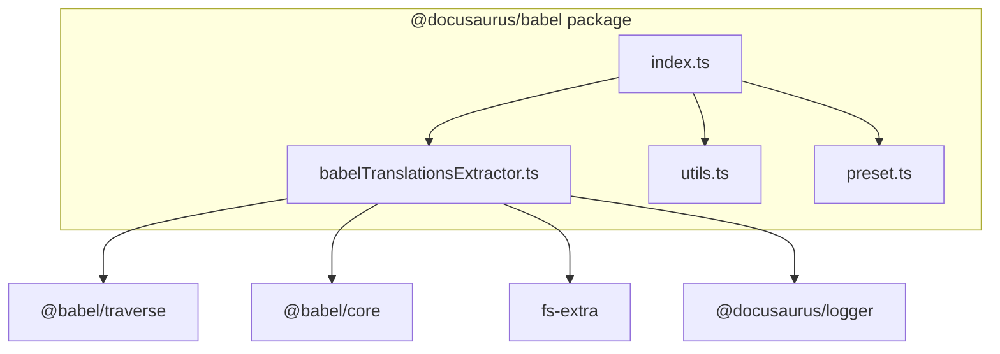
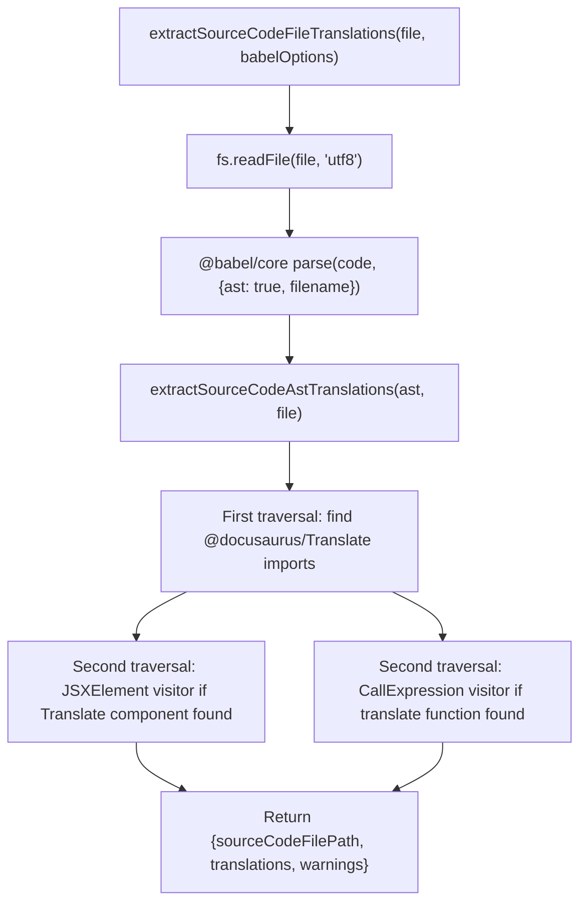

# Translation extraction internals

This document describes the modules, data flow, public API, and extension points behind Docusaurus translation extraction. Translation extraction reads source code files, identifies translatable strings that use the`@docusaurus/Translate` imports, and produces a structured`TranslationFileContent` object that can be merged into translation files.

## Package structure

Translation extraction is implemented in the`@docusaurus/babel` package, located under`packages/docusaurus-babel`. The package contains four source files:

| File | Responsibility |
|------|----------------|
|`src/index.ts` | Public exports for the package |
|`src/babelTranslationsExtractor.ts` | Core Babel-based extraction logic |
|`src/utils.ts` | Babel configuration helpers |
|`src/preset.ts` | Babel preset used during site compilation |

The extraction pipeline depends on`@babel/core`,`@babel/traverse`, and`@babel/generator` from Babel, plus`fs-extra` for file reads and`@docusaurus/logger` for error reporting.



## Public API

`src/index.ts` re-exports the functions that callers outside the package can use:

```ts
export {getCustomBabelConfigFilePath, getBabelOptions} from './utils';

export {extractAllSourceCodeFileTranslations} from './babelTranslationsExtractor';
```

###`extractAllSourceCodeFileTranslations`

`packages/docusaurus-babel/src/babelTranslationsExtractor.ts`

```ts
export async function extractAllSourceCodeFileTranslations(
  sourceCodeFilePaths: string[],
  babelOptions: TransformOptions,
): Promise<SourceCodeFileTranslations[]>
```

This is the main entry point. It accepts a list of source file paths and Babel transform options, then processes each file concurrently with`Promise.all` and`flatMap`.

The return type is defined in the same file:

```ts
export type SourceCodeFileTranslations = {
  sourceCodeFilePath: string;
  translations: TranslationFileContent;
  warnings: string[];
};
```

`TranslationFileContent` is imported from`@docusaurus/types`. The implementation treats it as an object where each key is a translation ID or message, and each value contains at least a`message` property and optionally a`description` property.

###`extractSourceCodeFileTranslations`

```ts
export async function extractSourceCodeFileTranslations(
  sourceCodeFilePath: string,
  babelOptions: TransformOptions,
): Promise<SourceCodeFileTranslations>
```

This lower-level function extracts translations from a single source file. It performs the following steps:

1. Reads the file contents with`fs.readFile(sourceCodeFilePath, 'utf8')`.
2. Parses the code into a Babel AST using`parse` from`@babel/core`.
3. Delegates AST traversal to`extractSourceCodeAstTranslations`.
4. Wraps any error in a new`Error` with`logger.interpolate` and attaches the original error as`cause`.

The`filename` option is passed explicitly to`parse` because Babel treats JavaScript and TypeScript files differently based on the file extension, as noted in the source comment.

###`getCustomBabelConfigFilePath`

`packages/docusaurus-babel/src/utils.ts`

```ts
export async function getCustomBabelConfigFilePath(
  siteDir: string,
): Promise<string | undefined>
```

Returns the absolute path to a custom Babel configuration file if`babel.config.js` exists inside`siteDir`, otherwise returns`undefined`.

###`getBabelOptions`

```ts
export function getBabelOptions({
  isServer,
  babelOptions,
}: {
  isServer?: boolean;
  babelOptions?: TransformOptions | string;
} = {}): TransformOptions
```

Builds a complete Babel`TransformOptions` object. The`caller` identifies whether the current build is for server or client. When`babelOptions` is a string, it is treated as the path to a custom config file. Otherwise, the preset`@docusaurus/babel/preset` is used by default.

## Extraction pipeline

The following diagram shows the end-to-end flow for a single source file:



## Extraction algorithm

`extractSourceCodeAstTranslations` performs two AST traversals.

### First pass: Import resolution

The first`traverse` call looks for`ImportDeclaration` nodes where the module source is exactly`@docusaurus/Translate`. It skips type-only imports (`importKind === 'type'`).

For each matching import, it determines:

-`translateComponentName`: the local name of the default import, if present. This is the React component (`<Translate>`).
-`translateFunctionName`: the local name of the named import`translate`, if present.

If neither import is found, the second traversal adds no visitors, so no translations are extracted from that file. This prevents false positives from unrelated code.

### Second pass: JSX extraction

If`translateComponentName` was found, a`JSXElement` visitor extracts translations from`<Translate>` elements.

The visitor:

1. Checks that the opening element name matches`translateComponentName`.
2. Evaluates the`id` and`description` JSX attributes through`evaluateJSXProp`.
3. Determines the message content:
   - If there are no children, the element must have an`id` prop. The translation is recorded with`message: id` and optional`description`.
   - If there is exactly one non-empty child, the child must be either a`JSXText` node or a`JSXExpressionContainer` whose expression evaluates confidently to a static value. The text is trimmed and whitespace-normalized, and the key is`id ?? message`.
   - Otherwise a warning is emitted.
4. Adds a warning when an attribute value is not statically evaluable, because dynamic values prevent extraction.

The`evaluateJSXProp` helper finds an attribute by name, evaluates its value using Babel's path evaluation, and requires the result to be a string with`confident === true`.

### Second pass: Function extraction

If`translateFunctionName` was found, a`CallExpression` visitor extracts translations from`translate({...})` calls.

The visitor:

1. Checks that the callee identifier matches`translateFunctionName`.
2. Requires exactly one or two arguments.
3. Evaluates the first argument. It must be a statically evaluable object with`confident === true`.
4. Reads`message`,`id`, and`description` from the evaluated object.
5. Records the translation with key`String(id ?? message)` and value`{message: String(message ?? id), ...(description ? {description} : {})}`.
6. Emits warnings if the first argument is not statically evaluable or if the wrong number of arguments is passed.

## Warnings and error handling

The extractor returns warnings rather than throwing for non-fatal issues. Warnings are collected in the`warnings` array for each file and include the source file path and line number where possible via`sourceWarningPart`.

Examples of warnings:

-`<Translate>``id`/`description` prop is not statically evaluable.
-`<Translate>` without children and without`id`.
-`<Translate>` content could not be extracted because it is not a static string or static expression.
-`translate()` first arg is not a statically evaluable object.
-`translate()` function takes more than 2 arguments.

Fatal errors, such as a file read failure or Babel parse failure, are caught in`extractSourceCodeFileTranslations` and rethrown with an interpolated logger message and a`cause` property.

## Extension points

Translation extraction is inherently extensible through Babel options passed to`parse`. The`babelOptions` parameter is forwarded directly to Babel, so callers can inject custom plugins or presets that transform code before extraction. However, the core extraction visitors are hard-coded to`@docusaurus/Translate` imports and cannot be replaced without modifying this module.

The separation between`extractAllSourceCodeFileTranslations` and`extractSourceCodeFileTranslations` allows callers to process individual files independently, reuse per-file extraction, or implement custom batch processing.

## Limitations

- The extractor only recognizes imports from`@docusaurus/Translate`. Other translation mechanisms are not handled.
- JSX attribute values and`translate()` arguments must be statically evaluable. Dynamic values are not extracted and generate warnings.
- The second traversal is skipped entirely if no`@docusaurus/Translate` import is found, so files that use a different import path for the same components are silently ignored.
- The module does not merge or persist extracted translations; it only returns the structured data. Other parts of Docusaurus are responsible for writing translation files.

## Related documentation

- Translation Extraction feature
- How to generate translation files for localization
- Architecture