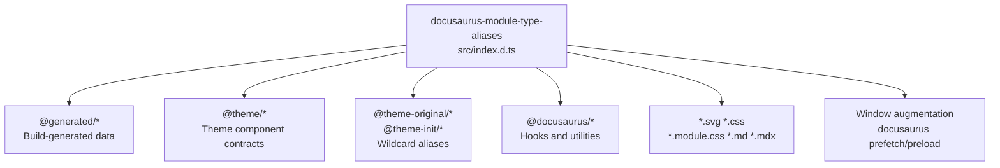
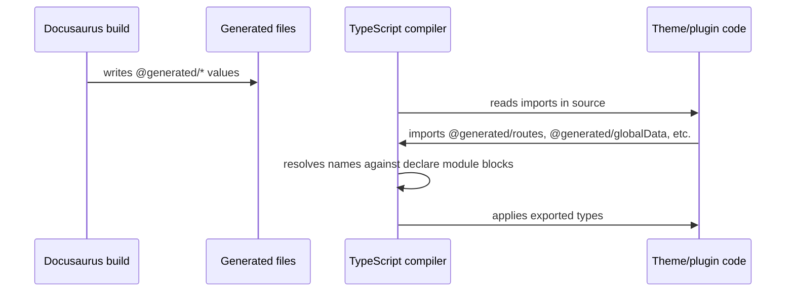
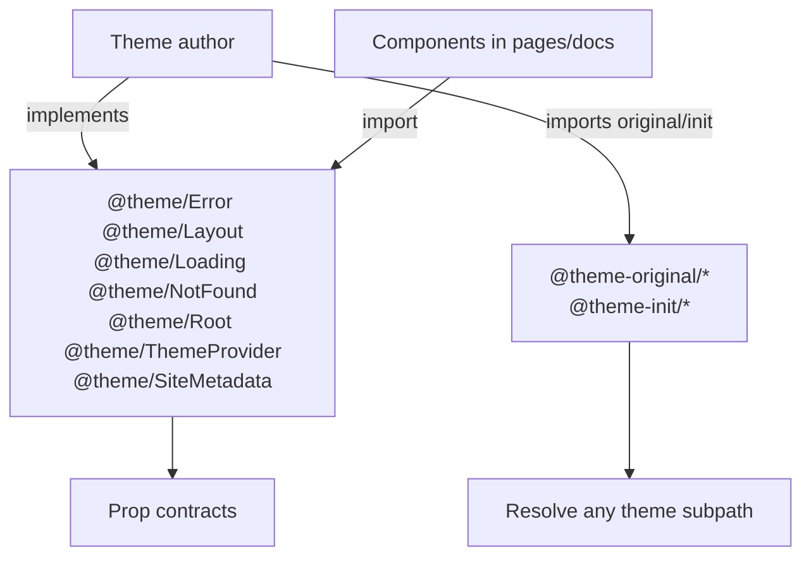

# TypeScript module aliases internals

## Overview

The`docusaurus-module-type-aliases` package gives theme and plugin developers TypeScript contracts for the ambient modules that Docusaurus fills in at build time. Its single entry point,`packages/docusaurus-module-type-aliases/src/index.d.ts`, contains`declare module` blocks for:

-`@generated/*` modules that receive their runtime values from the build output
-`@theme/*` component contracts and`@theme-original/*` /`@theme-init/*` resolution wildcards
-`@docusaurus/*` runtime APIs, hooks, and utilities
- Static asset imports such as`*.svg`,`*.css`, and`*.mdx`
- The global`Window` interface augmentation

Because these are ambient declarations, the aliases have no implementing files in this package. They exist purely to give the TypeScript compiler type information for names that are resolved by webpack aliases or generated files at runtime.

For the user-facing behavior these aliases enable, see TypeScript Module Aliases.

## Package structure

The package has one source file:

-`packages/docusaurus-module-type-aliases/src/index.d.ts`, all ambient module declarations, approximately 11 KB.

There is no runtime code in this package. Every declaration is erased at compile time; the compiler only uses the exported types and signatures.

## Alias architecture

The following diagram shows the declaration groups and their consumers.



Each group targets a different part of the developer workflow:

-`@generated/*` provides types for data the build writes into the site.
-`@theme/*` and the wildcard aliases type the component contracts theme authors implement.
-`@docusaurus/*` types the APIs used inside React components and layouts.
- Asset declarations let import statements for static resources type-check.
- The`Window` augmentation types browser globals injected by the client runtime.

## Generated module declarations

All`@generated/*` modules correspond to files emitted during the production or development build. Runtime values come from the build, while the declarations here supply their shapes. See Site Building & Bundling Internals for how these files are generated.

### Default-exported modules

These modules use`export default`:

```ts
declare module '@generated/client-modules' {
  import type {ClientModule} from '@docusaurus/types';

  const clientModules: readonly (ClientModule & {default?: ClientModule})[];
  export default clientModules;
}

declare module '@generated/docusaurus.config' {
  import type {DocusaurusConfig} from '@docusaurus/types';

  const config: DocusaurusConfig;
  export default config;
}

declare module '@generated/registry' {
  import type {Registry} from '@docusaurus/types';

  const registry: Registry;
  export default registry;
}

declare module '@generated/routes' {
  import type {RouteConfig as RRRouteConfig} from 'react-router-config';
  import type Loadable from 'react-loadable';

  type RouteConfig = RRRouteConfig & {
    path: string;
    component: ReturnType<typeof Loadable>;
  };
  const routes: RouteConfig[];
  export default routes;
}
```

Notable contract details:

-`@generated/client-modules` declares an array of`ClientModule` where each entry may also have a`default` property. This matches the ESM/CJS interop shape the client runtime loads.
-`@generated/routes` narrows the`react-router-config``RouteConfig` so that`path` is required and`component` is a`react-loadable``Loadable` return type.

### Export-equals modules

These modules use`export =`, which requires`esModuleInterop`-style handling:

```ts
declare module '@generated/site-metadata' {
  import type {SiteMetadata} from '@docusaurus/types';

  const siteMetadata: SiteMetadata;
  export = siteMetadata;
}

declare module '@generated/site-storage' {
  import type {SiteStorage} from '@docusaurus/types';

  const siteStorage: SiteStorage;
  export = siteStorage;
}

declare module '@generated/routesChunkNames' {
  import type {RouteChunkNames} from '@docusaurus/types';

  const routesChunkNames: RouteChunkNames;
  export = routesChunkNames;
}

declare module '@generated/globalData' {
  import type {GlobalData} from '@docusaurus/types';

  const globalData: GlobalData;
  export = globalData;
}

declare module '@generated/i18n' {
  import type {I18n} from '@docusaurus/types';

  const i18n: I18n;
  export = i18n;
}

declare module '@generated/codeTranslations' {
  import type {CodeTranslations} from '@docusaurus/types';

  const codeTranslations: CodeTranslations;
  export = codeTranslations;
}
```

The mix of`export default` and`export =` reflects the output shape of the corresponding generated files and is intentional: consumers must import exactly the shape each file produces.

## Generated module data flow

The declarations are resolved during type-checking, while the runtime values are produced separately by the build.



At runtime the same module names resolve through webpack aliases to the files in the generated output directory. The ambient declarations in`index.d.ts` never affect the final bundle.

## Theme module declarations

Theme aliases are split into two forms: wildcard pass-through declarations and typed component contracts.

### Wildcard aliases

```ts
declare module '@theme-original/*';
declare module '@theme-init/*';
```

These declarations contain no members. They allow any import whose specifier starts with`@theme-original/` or`@theme-init/` to type-check as the resolved implementation, without forcing theme authors to redeclare component props for every theme component they use.

### Typed theme components

The core theme components have explicit prop contracts:

```ts
declare module '@theme/Error' {
  import type {ReactNode} from 'react';
  import type {FallbackParams} from '@docusaurus/ErrorBoundary';

  export interface Props extends FallbackParams {}
  export default function Error(props: Props): ReactNode;
}

declare module '@theme/Layout' {
  import type {ReactNode} from 'react';

  export interface Props {
    readonly children?: ReactNode;
  }
  export default function Layout(props: Props): ReactNode;
}

declare module '@theme/Loading' {
  import type {ReactNode} from 'react';
  import type {LoadingComponentProps} from 'react-loadable';

  export default function Loading(props: LoadingComponentProps): ReactNode;
}

declare module '@theme/NotFound' {
  import type {ReactNode} from 'react';

  export default function NotFound(): ReactNode;
}

declare module '@theme/Root' {
  import type {ReactNode} from 'react';

  export interface Props {
    readonly children: ReactNode;
  }
  export default function Root({children}: Props): ReactNode;
}

declare module '@theme/ThemeProvider' {
  import type {ReactNode} from 'react';

  export interface Props {
    readonly children: ReactNode;
  }
  export default function ThemeProvider({children}: Props): ReactNode;
}

declare module '@theme/SiteMetadata' {
  import type {ReactNode} from 'react';

  export default function SiteMetadata(): ReactNode;
}
```

The relationship between the wildcard aliases and the typed contracts is shown here:



## Docusaurus runtime API declarations

These modules type the client-side APIs available inside site React code.

### Constants and ErrorBoundary

```ts
declare module '@docusaurus/constants' {
  export const DEFAULT_PLUGIN_ID: 'default';
}

declare module '@docusaurus/ErrorBoundary' {
  import type {ReactNode} from 'react';

  export type FallbackParams = {
    readonly error: Error;
    readonly tryAgain: () => void;
  };

  export type FallbackFunction = (params: FallbackParams) => ReactNode;

  export interface Props {
    readonly fallback?: FallbackFunction;
    readonly children: ReactNode;
  }
  export default function ErrorBoundary(props: Props): ReactNode;
}
```

`DEFAULT_PLUGIN_ID` is declared with the literal type`'default'`, so code can rely on it as the default plugin identifier in discriminated-union checks.

### Head and link

```ts
declare module '@docusaurus/Head' {
  import type {ReactNode} from 'react';
  import type {HelmetProps} from 'react-helmet-async';

  export type Props = HelmetProps & {children: ReactNode};

  export default function Head(props: Props): ReactNode;
}

declare module '@docusaurus/Link' {
  import type {CSSProperties, ComponentProps, ReactNode} from 'react';
  import type {NavLinkProps as RRNavLinkProps} from 'react-router-dom';

  type NavLinkProps = Partial<RRNavLinkProps>;
  export type Props = NavLinkProps &
    ComponentProps<'a'> & {
      readonly className?: string;
      readonly style?: CSSProperties;
      readonly isNavLink?: boolean;
      readonly to?: string;
      readonly href?: string;
      readonly autoAddBaseUrl?: boolean;

      /** Escape hatch in case broken links check doesn't make sense. */
      readonly 'data-noBrokenLinkCheck'?: boolean;
    };
  export default function Link(props: Props): ReactNode;
}
```

`Link` is a merged contract: it accepts`react-router-dom` nav-link props, standard anchor attributes, and Docusaurus-specific options such as`autoAddBaseUrl` and`data-noBrokenLinkCheck`.

### Interpolate

`@docusaurus/Interpolate` uses template-literal type inference to derive placeholder keys:

```ts
declare module '@docusaurus/Interpolate' {
  import type {ReactNode} from 'react';

  export type ExtractInterpolatePlaceholders<Str extends string> =
    Str extends `${string}{${infer Key}}${infer Rest}`
      ? Key | ExtractInterpolatePlaceholders<Rest>
      : never;

  export type InterpolateValues<Str extends string, Value extends ReactNode> = {
    [key in ExtractInterpolatePlaceholders<Str>]: Value;
  };

  export function interpolate<Str extends string>(
    text: Str,
    values?: InterpolateValues<Str, string | number>,
  ): string;

  export function interpolate<Str extends string, Value extends ReactNode>(
    text: Str,
    values?: InterpolateValues<Str, Value>,
  ): ReactNode;

  export type InterpolateProps<Str extends string> = {
    children: Str;
    values?: InterpolateValues<Str, ReactNode>;
  };

  export default function Interpolate<Str extends string>(
    props: InterpolateProps<Str>,
  ): ReactNode;
}
```

This lets TypeScript enforce that a message string literal such as`'Hello {name}'` is paired with a`values` object containing exactly the key`name`.

### Translate

`@docusaurus/Translate` enforces that either`id` or the message text is provided:

```ts
declare module '@docusaurus/Translate' {
  import type {ReactNode} from 'react';
  import type {InterpolateValues} from '@docusaurus/Interpolate';

  type IdOrMessage<
    MessageKey extends 'children' | 'message',
    Str extends string,
  > =
    | ({[key in MessageKey]: Str} & {id?: string})
    | ({[key in MessageKey]?: Str} & {id: string});

  export type TranslateParam<Str extends string> = IdOrMessage<
    'message',
    Str
  > & {
    description?: string;
  };

  export function translate<Str extends string>(
    param: TranslateParam<Str>,
    values?: InterpolateValues<Str, string | number>,
  ): string;

  export type TranslateProps<Str extends string> = IdOrMessage<
    'children',
    Str
  > & {
    description?: string;
    values?: InterpolateValues<Str, ReactNode>;
  };

  export default function Translate<Str extends string>(
    props: TranslateProps<Str>,
  ): ReactNode;
}
```

The union in`IdOrMessage` makes it impossible to omit both the identifier and the translatable text.

### Router and hooks

```ts
declare module '@docusaurus/router' {
  export {useHistory, useLocation, Redirect, matchPath} from 'react-router-dom';
}

declare module '@docusaurus/useDocusaurusContext' {
  import type {DocusaurusContext} from '@docusaurus/types';

  export default function useDocusaurusContext(): DocusaurusContext;
}

declare module '@docusaurus/useRouteContext' {
  import type {PluginRouteContext} from '@docusaurus/types';

  export default function useRouteContext(): PluginRouteContext;
}

declare module '@docusaurus/useBrokenLinks' {
  export type BrokenLinks = {
    collectLink: (link: string | undefined) => void;
    collectAnchor: (anchor: string | undefined) => void;
  };

  export default function useBrokenLinks(): BrokenLinks;
}

declare module '@docusaurus/useIsBrowser' {
  export default function useIsBrowser(): boolean;
}

declare module '@docusaurus/useBaseUrl' {
  export type BaseUrlOptions = {
    forcePrependBaseUrl?: boolean;
    absolute?: boolean;
  };

  export type BaseUrlUtils = {
    withBaseUrl: (url: string, options?: BaseUrlOptions) => string;
  };

  export function useBaseUrlUtils(): BaseUrlUtils;

  export default function useBaseUrl(
    relativePath: string | undefined,
    opts?: BaseUrlOptions,
  ): string;
}
```

`@docusaurus/router` is a narrow re-export surface from`react-router-dom`, exposing`useHistory`,`useLocation`,`Redirect`, and`matchPath` only.

### useGlobalData overloads

`@docusaurus/useGlobalData` uses overloads to model the`failfast` behavior:

```ts
declare module '@docusaurus/useGlobalData' {
  import type {GlobalData, UseDataOptions} from '@docusaurus/types';

  export function useAllPluginInstancesData(
    pluginName: string,
    options: {failfast: true},
  ): GlobalData[string];

  export function useAllPluginInstancesData(
    pluginName: string,
    options?: UseDataOptions,
  ): GlobalData[string] | undefined;

  export function usePluginData(
    pluginName: string,
    pluginId: string | undefined,
    options: {failfast: true},
  ): NonNullable<GlobalData[string][string]>;

  export function usePluginData(
    pluginName: string,
    pluginId?: string,
    options?: UseDataOptions,
  ): GlobalData[string][string];

  export default function useGlobalData(): GlobalData;
}
```

When callers pass`{failfast: true}`, the return type is non-optional; otherwise it may be`undefined`. This gives a typed contract for runtime lookup failure handling.

### Other runtime helpers

```ts
declare module '@docusaurus/useIsomorphicLayoutEffect' {
  import {useLayoutEffect} from 'react';

  export = useLayoutEffect;
}

declare module '@docusaurus/ExecutionEnvironment' {
  const ExecutionEnvironment: {
    canUseDOM: boolean;
    canUseEventListeners: boolean;
    canUseIntersectionObserver: boolean;
    canUseViewport: boolean;
  };
  export default ExecutionEnvironment;
}

declare module '@docusaurus/ComponentCreator' {
  import type Loadable from 'react-loadable';

  export default function ComponentCreator(
    path: string,
    hash: string,
  ): ReturnType<typeof Loadable>;
}

declare module '@docusaurus/BrowserOnly' {
  import type {ReactNode} from 'react';

  export interface Props {
    readonly children?: () => ReactNode;
    readonly fallback?: ReactNode;
  }
  export default function BrowserOnly(props: Props): ReactNode | null;
}

declare module '@docusaurus/isInternalUrl' {
  export function hasProtocol(url: string): boolean;
  export default function isInternalUrl(url?: string): boolean;
}

declare module '@docusaurus/Noop' {
  export default function (): null;
}

declare module '@docusaurus/renderRoutes' {
  import {renderRoutes} from 'react-router-config';

  export default renderRoutes;
}
```

Note that`@docusaurus/useIsomorphicLayoutEffect` uses`export =` and aliases React's`useLayoutEffect` directly.`@docusaurus/Noop` is declared as a callable returning`null`.

## Asset and CSS module declarations

The file declares import types for webpack-handled file types:

```ts
declare module '*.svg' {
  import type {ComponentType, SVGProps} from 'react';

  const ReactComponent: ComponentType<
    SVGProps<SVGSVGElement> & {title?: string}
  >;

  export default ReactComponent;
}

declare module '*.module.css' {
  const classes: {readonly [key: string]: string};
  export default classes;
}

declare module '*.css' {
  const src: string;
  export default src;
}

declare module '*.md' {
  import type {ComponentType} from 'react';

  const ReactComponent: ComponentType<unknown>;

  export default ReactComponent;
}

declare module '*.mdx' {
  import type {ComponentType} from 'react';

  const ReactComponent: ComponentType<unknown>;

  export default ReactComponent;
}
```

The source includes a comment on the`*.svg` declaration noting that the ambient type is expected to remain here rather than moving to the SVGR plugin, referencing the practical difficulty of relocating it.

## Window augmentation

The source augments the browser`Window` interface with the Docusaurus client globals:

```ts
interface Window {
  docusaurus: {
    prefetch: (url: string) => false | Promise<void[]>;
    preload: (url: string) => false | Promise<void[]>;
  };
  docusaurusRoot?: import('react-dom/client').Root;
}
```

This lets client code access`window.docusaurus.prefetch`,`window.docusaurus.preload`, and the optional`docusaurusRoot` handle with full type checking.

## Extension points

The ambient declarations create three primary extension points.

1. **Theme component implementation.** Theme authors create components whose filenames match`@theme/*` imports. The wildcard`@theme-original/*` and`@theme-init/*` declarations let those authors reference upstream implementations without declaring their own module types; the explicit`@theme/*` declarations enforce prop compatibility for the core components.

2. **Generated data consumers.** Plugin and theme code can import any`@generated/*` module and receive the declared shape. New generated files added by Docusaurus must have a matching`declare module` block added to this file.

3. **Static asset imports.** The asset declarations let components import SVGs, CSS, CSS Modules, Markdown, and MDX without per-project`*.d.ts` files.

For the complete public API surface of Docusaurus, see API Reference.

## Related pages

- TypeScript Module Aliases
- Site Building & Bundling Internals
- Architecture
- API Reference