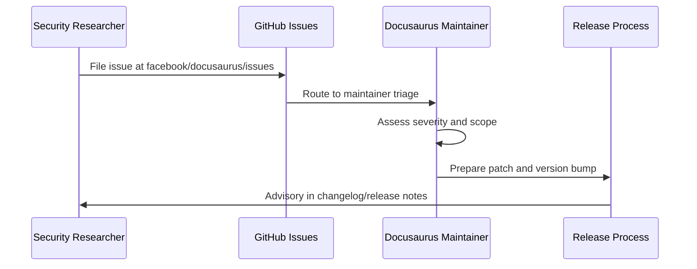
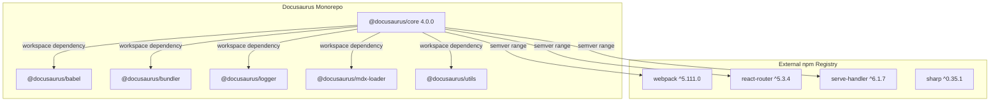

# Security frequently asked questions

Docusaurus is a static site generator with security properties driven by its dependency model, build pipeline, and operational posture. This FAQ answers the most common security questions from developers, site administrators, and security reviewers.

## How do I report a security vulnerability?

Docusaurus is maintained as an open-source project at`https://github.com/facebook/docusaurus.git` under the MIT license. The issue tracker at`https://github.com/facebook/docusaurus/issues` is the canonical public reporting channel.

The following diagram shows the reporting and triage flow:



For suspected vulnerabilities in dependencies rather than Docusaurus itself, check the maintainer advisory channels for the affected upstream package. Docusaurus follows the semver range constraints declared in each`package.json`.

## How does docusaurus manage dependencies?

Docusaurus is a pnpm workspace monorepo. The core package`@docusaurus/core` (version`4.0.0`) declares all internal packages with the`workspace:*` protocol, which pins them to the exact local monorepo versions. For example,`@docusaurus/core` depends on:

-`@docusaurus/babel` at`workspace:*`
-`@docusaurus/bundler` at`workspace:*`
-`@docusaurus/logger` at`workspace:*`
-`@docusaurus/mdx-loader` at`workspace:*`
-`@docusaurus/utils` at`workspace:*`
-`@docusaurus/utils-common` at`workspace:*`
-`@docusaurus/utils-validation` at`workspace:*`

This workspace protocol eliminates version drift between internal packages within a single monorepo checkout. External dependencies use semver ranges such as`^6.2.1` for`boxen`,`^3.6.0` for`chokidar`, and`^0.6.5` for`cli-table3`.

The trust boundary between the monorepo and external npm packages looks like this:



The`@docusaurus/lqip-loader` package follows the same model: it depends on`@docusaurus/logger` at`workspace:*` and on`sharp` at`^0.35.1`.

## Which Node.js version is required?

Both`@docusaurus/core` and`@docusaurus/lqip-loader` declare the same engine constraint:

```json
"engines": {
  "node": ">=24.21"
}
```

Node.js 24.21 or later is the minimum supported runtime. Older Node.js versions receive no security patch guarantees from the Docusaurus project.

## Are react and react DOM pinned?

Yes for the core package.`@docusaurus/core` declares React 19.3.0 as a peer dependency:

```json
"peerDependencies": {
  "react": "^19.3.0",
  "react-dom": "^19.3.0",
  "@mdx-js/react": "^3.1.1"
}
```

Installing Docusaurus alongside a significantly older React major, such as React 16.14.0, produces an incompatible dependency tree. The repository includes`admin/test-bad-package/package.json` precisely to reproduce this scenario:

```json
{
  "name": "test-bad-package",
  "version": "4.0.0",
  "private": true,
  "dependencies": {
    "@mdx-js/react": "1.0.1",
    "react": "16.14.0",
    "react-dom": "16.14.0"
  }
}
```

This fixture lets maintainers verify that React 16 builds fail or warn consistently. Site owners should run`pnpm install` with the React peer versions aligned to`^19.3.0` to avoid a broken or inconsistently patched dependency tree.

## Is docusaurus safe for production publishing?

The published npm packages are marked with public access:

```json
"publishConfig": {
  "access": "public"
}
```

Because Docusaurus generates static output, the production surface is limited to the built assets. There is no server-side runtime, no database, and no backend session store. Attack surface is concentrated at build time and in the resulting browser-side JavaScript and HTML.

The`@docusaurus/core` package publishes its CLI executable at`bin/docusaurus.mjs`, so the`docusaurus build`,`docusaurus start`, and`docusaurus serve` commands are the primary entry points that execute build-time code.

## How are deployment-related tokens handled?

The`website/package.json` file shows Netlify deployment pipelines that consume environment-scoped tokens for Crowdin localization. The relevant scripts are:

-`netlify:build:production`
-`netlify:crowdin:downloadTranslations`
-`netlify:crowdin:downloadTranslationsFailSafe`
-`netlify:crowdin:uploadSources`

The fail-safe script explicitly handles the absence of the Crowdin token for non-internal pull requests:

```
pnpm netlify:crowdin:wait && (pnpm --dir .. crowdin:download:website || echo 'Crowdin translation download failure (only internal PRs have access to the Crowdin env token)')
```

This confirms that Crowdin credentials are kept out of the repository and injected only through Netlify environment variables available to internal builds. Public pull requests that cannot access the token fall back to non-translated builds.

## What should I check before adding docusaurus to my project?

1. **Verify the Node.js runtime** meets the`>=24.21` engine constraint.
2. **Align React and React DOM** to`^19.3.0` and`@mdx-js/react` to`^3.1.1`.
3. **Pin lockfiles** with`pnpm-lock.yaml` and commit them to source control.
4. **Review third-party plugins** because any plugin that runs at build time executes trusted code on the build machine.
5. **Scan dependency trees** with a tool such as`npm audit`,`pnpm audit`, or an SBOM workflow.

## Does docusaurus collect usage telemetry?

No telemetry collection is present in the core package dependency manifest. The`@docusaurus/core` package declares dependencies for build tooling and serving, but nothing that sends analytics back to Facebook or the Docusaurus project. Third-party plugins and analytics integrations such as`@docusaurus/plugin-google-gtag` are opt-in and are declared as workspace dependencies only in the`website/package.json`.

## What is the supply chain security posture?

Docusaurus pins internal monorepo packages through pnpm workspace protocol and declares exact peer versions for React. External dependencies use semver ranges, so the lockfile is the authoritative supply chain record for resolution.

The package metadata hardcodes the repository location and the issue tracker:

```json
"repository": {
  "type": "git",
  "url": "https://github.com/facebook/docusaurus.git",
  "directory": "packages/docusaurus"
},
"bugs": {
  "url": "https://github.com/facebook/docusaurus/issues"
}
```

This metadata lets you trace every published package back to the source code and establish provenance through the GitHub repository.

## Related pages

- Security Policy
- Threat Assessment
- CycloneDX SBOM
- SPDX SBOM
- AI Bill of Materials
- System Requirements and Prerequisites