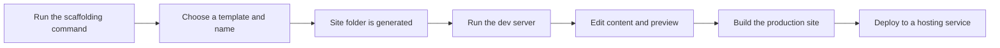
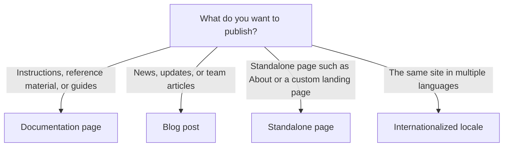

# Frequently asked questions

This FAQ answers common questions about setting up, customizing, building, and troubleshooting a Docusaurus site. If you are new to Docusaurus, start with the Getting Started guides before diving into the answers below.

## What is docusaurus?

Docusaurus is a tool that turns Markdown and React content into a fully static website. It is designed for documentation sites, but it also handles blogs, standalone pages, versioned content, and multi-language sites. You write your content as files, run a build command, and publish the output to any static hosting service.

For a full introduction to the concepts, see the Glossary of Terms.

## What do I need before I can use docusaurus?

You need Node.js version 24.21 or later and a package manager such as npm, yarn, or pnpm. There is no database to install and no backend server to configure. Docusaurus generates static HTML, CSS, and JavaScript that any static file host can serve.

For the complete list of requirements, see System Requirements and Prerequisites.

## How do I create a new site?

Run the scaffolding command from your terminal and answer a few prompts about your project name and template. The command produces a working site with sample documentation, a blog, and navigation already wired up.

For step-by-step instructions, see Installation and Site Creation and How to initialize a new Docusaurus project.

## Should I choose the classic or TypeScript template?

Both templates create the same site structure. The Classic template gives you a standard JavaScript project. The TypeScript template sets up TypeScript configuration and type checking from the start. Choose TypeScript if you plan to write React components or plugins in TypeScript; choose Classic for the simplest starting point.

For a detailed comparison, see How to choose between Classic and TypeScript templates.

## How do I preview my site while I write?

Run`docusaurus start` from your project folder. This launches a development server, opens your site in the browser, and reloads pages automatically when you edit content. Changes to Markdown, MDX, and React files appear nearly instantly.

To see the production build exactly as visitors will, run`docusaurus build` followed by`docusaurus serve`. The`start` command is for writing, while`serve` shows the final output.

For help reading the progress output, see How to view build progress and status messages.

## What kind of content can I create?

Three main content types are available:

### Documentation

Create a Markdown file (`.md`) or MDX file (`.mdx`) inside your`docs` folder. At the top of the file, include front matter with a title and sidebar position. The page appears in your documentation sidebar automatically.

For a first-page walkthrough, see Quick Start. For organizing documentation at scale, see Documentation.

### Blog

Add a Markdown file to your`blog` folder. The front matter sets the title, author, date, and tags. Blog posts automatically appear on the blog listing page and in the site RSS feed.

For the full scope of blogging features, see Blog and How to read blog posts.

### Standalone pages

For pages that do not fit the documentation structure, such as a landing page or an About page, use the`pages` folder. These pages can be MDX or React components.

For details, see Pages.

## How do I organize my documentation sidebar?

You have two options:

1. **Let Docusaurus generate the sidebar automatically** from your file structure.
2. **Define the sidebar manually** so you control exactly which pages appear and in what order.

For a step-by-step configuration walkthrough, see How to configure documentation sidebar and paths. To understand how visitors navigate the sidebar, see How to browse documentation by sidebar.

## How do I keep multiple versions of my documentation?

Docusaurus supports versioned documentation so you can maintain, for example, a version 1.0 and a version 2.0 side by side. Visitors switch between versions using a dropdown menu.

For the version model and how versions are labeled, see Versioning. For the visitor experience, see How to navigate versioned documentation sets.

## How do I translate my site?

Docusaurus supports internationalization, which means your content and interface can appear in multiple languages. You generate translation files with the`docusaurus write-translations` command, then maintain locale-specific versions of your pages.

For the overall approach, see Internationalization. For generating translation files, see Translation Extraction and How to generate translation files for localization.

## How do I add search?

Docusaurus provides a built-in search integration so visitors can find content across your documentation. The search bar is part of the site layout, and the underlying index is managed by a search provider.

For enabling and configuring search, see Search and How to search documentation content.

## How do I change how my site looks?

Themes control your site's appearance, navigation, and layout. The default theme includes light and dark modes and follows common documentation site conventions. You can customize the theme or replace parts of it with your own components.

For an overview of theming, see Themes.

## How do I extend docusaurus with plugins?

Plugins add features and change behavior. Docusaurus includes built-in plugins for blogs, documentation, standalone pages, redirects, and other needs. You can also install community plugins or write your own.

For how the plugin system works, see Plugins.

## How do I build and deploy my site?

1. Run`docusaurus build` to compile your site into a`build` folder containing static files.
2. Serve the`build` folder locally with`docusaurus serve` to verify what will be deployed.
3. Upload the`build` folder to any static hosting service, Netlify, Vercel, GitHub Pages, or a custom server.

For the complete build pipeline, see Site Building & Bundling and How to build production site.

## How do I make builds faster?

Several optimizations can reduce build time:

- Faster build mode
- The Rspack bundler as an alternative to the default
- SWC minification for JavaScript
- Lightning CSS minification for CSS
- Targeting modern browsers for smaller output bundles

For the full set of performance options, see Performance Optimization. For specific how-to guides, see How to use Rspack bundler for faster builds, How to enable faster build mode, How to use SWC minifier for JS, How to use Lightning CSS minifier for CSS, and How to target modern browsers for smaller bundles.

## How do I redirect broken or legacy links?

If you rename a page, retire content, or change your URL structure, you can add redirect rules so visitors and search engines automatically land on the correct page. Redirects can be created at build time or handled on the client side.

For step-by-step instructions, see Client-Side Redirects and How to redirect broken or legacy URLs.

## What is the difference between start, build, serve, and deploy?

| Command | Purpose |
|---------|---------|
|`docusaurus start` | Runs a local development server with live reload for writing and editing |
|`docusaurus build` | Compiles your content into static output files in the`build` folder |
|`docusaurus serve` | Serves the production`build` output locally for final verification |
|`docusaurus deploy` | Deploys the built site to a configured hosting target |

Each command is part of a single flow: write with`start`, verify with`build` and`serve`, then publish with`deploy`.

## I see warnings or errors during a build. what should I do?

Read the complete warning text first, Docusaurus often tells you exactly which setting or file needs attention. If the message is unclear, you can enable more detailed diagnostics to capture additional context.

For guidance, see How to receive warnings for configuration issues and How to debug errors with detailed context. To measure build performance and memory usage, see How to measure build performance and memory usage.

## Do I need a database or backend server?

No. Docusaurus builds a fully static site. All content lives as files in your project, and the build step transforms them into HTML, CSS, and JavaScript. You only need Node.js to build and any static file host to serve the result.

## Can I have documentation, a blog, and standalone pages in the same site?

Yes. The default site template includes all three. A single project can contain a`docs` folder for documentation, a`blog` folder for posts, and a`pages` folder for standalone pages. The navigation bar links to each section automatically.

## How do I write content with rich formatting?

Docusaurus supports Markdown and MDX. Markdown gives you headings, lists, tables, code blocks, images, and links. MDX adds the ability to embed interactive React components directly inside your content.

For authoring guidance, see MDX & Markdown Authoring and How to write Markdown content with front matter. For embedding React components, see How to embed interactive React components in MDX.

## How do I fix CSS or JavaScript bundle sizes?

If your production bundle feels large, you can:

- Minify CSS with the built-in CSS optimizer
- Remove unused custom CSS properties
- Minify JavaScript with SWC
- Target modern browsers to drop legacy compatibility code

For the full set of CSS controls, see CSS Optimization. For JavaScript, see How to minify JavaScript bundles. For CSS-specific how-to guides, see How to minify CSS assets for production, How to optimize CSS bundle size, and How to remove unnecessary custom properties from CSS.

## I am a TypeScript user. how do I avoid errors and get autocompletion?

Docusaurus provides TypeScript module aliases and generated types for themes and plugins. If you write custom React components or plugins in TypeScript, you can reference these types directly in your project for better editor support and fewer type errors.

For the available aliases, see TypeScript Module Aliases. For editor autocompletion, see [How to get autocompletion for
