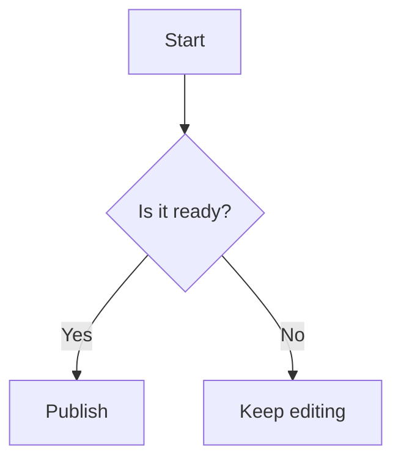

# How to render Mermaid diagrams

You can add diagrams to your documentation pages by writing Mermaid syntax inside a Markdown code block. Docusaurus automatically turns those code blocks into visual diagrams.

## Prerequisites

- You can edit the Markdown or MDX page where the diagram should appear
- Mermaid diagram support is already enabled for your site
- You know the basic Mermaid syntax for the type of diagram you want to create

## Add and render a Mermaid diagram

1. Open the Markdown or MDX file where you want the diagram to appear.
2. Place your cursor at the location where the diagram should be displayed.
3. Start a code block with three backticks followed by `mermaid`.
4. On the following lines, type your Mermaid diagram syntax.
5. Close the code block with three backticks.
6. Save the file.
7. Preview the page in your browser. The diagram appears as a rendered visual instead of raw code.

## Example

````markdown

````

This example renders a flowchart with a starting point, a decision, and two possible outcomes.

## Expected result

Your Mermaid code block appears as a rendered, interactive diagram on the page. The raw Mermaid text is not visible to readers.

## Common issues

- **The diagram shows as raw text.** Make sure the word `mermaid` appears immediately after the opening backticks, with no extra spaces and no misspelling.
- **The diagram is blank or shows an error.** Review your Mermaid syntax. Use node labels such as `A[Label]`, keep arrows correctly formed, and avoid spaces inside node identifiers.
- **The diagram looks correct locally but not on the published page.** Confirm the page was saved and rebuilt after your changes.
- **A more complex diagram is hard to read.** Use Mermaid formatting options such as node labels, subgraphs, or a different diagram direction to improve readability.