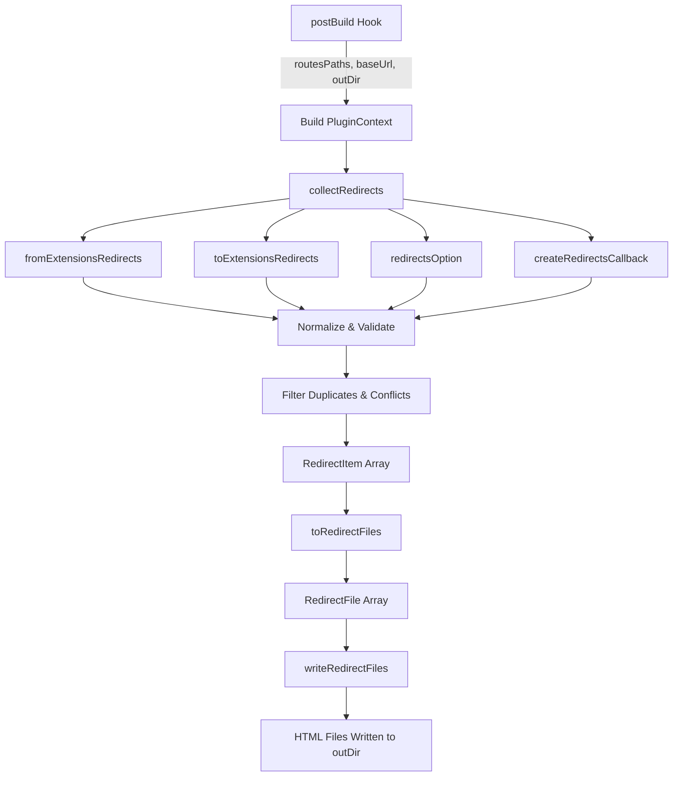

# Client-Side redirects internals

This document describes the modules, services, data flow, APIs, and extension points behind the Docusaurus client-side redirects plugin.

## Overview

The plugin is located at`packages/docusaurus-plugin-client-redirects/src/`. It runs in the`postBuild` lifecycle and generates static HTML redirect pages. Each generated page contains a small script that redirects the browser from a`from` pathname to an existing`to` pathname.

Core modules:

| Module | Responsibility |
| --- | --- |
|`index.ts` | Plugin entry point and`postBuild` orchestration |
|`options.ts` | User option validation and defaults |
|`types.ts` | Shared TypeScript types |
|`collectRedirects.ts` | Collect, normalize, validate, and filter redirects |
|`extensionRedirects.ts` | Generate redirects from file extensions |
|`redirectValidation.ts` | Validate a single redirect item |
|`createRedirectPageContent.ts` | Render the HTML content of a redirect page |
|`writeRedirectFiles.ts` | Convert redirect items to files and write them (not included in provided source) |

## Data flow

The following diagram shows the redirect generation workflow:



The workflow follows these steps:

1. Docusaurus calls the plugin after the site build completes.
2. The plugin builds a`PluginContext` from route paths, base URL, output directory, options, and site config.
3.`collectRedirects` creates redirect items from four sources:`fromExtensions`,`toExtensions`, the`redirects` option, and the`createRedirects` callback.
4. Collected redirects are normalized to apply trailing slash rules, validated, and filtered to remove duplicates and conflicts.
5.`toRedirectFiles` converts redirect items into file descriptors.
6.`writeRedirectFiles` writes the HTML files to the output directory.

## Key types

###`RedirectItem`

Defined in`packages/docusaurus-plugin-client-redirects/src/types.ts`:

```ts
export type RedirectItem = {
  /** Pathname of the new page we should create */
  from: string;
  /** Pathname of an existing Docusaurus page */
  to: string;
};
```

The`from` path is the file that will be created. The`to` path is an existing Docusaurus route that receives the redirect.

###`PluginContext`

Defined in the same file:

```ts
export type PluginContext = Pick<Props, 'outDir' | 'baseUrl' | 'siteConfig'> & {
  options: PluginOptions;
  relativeRoutesPaths: string[];
};
```

`relativeRoutesPaths` contains all existing route paths relative to`baseUrl`. For example, if`baseUrl` is`/docs/` and a route is`/docs/api/overview`, the relative path is`/api/overview`.

###`PluginOptions`

Defined in`options.ts`:

```ts
export type PluginOptions = {
  id: string;
  fromExtensions: string[];
  toExtensions: string[];
  redirects: RedirectOption[];
  createRedirects?: (path: string) => string[] | string | null | undefined;
};
```

`RedirectOption` is:

```ts
export type RedirectOption = {
  to: string;
  from: string | string[];
};
```

## Plugin entry point

File:`packages/docusaurus-plugin-client-redirects/src/index.ts`

The default export is the plugin factory:

```ts
export default function pluginClientRedirectsPages(
  context: LoadContext,
  options: PluginOptions,
): Plugin<void> | null
```

It reads the site's`trailingSlash` setting and the configured router:

```ts
const {trailingSlash} = context.siteConfig;
const router = context.siteConfig.future.experimental_router;

if (router === 'hash') {
  logger.warn(
    `${PluginName} does not support the Hash Router and will be disabled.`,
  );
  return null;
}
```

For non-hash router sites, it returns a plugin with a`postBuild` hook:

```ts
async postBuild(props) {
  const pluginContext: PluginContext = {
    relativeRoutesPaths: props.routesPaths.map(
      (path) => `${addLeadingSlash(removePrefix(path, props.baseUrl))}`,
    ),
    baseUrl: props.baseUrl,
    outDir: props.outDir,
    options,
    siteConfig: props.siteConfig,
  };

  const redirects: RedirectItem[] = collectRedirects(
    pluginContext,
    trailingSlash,
  );

  const redirectFiles: RedirectFile[] = toRedirectFiles(
    redirects,
    pluginContext,
    trailingSlash,
  );

  await writeRedirectFiles(redirectFiles);
}
```

The plugin exports validation and types:

```ts
export {validateOptions} from './options';
export type {PluginOptions, Options};
```

## Options validation

File:`packages/docusaurus-plugin-client-redirects/src/options.ts`

Default options:

```ts
export const DEFAULT_OPTIONS: Partial<PluginOptions> = {
  fromExtensions: [],
  toExtensions: [],
  redirects: [],
};
```

The validation schema uses Joi:

```ts
const UserOptionsSchema = Joi.object<PluginOptions>({
  fromExtensions: Joi.array()
    .items(isString)
    .default(DEFAULT_OPTIONS.fromExtensions),
  toExtensions: Joi.array()
    .items(isString)
    .default(DEFAULT_OPTIONS.toExtensions),
  redirects: Joi.array()
    .items(RedirectPluginOptionValidation)
    .default(DEFAULT_OPTIONS.redirects),
  createRedirects: Joi.function().maxArity(1),
}).default(DEFAULT_OPTIONS);
```

Each redirect option must have a valid`from` (string or array) and`to`:

```ts
const RedirectPluginOptionValidation = Joi.object<RedirectOption>({
  from: Joi.alternatives().try(
    PathnameSchema.required(),
    Joi.array().items(PathnameSchema.required()),
  ),
  to: Joi.string().required(),
});
```

The`createRedirects` callback is limited to one argument via`maxArity(1)`.

## Redirect collection

File:`packages/docusaurus-plugin-client-redirects/src/collectRedirects.ts`

The main function:

```ts
export default function collectRedirects(
  pluginContext: PluginContext,
  trailingSlash: boolean | undefined,
): RedirectItem[]
```

### Normalization

Before validation, every`to` value is normalized using the site's`trailingSlash` setting:

```ts
function normalizeRedirectTo(to: string) {
  return to.startsWith('/')
    ? applyTrailingSlash(to, {
        trailingSlash,
        baseUrl: pluginContext.baseUrl,
      })
    : to;
}
```

This allows site owners to toggle the global`trailingSlash` setting without updating every redirect option. For example, if`to: "/docs/api"` is specified and the site enables`trailingSlash: true`, it becomes`to: "/docs/api/"`.

### Redirect sources

Redirects are created from four sources and combined into a single array:

```ts
const redirects = [
  ...createFromExtensionsRedirects(
    pluginContext.relativeRoutesPaths,
    pluginContext.options.fromExtensions,
  ),
  ...createToExtensionsRedirects(
    pluginContext.relativeRoutesPaths,
    pluginContext.options.toExtensions,
  ),
  ...createRedirectsOptionRedirects(pluginContext.options.redirects),
  ...createCreateRedirectsOptionRedirects(
    pluginContext.relativeRoutesPaths,
    pluginContext.options.createRedirects,
  ),
].map((redirect) => ({
  ...redirect,
  to: normalizeRedirectTo(redirect.to),
}));
```

###`redirects` option

```ts
function createRedirectsOptionRedirects(
  redirectsOption: PluginOptions['redirects'],
): RedirectItem[] {
  function optionToRedirects(option: RedirectOption): RedirectItem[] {
    if (typeof option.from === 'string') {
      return [{from: option.from, to: option.to}];
    }
    return option.from.map((from) => ({from, to: option.to}));
  }

  return redirectsOption.flatMap(optionToRedirects);
}
```

Each`RedirectOption` maps either a single`from` path or multiple`from` paths to one`to` path.

###`createRedirects` callback

```ts
function createCreateRedirectsOptionRedirects(
  paths: string[],
  createRedirects: PluginOptions['createRedirects'],
): RedirectItem[] {
  function createPathRedirects(path: string): RedirectItem[] {
    const fromsMixed: string | string[] = createRedirects?.(path) ?? [];

    const froms: string[] =
      typeof fromsMixed === 'string' ? [fromsMixed] : fromsMixed;

    return froms.map((from) => ({from, to: path}));
  }

  return paths.flatMap(createPathRedirects);
}
```

For every existing route path, the callback receives the path and returns one path, an array of paths,`null`, or`undefined`. Each returned value becomes a`from` path that redirects to the original route. For example, if a path is`/api/v2/overview`, the callback might return`/api/v1/overview` to create a redirect from the old API version to the new one.

### Validation

After collection, each redirect is validated with`validateRedirect`. Invalid redirects cause an aggregate error:

```ts
if (redirectValidationErrors.length > 0) {
  throw new Error(
    `Some created redirects are invalid:\n- ${redirectValidationErrors.join('\n- ')}\n`,
  );
}
```

The function also verifies that every pathname-like`to` value points to an existing route. It builds`allowedToPaths` from`relativeRoutesPaths`, then maps redirect`to` values that start with`/` through`URL.parse` to extract and decode the pathname.

Trailing-slash mismatches are detected with`differByTrailSlash`. If a redirect target exists only with a different trailing slash and the site has an explicit`trailingSlash` setting, the plugin reports:

```
You are trying to create client-side redirections to invalid paths.

These paths do exist, but because you have explicitly set trailingSlash=true, 
you need to write the path with trailing slash:
- /docs/api
```

It distinguishes between trailing-slash issues and paths that do not exist at all.

### Filtering duplicate and conflicting redirects

```ts
function filterUnwantedRedirects(
  redirects: RedirectItem[],
  pluginContext: PluginContext,
): RedirectItem[]
```

The function groups redirects by`from`. If multiple redirects share the same`from`, it logs a duplicate route report:

```ts
logger.report(
  pluginContext.siteConfig.onDuplicateRoutes,
)`name=${'@docusaurus/plugin-client-redirects'}: multiple redirects are created with the same "from" pathname: path=${from}`;
```

It then deduplicates with`_.uniqBy` and removes any redirect whose`from` path already exists in`relativeRoutesPaths`:

```ts
const {false: newRedirects = [], true: redirectsOverridingExistingPath = []} =
  _.groupBy(collectedRedirects, (redirect) =>
    pluginContext.relativeRoutesPaths.includes(redirect.from),
  );
```

Redirects that would override existing pages are ignored and reported through`logger.report(siteConfig.onDuplicateRoutes)`.

## Extension redirects

File:`packages/docusaurus-plugin-client-redirects/src/extensionRedirects.ts`

Extension values are validated before use. An invalid extension throws an`Error` with a helpful message:

```ts
const ExtensionAdditionalMessage =
  'If the redirect extension system is not good enough for your use case, you can create redirects yourself with the "createRedirects" plugin option.';
```

`validateExtension` rejects:
- Empty extensions
- Extensions containing dots (`.`)
- Extensions containing slashes (`/`)
- Extensions with invalid URI characters

###`createToExtensionsRedirects`

For each existing route path ending with a configured extension, it creates a redirect from the same path without that extension:

```ts
export function createToExtensionsRedirects(
  paths: string[],
  extensions: string[],
): RedirectItem[] {
  extensions.forEach(validateExtension);

  const dottedExtensions = extensions.map(addLeadingDot);

  const createPathRedirects = (path: string): RedirectItem[] => {
    const extensionFound = dottedExtensions.find((ext) => path.endsWith(ext));
    if (extensionFound) {
      return [{from: removeSuffix(path, extensionFound), to: path}];
    }
    return [];
  };

  return paths.flatMap(createPathRedirects);
}
```

For example, if`toExtensions: ['html']` is configured and an existing route is`/page.html`, this creates a redirect from`/page` to`/page.html`.

###`createFromExtensionsRedirects`

For each existing route path that does not already end with a configured extension, it creates a redirect from a path with that extension:

```ts
export function createFromExtensionsRedirects(
  paths: string[],
  extensions: string[],
): RedirectItem[] {
  extensions.forEach(validateExtension);

  const dottedExtensions = extensions.map(addLeadingDot);

  const alreadyEndsWithAnExtension = (str: string) =>
    dottedExtensions.some((ext) => str.endsWith(ext));

  const createPathRedirects = (path: string): RedirectItem[] => {
    if (path === '' || path === '/' || alreadyEndsWithAnExtension(path)) {
      return [];
    }
    return extensions.map((ext) => ({
      from: path.endsWith('/')
        ? addTrailingSlash(`${removeTrailingSlash(path)}.${ext}`)
        : `${path}.${ext}`,
      to: path,
    }));
  };

  return paths.flatMap(createPathRedirects);
}
```

For example, if`fromExtensions: ['html']` is configured and an existing route is`/page/`, this creates a redirect from`/page.html/` to`/page/`. The code intentionally handles trailing slashes as described in Docusaurus issue #5055, where the filename pattern preserves trailing slash semantics during extension transformation.

## Redirect page content

File:`packages/docusaurus-plugin-client-redirects/src/createRedirectPageContent.ts`

The plugin uses the Eta template engine to render HTML redirect pages:

```ts
import {Eta} from 'eta';
import redirectPageTemplate from './templates/redirectPage.template.html';

const eta = new Eta();
```

The compiled template is memoized to avoid recompilation:

```ts
const getCompiledRedirectPageTemplate = _.memoize(() =>
  eta.compile(redirectPageTemplate.trim()),
);
```

`renderRedirectPageTemplate` passes two values to the template:

```ts
function renderRedirectPageTemplate(data: {
  toUrl: string;
  searchAnchorForwarding: boolean;
}) {
  const compiled = getCompiledRedirectPageTemplate();
  return eta.render(compiled, data);
}
```

The`searchAnchorForwarding` flag determines whether the redirect page should preserve the original page's query string and hash when redirecting. It is set to`true` only if the target URL doesn't already contain a query string or hash:

```ts
function searchAnchorForwarding(toUrl: string): boolean {
  const url = URL.parse(toUrl, 'https://example.com');
  if (url === null) {
    return false;
  }
  const containsSearchOrAnchor = url.search || url.hash;
  return !containsSearchOrAnchor;
}
```

The exported function encodes the target URL before rendering:

```ts
export default function createRedirectPageContent({
  toUrl,
}: {
  toUrl: string;
}): string {
  return renderRedirectPageTemplate({
    toUrl: encodeURI(toUrl),
    searchAnchorForwarding: searchAnchorForwarding(toUrl),
  });
}
```

The HTML template file (`templates/redirectPage.template.html`) is not included in the provided source bundle but is imported and used to generate the actual redirect HTML.

## Redirect validation module

File:`packages/docusaurus-plugin-client-redirects/src/redirectValidation.ts`

Each redirect item is validated against a Joi schema:

```ts
const RedirectSchema = Joi.object<RedirectItem>({
  from: PathnameSchema.required(),
  to: Joi.string().required(),
});
```

The`validateRedirect` function validates with strict options:

```ts
export function validateRedirect(redirect: RedirectItem): void {
  const {error} = RedirectSchema.validate(redirect, {
    abortEarly: true,
    convert: false,
  });

  if (error) {
    throw new Error(
      `${JSON.stringify(redirect)} => Validation error: ${error.message}`,
    );
  }
}
```

Setting`convert: false` ensures values are not coerced or transformed. The error includes the full redirect object so the user can identify the failing entry.

## Write redirect files API contract

The implementation file`writeRedirectFiles.ts` is not included in the provided source bundle. Based on call sites in`index.ts`, it exports:

```ts
export function toRedirectFiles(
  redirects: RedirectItem[],
  pluginContext: PluginContext,
  trailingSlash: boolean | undefined,
): RedirectFile[];

export default function writeRedirectFiles(
  redirectFiles: RedirectFile[],
): Promise<void>;

export type RedirectFile = unknown;
```

The`toRedirectFiles` function converts in-memory`RedirectItem` objects into file descriptors (of type`RedirectFile`) that specify the output paths and content. The`writeRedirectFiles` function takes those descriptors and writes the HTML redirect files to disk asynchronously.

## Extension points

The plugin offers four main extension points through its options:

1. **`redirects` option**, Declare static redirects, each mapping one or more`from` paths to one`to` path. Use when you have a known set of URL changes.

2. **`createRedirects` callback**, Generate dynamic redirects for every existing route path. Return`null`,`undefined`, a string, or an array of strings. Use for programmatic redirect generation, such as handling version migrations or path transformations.

3. **`fromExtensions`**, Create paths with an appended extension that redirect to extensionless paths. For example,`fromExtensions: ['html']` redirects`/page.html` to`/page`.

4. **`toExtensions`**, Create extensionless paths that redirect to paths with an extension. For example,`toExtensions: ['html']` redirects`/page` to`/page.html`.

The global Docusaurus`trailingSlash` site configuration automatically normalizes all pathname-like`to` values, so you don't need to update your redirects when toggling trailing slash behavior.

## Error handling and reporting

The plugin implements several error-handling strategies:

**Validation errors:** Validation errors from`validateRedirect` are aggregated and thrown as a single`Error` with all failures listed:

```
Some created redirects are invalid:
- {"from":"/old","to":"invalid"} => Validation error: ...
- ...
```

**Invalid target paths:** Redirect targets are checked against existing routes. If a target doesn't exist or differs only in trailing slash, an error lists the problems:

```
You are trying to create client-side redirections to invalid paths.

These paths do exist, but because you have explicitly set trailingSlash=true,
you need to write the path with trailing slash:
- /docs/api

These paths are redirected to but do not exist:
- /nonexistent
```

**Duplicate and conflicting redirects:** Duplicate`from` paths and redirects that would override existing pages are reported through`logger.report(siteConfig.onDuplicateRoutes)` and ignored (not written to disk).

**Hash router:** When the site uses hash routing (detected via`context.siteConfig.future.experimental_router === 'hash'`), the plugin logs a warning and disables itself by returning`null`:

```
@docusaurus/plugin-client-redirects: does not support the Hash Router 
and will be disabled.
```

## Source references

-`packages/docusaurus-plugin-client-redirects/src/index.ts`, Plugin entry point
-`packages/docusaurus-plugin-client-redirects/src/options.ts`, Options validation
-`packages/docusaurus-plugin-client-redirects/src/types.ts`, Type definitions
-`packages/docusaurus-plugin-client-redirects/src/collectRedirects.ts`, Redirect collection and validation
-`packages/docusaurus-plugin-client-redirects/src/extensionRedirects.ts`, Extension-based redirect generation
-`packages/docusaurus-plugin-client-redirects/src/redirectValidation.ts`, Single redirect validation
-`packages/docusaurus-plugin-client-redirects/src/createRedirectPageContent.ts`, HTML template rendering

## Related documentation

- Client-Side Redirects, Feature overview and usage guide
- How to redirect broken or legacy URLs, Configuration examples
- How to handle page renames without 404s, Practical redirect scenarios