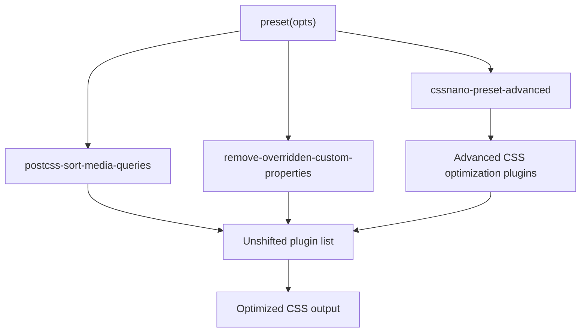
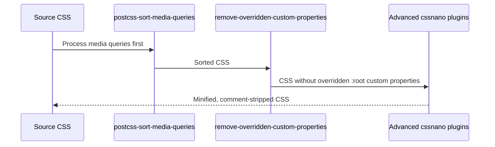

# CSS optimization internals

CSS optimization in Docusaurus is implemented in the`packages/docusaurus-cssnano-preset` package. The package provides a custom cssnano preset that wraps`cssnano-preset-advanced` and adds two PostCSS plugins for media query sorting and removal of overridden custom properties.

## Package layout

| Path | Purpose |
| --- | --- |
|`packages/docusaurus-cssnano-preset/src/index.ts` | Defines and exports the cssnano preset |
|`packages/docusaurus-cssnano-preset/src/deps.d.ts` | Declares the type for`postcss-sort-media-queries` |
|`packages/docusaurus-cssnano-preset/src/remove-overridden-custom-properties/index.ts` | Custom PostCSS plugin for removal of overridden`:root` custom properties |
|`packages/docusaurus-cssnano-preset/src/remove-overridden-custom-properties/__tests__` | Tests for the custom property removal plugin |

## Architecture

The exported preset builds on`cssnano-preset-advanced`, applies Docusaurus-specific defaults, and prepends two custom plugins. The preset function defined in`packages/docusaurus-cssnano-preset/src/index.ts` takes optional configuration and returns a PostCSS plugin list:

```ts
const preset: typeof advancedBasePreset = function preset(opts) {
  const advancedPreset = advancedBasePreset({
    autoprefixer: {add: false},
    discardComments: {removeAll: true},
    reduceIdents: {counter: false},
    zindex: false,
    ...opts,
  });

  advancedPreset.plugins.unshift(
    [postCssSortMediaQueries, undefined],
    [postCssRemoveOverriddenCustomProperties, undefined],
  );

  return advancedPreset;
};
```

The following diagram shows how the preset components compose into a processing pipeline:



## Preset defaults

The preset applies the following defaults to`advancedBasePreset` before applying the caller-provided`opts`:

| Option | Value | Effect |
| --- | --- | --- |
|`autoprefixer` |`{add: false}` | Does not add vendor prefixes |
|`discardComments` |`{removeAll: true}` | Removes all CSS comments |
|`reduceIdents` |`{counter: false}` | Does not reduce CSS counters, avoiding a CodeBlock custom line number issue (see pull request #11487) |
|`zindex` |`false` | Does not rebase`z-index` values |

Because`...opts` is spread after the defaults, callers can override any of these settings.

## Processing pipeline

The final PostCSS plugin order after the calls to`unshift` is:

1.`postcss-sort-media-queries`, sorts media queries in CSS
2.`remove-overridden-custom-properties`, removes duplicate custom properties from`:root`
3. The plugins provided by`cssnano-preset-advanced`, applies minification, comment stripping, and other advanced optimizations



## remove-overridden-custom-properties plugin

The plugin is defined in`packages/docusaurus-cssnano-preset/src/remove-overridden-custom-properties/index.ts`.

It is a PostCSS plugin whose`postcssPlugin` identifier is`postcss-remove-overridden-custom-properties`. The plugin is marked as a PostCSS plugin with:

```ts
creator.postcss = true as const;
```

The plugin only processes declarations whose parent is a PostCSS`Rule` with the exact selector`:root`:

```ts
if (!isRule(decl.parent) || decl.parent.selector !== ':root') {
  return;
}
```

Despite the plugin name, the implementation matches any repeated property in`:root`, not only properties starting with`--`. It is intended for custom properties while being implemented as a general repeated-property removal for`:root`.

### Removal behavior

For each declaration in`:root`, the plugin finds all other declarations with the same`prop` name:

```ts
const sameProperties = decl.parent.nodes.filter(
  (n) => 'prop' in n && n.prop === decl.prop,
);
```

The removal behavior depends on whether any duplicate declaration has`!important`:

- If none of the duplicate declarations have`!important`, all except the last are removed.
- If at least one duplicate declaration has`!important`, all declarations without`!important` are removed.

```ts
const hasImportantProperties = sameProperties.some(
  (p) => 'important' in p,
);

const overriddenProperties = hasImportantProperties
  ? sameProperties.filter((p) => !('important' in p))
  : sameProperties.slice(0, -1);

overriddenProperties.map((p) => p.remove());
```

For example, given:

```css
:root {
  --color: red;
  --color: blue;
  --size: 1px;
  --size: 2px !important;
}
```

The plugin removes`--color: red` because the last`--color` without`!important` wins. It also removes`--size: 1px` because a same-named property with`!important` exists.

## Type declaration for postcss-sort-media-queries

`postcss-sort-media-queries` does not ship its own TypeScript types in this package. The declaration is provided locally in`packages/docusaurus-cssnano-preset/src/deps.d.ts`:

```ts
declare module 'postcss-sort-media-queries' {
  const plugin: import('postcss').PluginCreator<object>;
  export default plugin;
}
```

This declares the module as a PostCSS`PluginCreator` accepting an`object` options parameter.

## Extension points

- **Preset options** —`preset(opts)` accepts the options of`cssnano-preset-advanced`. Because`...opts` is applied after Docusaurus defaults, callers can override`autoprefixer`,`discardComments`,`reduceIdents`, and`zindex`.
- **Custom removal plugin** —`remove-overridden-custom-properties` is a standalone PostCSS plugin and can be imported independently for use in another PostCSS pipeline.
- **Plugin ordering**, The preset prepends both custom plugins to the front of the advanced preset plugin list via`unshift`, making their execution order fixed relative to the bundled cssnano plugins.

## Related

- CSS Optimization feature overview
- How to minify CSS assets for production
- How to optimize CSS bundle size
- How to remove unnecessary custom properties from CSS