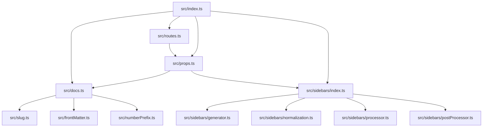
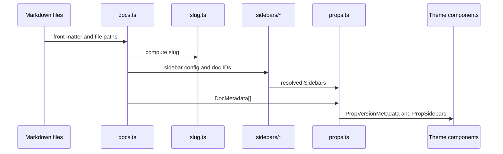
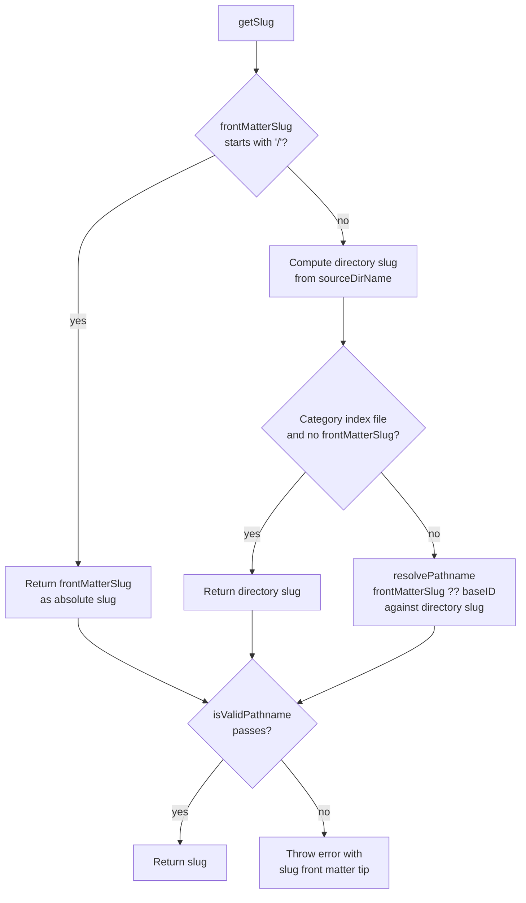
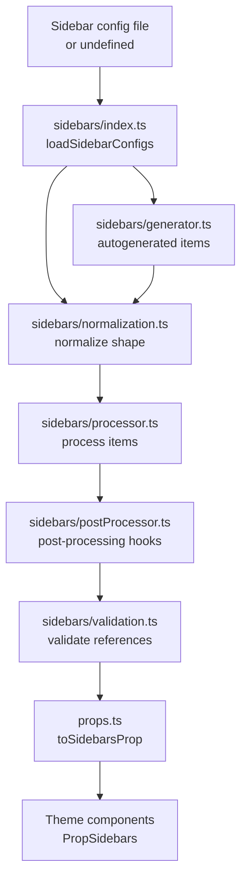

# Documentation internals

This reference covers the internal modules, data flow, and extension points of the`@docusaurus/plugin-content-docs` package. The package is implemented under`packages/docusaurus-plugin-content-docs/src` and turns Markdown files plus sidebar configuration into versioned, routable documentation content.

Source paths in this document are relative to the repository root and use the`main` branch.

---

## Module map

The plugin has three main areas: server-side processing modules, client-side React modules, and a sidebar subsystem. The following architecture diagram shows the primary relationships.



### Server-side core modules

| File | Responsibility |
| --- | --- |
|`packages/docusaurus-plugin-content-docs/src/index.ts` | Plugin entry point, exports`pluginContentDocs` and`validateOptions` |
|`packages/docusaurus-plugin-content-docs/src/docs.ts` | Doc loading and metadata creation |
|`packages/docusaurus-plugin-content-docs/src/routes.ts` | Route configuration generation |
|`packages/docusaurus-plugin-content-docs/src/props.ts` | Conversion of loaded content into component props |
|`packages/docusaurus-plugin-content-docs/src/options.ts` | Option schema and validation |
|`packages/docusaurus-plugin-content-docs/src/translations.ts` | Translation data collection |
|`packages/docusaurus-plugin-content-docs/src/globalData.ts` | Global data generation |
|`packages/docusaurus-plugin-content-docs/src/slug.ts` | Slug computation from path and front matter |
|`packages/docusaurus-plugin-content-docs/src/numberPrefix.ts` | Number prefix parsing |
|`packages/docusaurus-plugin-content-docs/src/frontMatter.ts` | Doc front matter validation |
|`packages/docusaurus-plugin-content-docs/src/contentHelpers.ts` | Shared content helper functions |
|`packages/docusaurus-plugin-content-docs/src/categoryGeneratedIndex.ts` | Category index page generation |
|`packages/docusaurus-plugin-content-docs/src/constants.ts` | Path and version constants |
|`packages/docusaurus-plugin-content-docs/src/server-export.ts` | Undocumented Node.js-facing APIs for third-party plugins |
|`packages/docusaurus-plugin-content-docs/src/types.ts` | Version tag and global data types |
|`packages/docusaurus-plugin-content-docs/src/cli.ts` | CLI integration |

### Client-side modules

| File | Responsibility |
| --- | --- |
|`packages/docusaurus-plugin-content-docs/src/client/docsSearch.ts` | Contextual search tags and version filtering |
|`packages/docusaurus-plugin-content-docs/src/client/docsSidebar.tsx` | Sidebar React context provider and hook |

The`client/docsSearch.ts` module exports the search tag utilities.`getDocsVersionSearchTag` creates a versioned search identifier in the form`docs-{pluginId}-{versionName}`. The`useDocsContextualSearchTags` hook computes relevant search tags based on the user's current browsing context, falling back to the preferred or latest version for plugins the user hasn't explicitly visited.

The`client/docsSidebar.tsx` module provides the`DocsSidebarProvider` and`useDocsSidebar` hook for managing sidebar state.`DocsSidebarProvider` wraps children with sidebar context, using a context value only when both name and items are defined.`useDocsSidebar` returns the current sidebar or`null` if no sidebar is active, and throws a`ReactContextError` if called outside a provider.

### Sidebar subsystem

| File | Responsibility |
| --- | --- |
|`packages/docusaurus-plugin-content-docs/src/sidebars/index.ts` | Sidebar loading entry point |
|`packages/docusaurus-plugin-content-docs/src/sidebars/generator.ts` | Autogenerated sidebar generation |
|`packages/docusaurus-plugin-content-docs/src/sidebars/normalization.ts` | Sidebar item normalization |
|`packages/docusaurus-plugin-content-docs/src/sidebars/validation.ts` | Sidebar shape validation |
|`packages/docusaurus-plugin-content-docs/src/sidebars/processor.ts` | Sidebar processing pipeline |
|`packages/docusaurus-plugin-content-docs/src/sidebars/postProcessor.ts` | Post-processing hooks |
|`packages/docusaurus-plugin-content-docs/src/sidebars/utils.ts` | Sidebar helper utilities |
|`packages/docusaurus-plugin-content-docs/src/sidebars/types.ts` | Sidebar type definitions |

### Version handling

The`src/versions` directory contains version-specific logic.`src/server-export.ts` re-exports the following version helpers:

-`filterVersions`
-`getDefaultVersionBanner`
-`getVersionBadge`
-`getVersionBanner`
-`readVersionNames`

---

## Public API surface

The public typings are declared in`plugin-content-docs.d.ts`, which augments the`@docusaurus/plugin-content-docs` module.

### Plugin function

```ts
export default function pluginContentDocs(
  context: LoadContext,
  options: PluginOptions,
): Promise<Plugin<LoadedContent>>;
```

### Options validation

```ts
export function validateOptions(
  args: OptionValidationContext<Options | undefined, PluginOptions>,
): PluginOptions;
```

### Option groups

`PluginOptions` combines the following option groups:

```ts
export type PluginOptions = MetadataOptions &
  PathOptions &
  VersionsOptions &
  MDXOptions &
  SidebarOptions & {
    id: string;
    include: string[];
    exclude: string[];
    docsRootComponent: string;
    docVersionRootComponent: string;
    docRootComponent: string;
    docItemComponent: string;
    docTagDocListComponent: string;
    docTagsListComponent: string;
    docCategoryGeneratedIndexComponent: string;
    sidebarItemsGenerator: import('./sidebars/types').SidebarItemsGeneratorOption;
    tagsBasePath: string;
  };
```

The user-facing`Options` type is a partial version of`PluginOptions` with one override:

```ts
export type Options = Partial<
  Overwrite<
    PluginOptions,
    {
      numberPrefixParser: PluginOptions['numberPrefixParser'] | boolean;
    }
  >
>;
```

In other words,`numberPrefixParser` accepts`boolean` in user options but resolves to a`NumberPrefixParser` function in`PluginOptions`.

### Metadata options

`MetadataOptions` includes doc routing, editing, display options, and tag configuration:

```ts
export type MetadataOptions = TagsPluginOptions & {
  routeBasePath: string;
  editUrl?: string | EditUrlFunction;
  editCurrentVersion: boolean;
  editLocalizedFiles: boolean;
  showLastUpdateTime: boolean;
  showLastUpdateAuthor: boolean;
  numberPrefixParser: NumberPrefixParser;
  breadcrumbs: boolean;
};
```

The`editUrl` function receives version, locale, and document information:

```ts
export type EditUrlFunction = (editUrlParams: {
  version: string;
  versionDocsDirPath: string;
  docPath: string;
  permalink: string;
  locale: string;
}) => string | undefined;
```

### Path options

```ts
export type PathOptions = {
  path: string;
  sidebarPath?: string | false | undefined;
};
```

`sidebarPath: false` disables sidebars, and`sidebarPath: undefined` creates a fully autogenerated sidebar.

### Version options

```ts
export type VersionOptions = {
  path?: string;
  label?: string;
  banner?: 'none' | VersionBanner;
  badge?: boolean;
  noIndex?: boolean;
  className?: string;
};

export type VersionsOptions = {
  lastVersion?: string;
  onlyIncludeVersions?: string[];
  disableVersioning: boolean;
  includeCurrentVersion: boolean;
  versions: {[versionName: string]: VersionOptions};
};
```

`VersionBanner` is the union type`'unreleased' | 'unmaintained'`. A banner value of`'none'` normalizes to`null` in the resolved metadata.

### Sidebar options

```ts
export type SidebarOptions = {
  sidebarCollapsible: boolean;
  sidebarCollapsed: boolean;
};
```

### Number prefix parsing

The default parser is`DefaultNumberPrefixParser` from`src/numberPrefix.ts`. A custom parser has this signature:

```ts
export type NumberPrefixParser = (filename: string) => {
  filename: string;
  numberPrefix?: number;
};
```

Users can set`numberPrefixParser` to`true`,`false`, or a custom function.`validateOptions` normalizes the user value into the function shape used internally.

---

## Content loading and data flow

The package loads docs content, computes metadata, resolves sidebars, and converts the server-side result into client-facing props.



### Loaded content

The server-side plugin result uses`LoadedContent`:

```ts
export type LoadedContent = {
  loadedVersions: LoadedVersion[];
};
```

Each`LoadedVersion` includes version metadata, all loaded docs, draft docs, and resolved sidebars:

```ts
export type LoadedVersion = VersionMetadata & {
  docs: DocMetadata[];
  drafts: DocMetadata[];
  sidebars: import('./sidebars/types').Sidebars;
};
```

### Version metadata

`VersionMetadata` combines`ContentPaths` with version-specific information:

```ts
export type VersionMetadata = ContentPaths & {
  versionName: string;
  label: string;
  path: string;
  tagsPath: string;
  editUrl?: string | undefined;
  editUrlLocalized?: string | undefined;
  banner: VersionBanner | null;
  badge: boolean;
  noIndex: boolean;
  className: string;
  isLast: boolean;
  sidebarFilePath: string | false | undefined;
  routePriority: number | undefined;
};
```

The`routePriority` is`-1` for the latest docs version and`undefined` for older versions, ensuring the latest version sorts after versioned routes.

### Doc metadata shape

`DocMetadataBase` is the foundation:

```ts
export type DocMetadataBase = LastUpdateData & {
  id: string;
  version: string;
  title: string;
  description: string;
  source: string;
  sourceDirName: string;
  slug: string;
  permalink: string;
  draft: boolean;
  unlisted: boolean;
  sidebarPosition?: number;
  editUrl?: string | null;
  tags: TagMetadata[];
  frontMatter: DocFrontMatter & {[key: string]: unknown};
};
```

`DocMetadata` adds navigation and sidebar association:

```ts
export type DocMetadata = DocMetadataBase &
  PropNavigation & {
    sidebar?: string;
  };
```

Navigation is a pair of lightweight links:

```ts
export type PropNavigationLink = {
  readonly title: string;
  readonly permalink: string;
};

export type PropNavigation = {
  readonly previous?: PropNavigationLink;
  readonly next?: PropNavigationLink;
};
```

`PropNavigationLink` is a subset of another doc's metadata. Previous and next can be explicitly disabled through a doc's`pagination_prev` or`pagination_next` front matter by setting either to`null`.

### Front matter

Doc front matter is typed as`DocFrontMatter`:

```ts
export type DocFrontMatter = {
  id?: string;
  title?: string;
  tags?: FrontMatterTag[];
  hide_title?: boolean;
  hide_table_of_contents?: boolean;
  keywords?: string[];
  image?: string;
  description?: string;
  slug?: string;
  sidebar_key?: string;
  sidebar_label?: string;
  sidebar_position?: number;
  sidebar_class_name?: string;
  sidebar_custom_props?: {[key: string]: unknown};
  displayed_sidebar?: string | null;
  pagination_label?: string;
  custom_edit_url?: string | null;
  parse_number_prefixes?: boolean;
  toc_min_heading_level?: number;
  toc_max_heading_level?: number;
  pagination_next?: string | null;
  pagination_prev?: string | null;
  draft?: boolean;
  unlisted?: boolean;
  last_update?: FrontMatterLastUpdate;
};
```

Important behaviors controlled by these fields include:

-`sidebar_label`,`sidebar_class_name`, and`sidebar_custom_props` override sidebar config values
-`displayed_sidebar: null` disassociates a doc from all sidebars
-`draft` excludes the doc from production builds
-`unlisted` keeps the doc accessible by direct URL but hides it from the sidebar and pagination in production
-`pagination_next: null` or`pagination_prev: null` disables the corresponding pagination direction
-`hide_title` prevents the front matter title from rendering if no h1 heading exists in the document
-`hide_table_of_contents` hides the right-side TOC navigation
-`toc_min_heading_level` and`toc_max_heading_level` control which headings appear in the TOC (between 2 and 6)

### Assets

The`Assets` type captures document-specific asset references:

```ts
export type Assets = {
  image?: string;
};
```

---

## Slug computation

Slug generation is centralized in`packages/docusaurus-plugin-content-docs/src/slug.ts` and exported as the default function`getSlug`.

```ts
export default function getSlug({
  baseID,
  frontMatterSlug,
  source,
  sourceDirName,
  stripDirNumberPrefixes = true,
  numberPrefixParser = DefaultNumberPrefixParser,
}: {
  baseID: string;
  frontMatterSlug?: string;
  source: DocMetadataBase['source'];
  sourceDirName: DocMetadataBase['sourceDirName'];
  stripDirNumberPrefixes?: boolean;
  numberPrefixParser?: NumberPrefixParser;
}): string;
```

This diagram shows the slug resolution logic:



Resolution order:

1. If`frontMatterSlug` starts with`/`, return it as an absolute slug.
2. Compute the directory slug from`sourceDirName`, optionally stripping number prefixes with`stripPathNumberPrefixes`.
3. If there is no`frontMatterSlug` and the source is a category index (matched by`isCategoryIndex`), use the directory slug.
4. Otherwise, resolve`frontMatterSlug ?? baseID` against the directory slug with`resolvePathname`.

Before returning, the slug is validated with`isValidPathname`. A failure throws an error that suggests setting a custom`slug` front matter value.

---

## Sidebar processing

The`src/sidebars` folder implements the full sidebar lifecycle:

1. The sidebar config is loaded by`sidebars/index.ts`.
2. Autogenerated sidebar items can be produced by`generator.ts`.
3. Items are normalized into a consistent internal shape by`normalization.ts`.
4. Items pass through`processor.ts` and`postProcessor.ts`.
5.`validation.ts` catches invalid references early.



### Sidebar config type

The public`SidebarsConfig` type is re-exported from the plugin:

```ts
export type SidebarsConfig = import('./sidebars/types').SidebarsConfig;
```

### Converting sidebars to props

`packages/docusaurus-plugin-content-docs/src/props.ts` converts server-side sidebars and docs into`PropSidebars` for React themes. The`toSidebarsProp` function is the main conversion entry point:

```ts
export function toSidebarsProp(
  loadedVersion: Pick<LoadedVersion, 'docs' | 'sidebars'>,
): PropSidebars;
```

The conversion logic:

- Builds a`docsById` index using`createDocsByIdIndex`
- Throws when a sidebar references a missing doc ID
- Transforms sidebar items by converting`doc` and`ref` entries to`link` items with resolved permalinks
- Converts`category` items recursively, pulling in href and custom properties from linked documents
- Normalizes all items to either`link` or`category` types

Related helper functions in`props.ts`:

```ts
export function toSidebarDocItemLinkProp({
  item,
  doc,
}: {
  item: SidebarItemDoc;
  doc: Pick<
    DocMetadata,
    'id' | 'title' | 'permalink' | 'unlisted' | 'frontMatter'
  >;
}): PropSidebarItemLink;
```

This function creates a`PropSidebarItemLink` by merging sidebar config with doc front matter, prioritizing front matter values for label, class name, and custom properties.

```ts
export function toVersionMetadataProp(
  pluginId: string,
  loadedVersion: LoadedVersion,
): PropVersionMetadata;
```

This function produces`PropVersionMetadata` combining version information with resolved sidebars and docs.

---

## Category generated index

The`categoryGeneratedIndex.ts` module handles the automatic generation of index pages for sidebar categories. A category can define a`link` with type`'generated-index'`, which creates a page that lists all documents in that category.

```ts
export type CategoryGeneratedIndexMetadata = Required<
  Omit<
    import('./sidebars/types').SidebarItemCategoryLinkGeneratedIndex,
    'type'
  >,
  'title'
> & {
  navigation: PropNavigation;
  sidebar: string;
};
```

The metadata includes navigation links (previous and next docs) and the sidebar name. This metadata is passed to the`DocCategoryGeneratedIndexPage` theme component.

---

## Theme component contracts

The plugin declares module augmentations for theme components that consume the plugin's data.

### DocItem

`@theme/DocItem` receives a route and doc content:

```ts
declare module '@theme/DocItem' {
  export type DocumentRoute = {
    readonly component: () => ReactNode;
    readonly exact: boolean;
    readonly path: string;
    readonly sidebar?: string;
  };

  export interface Props {
    readonly route: DocumentRoute;
    readonly content: PropDocContent;
  }
}
```

`PropDocContent` is the loaded MDX content with doc front matter and metadata.

### DocCategoryGeneratedIndexPage

This component receives a category generated index:

```ts
declare module '@theme/DocCategoryGeneratedIndexPage' {
  export interface Props {
    readonly categoryGeneratedIndex: PropCategoryGeneratedIndex;
  }
}
```

### DocTagsListPage

This component displays all available tags:

```ts
declare module '@theme/DocTagsListPage' {
  export interface Props extends PropTagsListPage {}
}
```

`PropTagsListPage` contains an array of`TagsListItem` objects with label, permalink, description, and count.

### DocTagDocListPage

This component displays documents with a specific tag:

```ts
declare module '@theme/DocTagDocListPage' {
  export interface Props {
    readonly tag: PropTagDocList;
  }
}
```

`PropTagDocList` includes tag metadata and a list of documents (`PropTagDocListDoc`).

### Root layout components

Three layout wrapper components manage the hierarchy:

-`@theme/DocsRoot`, wraps all docs plugin pages
-`@theme/DocVersionRoot`, wraps pages of a specific version, receives`PropVersionMetadata`
-`@theme/DocRoot`, wraps regular doc pages with sidebars

---

## Extension points

### Sidebar items generator

The`sidebarItemsGenerator` option accepts a custom function that produces sidebar items from the file system:

```ts
export type SidebarItemsGeneratorOption = (context: {
  version: VersionMetadata;
  docs: DocMetadata[];
  // ... other context
}) => SidebarItem[];
```

This allows developers to implement custom sidebar generation strategies beyond the built-in autogeneration.

### Sidebar post-processor

The`postProcessor.ts` module applies post-processing hooks to the normalized sidebar structure, enabling transformations after validation.

### Number prefix parser

By setting`numberPrefixParser` to a custom function, developers can implement custom rules for extracting numeric prefixes from filenames:

```ts
numberPrefixParser: (filename: string) => ({
  filename: string;
  numberPrefix?: number;
})
```

---

## Server exports

The`server-export.ts` file re-exports undocumented but stable APIs intended for third-party plugins:

```ts
export {
  CURRENT_VERSION_NAME,
  VERSIONED_DOCS_DIR,
  VERSIONED_SIDEBARS_DIR,
  VERSIONS_JSON_FILE,
} from './constants';

export {
  filterVersions,
  getDefaultVersionBanner,
  getVersionBadge,
  getVersionBanner,
} from './versions/version';

export {readVersionNames} from './versions/files';
```

These exports are stable against breaking changes within a major version.

---

## Related documentation

For user-facing guidance on the documentation plugin, see the Documentation Plugin feature documentation.

For client-side hook usage and search integration, refer to MDX Content Loading.

For related plugin internals, see the Blog Internals and Site Building & Bundling Internals.