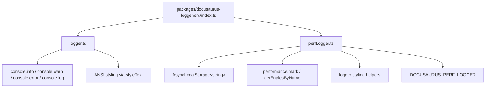
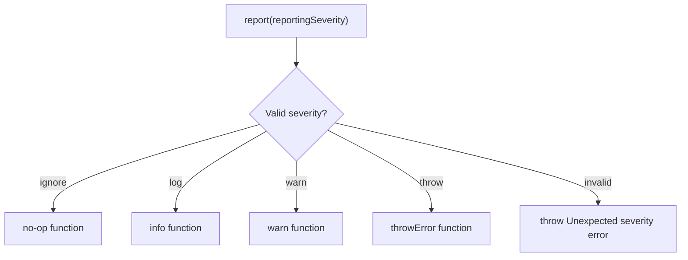
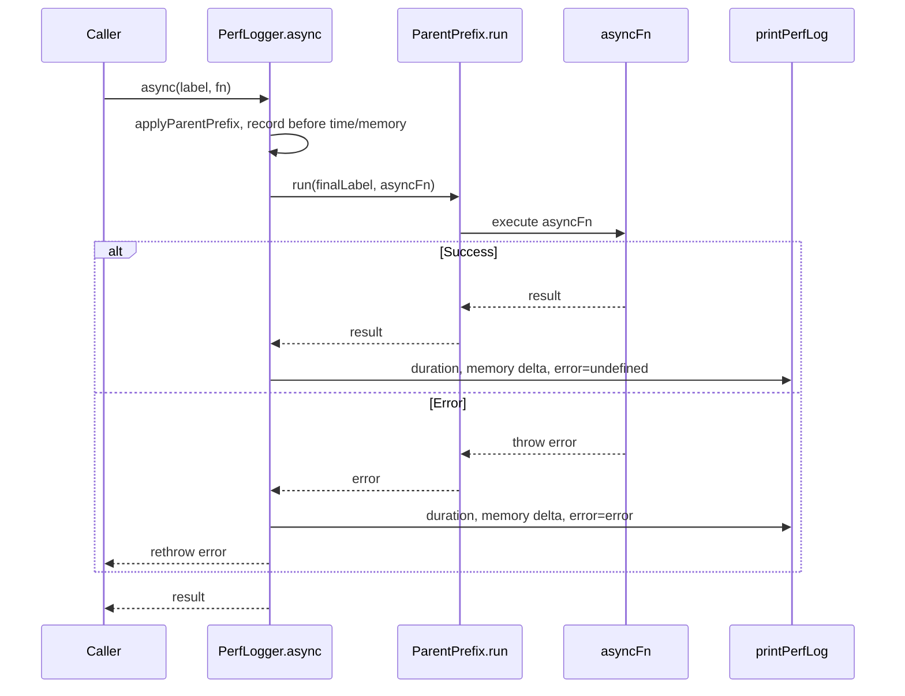
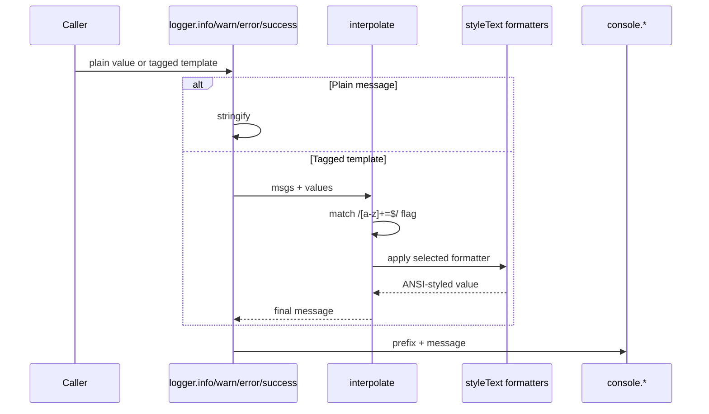

# Logging and diagnostics internals

This page describes the implementation behind Docusaurus logging and diagnostics: the`docusaurus-logger` package. It covers the logger singleton, the opt-in performance logger, message formatting, reporting severities, data flow, and the APIs available to callers.

For user-facing behavior and CLI output, see Logging & Diagnostics.

## Package layout

The`docusaurus-logger` package is organized into three core modules:



| File | Responsibility |
| --- | --- |
|`packages/docusaurus-logger/src/index.ts` | Entry point. Exports default logger, named`logger` export for ESM compat, and`PerfLogger`. |
|`packages/docusaurus-logger/src/logger.ts` | Core logger: message formatting, interpolation, console output, and severity reporting. |
|`packages/docusaurus-logger/src/perfLogger.ts` | Opt-in performance and memory diagnostics logger, gated by environment variable. |

The entry point exports both default and named exports to avoid ESM interop problems in the core CLI and`create-docusaurus`:

```ts
import OriginalLogger from './logger';

export default OriginalLogger;
export const logger = OriginalLogger;
export {PerfLogger} from './perfLogger';
```

## Core logger module

`packages/docusaurus-logger/src/logger.ts` is a singleton that wraps Node.js console methods with ANSI styling. It imports`styleText` from`node:util` and`ReportingSeverity` from`@docusaurus/types`.

### Styled primitives

The logger defines reusable formatting helpers that wrap values with ANSI styles:

| Helper | Style | Example output |
| --- | --- | --- |
|`logger.path(value)` | Cyan, underlined, quoted |`"some/path"` |
|`logger.url(value)` | Cyan, underlined |`https://example.com` |
|`logger.name(value)` | Blue, bold |`MyPlugin` |
|`logger.code(value)` | Cyan, with backticks |```someCode``` |
|`logger.subdue(value)` | Gray | de-emphasized text |
|`logger.num(value)` | Yellow | numeric value |
|`logger.red`,`logger.yellow`,`logger.green`,`logger.cyan`,`logger.bold`,`logger.dim` | Direct single styles | styled string |

Severity prefixes are pre-styled using`styleText`:

```ts
const Prefixes = {
  success: styleText(['green', 'bold'], '[SUCCESS]'),
  info: styleText(['cyan', 'bold'], '[INFO]'),
  warning: styleText(['yellow', 'bold'], '[WARNING]'),
  error: styleText(['red', 'bold'], '[ERROR]'),
};

const CommonStyles = {
  blueBold: ['blue', 'bold'],
  cyanUnderline: ['cyan', 'underline'],
} satisfies Record<string, StyleTextFormat>;
```

### Tagged template interpolation

The`interpolate` function supports tagged-template syntax with inline formatting flags. Each template segment is scanned for a flag matching`/[a-z]+=$`:

```ts
function interpolate(
  msgs: TemplateStringsArray,
  ...values: InterpolatableValue[]
): string
```

Supported flags and their formatters:

| Flag | Formatter |
| --- | --- |
|`path=` |`path` (cyan underlined quoted) |
|`url=` |`url` (cyan underlined) |
|`number=` |`num` (yellow) |
|`name=` |`name` (blue bold) |
|`subdue=` |`subdue` (gray) |
|`code=` |`code` (cyan with backticks) |
| (none) | Identity function (no formatting) |

Example usage:

```ts
logger.info`Processing path=${somePath}`;
// Outputs: [INFO] Processing path= (with somePath in cyan underlined quotes)

logger.warn`Failed to load name=${pluginName}`;
// Outputs: [WARNING] Failed to load name= (with pluginName in blue bold)
```

If a flag is unrecognized,`interpolate` throws:

```ts
throw new Error(
  'Bad Docusaurus logging message. This is likely an internal bug, please report it.',
);
```

Array values are rendered as newline-separated bullet points:

```ts
res += Array.isArray(value)
  ? `\n- ${value.map((v) => format(v)).join('\n- ')}`
  : format(value);
```

### Message stringification

`stringify` normalizes values before console output to handle special types:

```ts
function stringify(msg: unknown): string {
  if (String(msg) === '[object Object]') {
    return JSON.stringify(msg);
  }
  if (msg instanceof Date) {
    return msg.toUTCString();
  }
  return String(msg);
}
```

- Plain objects are serialized via`JSON.stringify`
- Dates are converted to UTC string representation
- All other values are coerced to strings

### Console output methods

Each severity method has two overloads: one for plain messages, one for tagged templates:

```ts
function info(msg: unknown): void;
function info(
  msg: TemplateStringsArray,
  ...values: [InterpolatableValue, ...InterpolatableValue[]]
): void;
```

The same pattern applies to`warn`,`error`, and`success`.

| Method | Console target | Prefix | Full message styling |
| --- | --- | --- |
|`logger.success` |`console.log` |`[SUCCESS]` in green bold | None (prefix only) |
|`logger.info` |`console.info` |`[INFO]` in cyan bold | None (prefix only) |
|`logger.warn` |`console.warn` |`[WARNING]` in yellow bold | Entire message wrapped in yellow |
|`logger.error` |`console.error` |`[ERROR]` in red bold | Entire message wrapped in red |
|`logger.newLine` |`console.log` | (none) | Empty line |
|`logger.throwError` | Throws`Error` | (message only, no prefix) | Used for fatal errors |

### Severity reporting

`logger.report` converts a`ReportingSeverity` value from`@docusaurus/types` into a logging function:

```ts
function report(reportingSeverity: ReportingSeverity): typeof success {
  const reportingMethods = {
    ignore: () => {},
    log: info,
    warn,
    throw: throwError,
  };
  if (!Object.prototype.hasOwnProperty.call(reportingMethods, reportingSeverity)) {
    throw new Error(`Unexpected "reportingSeverity" value: ${reportingSeverity}.`);
  }
  return reportingMethods[reportingSeverity];
}
```

This enables callers to convert configuration severity values into concrete behavior:



The`report` function returns the selected method, so it can be called with the same syntax as direct logger methods:

```ts
const method = logger.report('warn');
method`Some warning message`;
```

If an unknown severity is provided, the function throws:

```
Unexpected "reportingSeverity" value: <value>.
```

## Performance logger module

`packages/docusaurus-logger/src/perfLogger.ts` provides opt-in diagnostic timing and memory measurements. It is disabled by default and activated via environment variable:

```ts
const PerfDebuggingEnabled: boolean =
  process.env.DOCUSAURUS_PERF_LOGGER === 'true';
```

When disabled, all`PerfLogger` methods are no-ops except`async`, which passes through to the supplied function without overhead:

```ts
if (!PerfDebuggingEnabled) {
  const noop = () => {};
  return {
    start: noop,
    end: noop,
    log: noop,
    async: async (_label, asyncFn) => asyncFn(),
  };
}
```

### Public API

The performance logger exposes four methods:

```ts
type PerfLoggerAPI = {
  start: (label: string) => void;
  end: (label: string) => void;
  log: (message: string) => void;
  async: <Result>(
    label: string,
    asyncFn: () => Result | Promise<Result>,
  ) => Promise<Result>;
};
```

### Measurement flow for async operations

The`async` method wraps an async function and measures its duration, memory usage, and error state:



### Parent stack tracking

Nested performance labels are tracked using`AsyncLocalStorage<string>` to display parent-child relationships:

```ts
const ParentPrefix = new AsyncLocalStorage<string>();

function applyParentPrefix(label: string) {
  const parentPrefix = ParentPrefix.getStore();
  return parentPrefix ? `${parentPrefix} > ${label}` : label;
}
```

When the`async` method runs the supplied function, it uses`ParentPrefix.run(finalLabel, ...)` so child operations automatically prepend the parent label:

```ts
const result = await ParentPrefix.run(finalLabel, () => asyncFn());
```

This produces output like:`[PERF] Build > Compile > Transform - 234.56 ms`.

### Start and end

The synchronous`start` and`end` methods use Node's Performance API:

`start` records a performance mark with the current memory usage in its detail object:

```ts
const start: PerfLoggerAPI['start'] = (label) =>
  performance.mark(label, {
    detail: {
      memoryUsage: getMemory(),
    },
  });
```

`end` retrieves the start mark, calculates elapsed time, and prints diagnostics:

```ts
const readMark = (label: string) => {
  const startMark = performance.getEntriesByName(
    label,
    'mark',
  )?.[0] as PerformanceMark;
  if (!startMark) {
    throw new Error(`No performance start mark for label=${label}`);
  }
  performance.clearMarks(label);
  return startMark;
};

const end: PerfLoggerAPI['end'] = (label) => {
  const startMark = readMark(label);
  const duration = performance.now() - startMark.startTime;
  const { detail: { memoryUsage } } = startMark;
  printPerfLog({
    label: applyParentPrefix(label),
    duration,
    memory: {
      before: memoryUsage,
      after: getMemory(),
    },
    error: undefined,
  });
};
```

If no start mark exists for the given label,`readMark` throws:`No performance start mark for label=<label>`.

### Instant log

The`log` method prints current memory without start/end instrumentation:

```ts
const log: PerfLoggerAPI['log'] = (label: string) =>
  console.log(
    `${PerfPrefix} ${applyParentPrefix(label)} - ${formatMemoryCurrent()}`,
  );
```

This is useful for snapshot diagnostics at specific points.

### Thresholds and formatting

Output is suppressed for operations faster than the minimum threshold:

```ts
const Thresholds = {
  min: 5,      // milliseconds; below this, no output
  yellow: 100, // above this, duration shown in yellow
  red: 1000,   // above this, duration shown in red (in seconds)
};
```

`printPerfLog` returns early if`duration < Thresholds.min`, preventing noise from fast operations.

Duration formatting is color-coded:

```ts
const formatDuration = (duration: number): string => {
  if (duration > Thresholds.red) {
    return logger.red(`${(duration / 1000).toFixed(2)} seconds!`);
  } else if (duration > Thresholds.yellow) {
    return logger.yellow(`${duration.toFixed(2)} ms`);
  } else {
    return logger.green(`${duration.toFixed(2)} ms`);
  }
};
```

| Duration | Format | Color |
| --- | --- | --- |
| > 1000 ms | Seconds with`!`, e.g.,`1.23 seconds!` | Red |
| 100–1000 ms | Milliseconds, e.g.,`234.56 ms` | Yellow |
| < 100 ms | Milliseconds, e.g.,`45.67 ms` | Green |

Memory is formatted in megabytes with heap usage deltas and totals:

```ts
const formatBytesToMb = (bytes: number) =>
  logger.cyan(`${(bytes / 1024 / 1024).toFixed(0)}mb`);

const formatMemoryDelta = (memory: Memory): string => {
  return logger.dim(
    `(Heap ${formatBytesToMb(memory.before.heapUsed)} -> ${formatBytesToMb(
      memory.after.heapUsed,
    )} / Total ${formatBytesToMb(memory.after.heapTotal)})`,
  );
};
```

### Memory measurement

Before reading memory stats,`getMemory` attempts explicit garbage collection via`globalThis.gc?.()`:

```ts
function getMemory(): NodeJS.MemoryUsage {
  globalThis.gc?.();
  return process.memoryUsage();
}
```

This requires Node.js to be launched with the`--expose-gc` flag; without it, the call is silently ignored and`process.memoryUsage()` returns live heap statistics.

### Performance prefix

All perf output is prefixed with a styled indicator:

```ts
const PerfPrefix = logger.yellow(`[PERF]`);
```

Errors during async operations add a`[KO]` status in red:

```ts
const formatStatus = (error: Error | undefined): string => {
  return error ? logger.red('[KO]') : '';
};
```

A complete perf log line looks like:

```
[PERF] Build > Compile - 234.56 ms - (Heap 45mb -> 67mb / Total 120mb)
[PERF][KO] Build > Failed operation - 5.23 seconds! - (Heap 45mb -> 89mb / Total 256mb)
```

## Data flow summary



1. Caller invokes a logger method with either a plain value or tagged template.
2. Plain values pass through`stringify`.
3. Tagged templates enter`interpolate` for flag extraction and formatting.
4.`interpolate` matches formatting flags such as`path=`,`number=`, and`code=` against each template segment.
5. The selected style formatter wraps the value with ANSI styling via`styleText`.
6. The severity method prepends`[INFO]`,`[WARNING]`,`[ERROR]`, or`[SUCCESS]` and any additional full-message styling.
7. The final string is written to`console.info`,`console.warn`,`console.error`, or`console.log`.

## Extension points

### Importing the logger singleton

All callers import from the`docusaurus-logger` package entry point. The module exports both default and named imports to ensure compatibility across CommonJS and ESM environments:

```ts
import logger from 'docusaurus-logger';
// or
import {logger} from 'docusaurus-logger';
```

Both refer to the same singleton instance from`logger.ts`.

### Adding formatting flags

New tagged-template formatting flags are added by extending the flag-matching logic in the`interpolate` function in`packages/docusaurus-logger/src/logger.ts`:

1. Define a new formatting helper if needed:
```ts
   const custom = (msg: unknown): string =>
     styleText(['cyan', 'italic'], String(msg));
   ```

2. Add a new case to the flag switch:
```ts
   switch (flag[0]) {
     case 'path=':
       return path;
     case 'custom=':
       return custom;
     // ...
   }
   ```

3. Use in logger calls:
```ts
   logger.info`Custom value: custom=${value}`;
   ```

### Enabling performance diagnostics

Performance diagnostics are controlled entirely by the`DOCUSAURUS_PERF_LOGGER` environment variable:

```bash
DOCUSAURUS_PERF_LOGGER=true npm run build
```

No code changes are required. The performance logger is already integrated at call sites; setting the environment variable switches from no-op to active implementations.

### Extending severity reporting

To add a new severity level:

1. Extend`ReportingSeverity` in`@docusaurus/types`
2. Add a new entry to the`reportingMethods` object in`packages/docusaurus-logger/src/logger.ts`:
```ts
   const reportingMethods = {
     ignore: () => {},
     log: info,
     warn,
     throw: throwError,
     debug: info,  // new severity
   };
   ```

3. Call`report` with the new value to select the handler:
```ts
   const handler = logger.report('debug');
   handler`Debug message`;
   ```

## Limitations

- The logger has no built-in log-level filtering. Severity differences are primarily visual (console method and color) except for`throw`, which aborts execution.
- The`PerfLogger` error status only prints`[KO]` in red for failed operations; successful operations do not print`[OK]`.
- Memory measurement via`globalThis.gc?.()` is a no-op unless Node.js is launched with`--expose-gc`, so memory deltas reflect heap usage without forced GC collection.
- The Performance API marks are cleared after each`end` call, preventing multiple reads of the same mark.
- The per-logger instance for`PerfLogger` is created once at module load time; the no-op check happens at instantiation, not at call time, so`DOCUSAURUS_PERF_LOGGER` must be set before the module is imported.

## Related

- Logging & Diagnostics
- How to debug errors with detailed context
- How to measure build performance and memory usage
- How to receive warnings for configuration issues