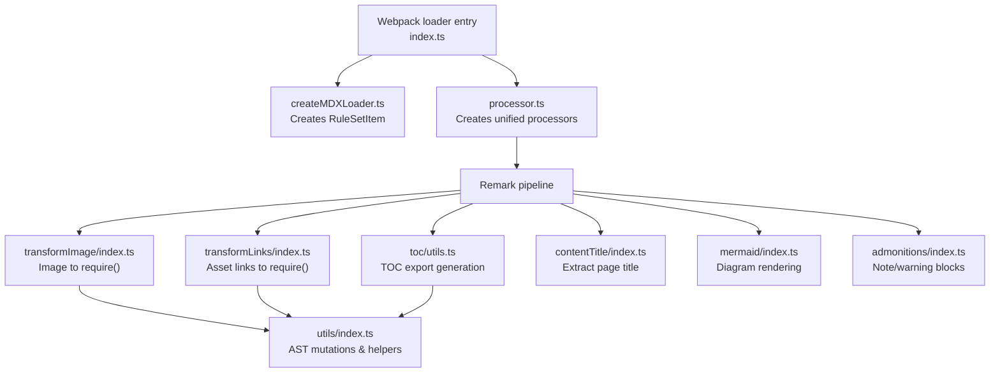
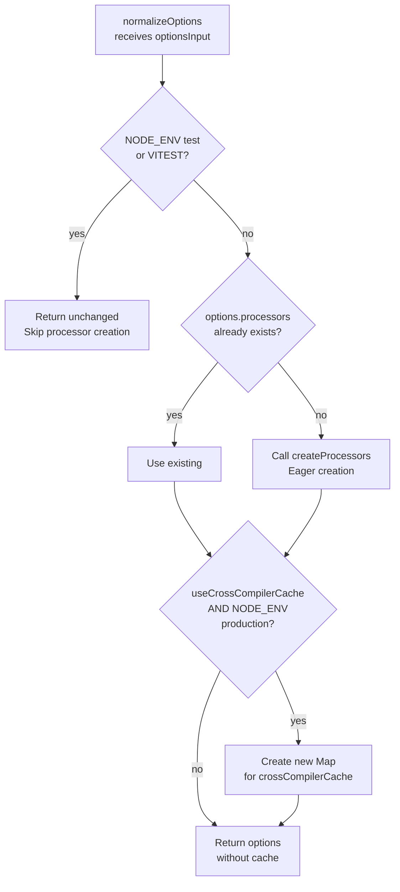
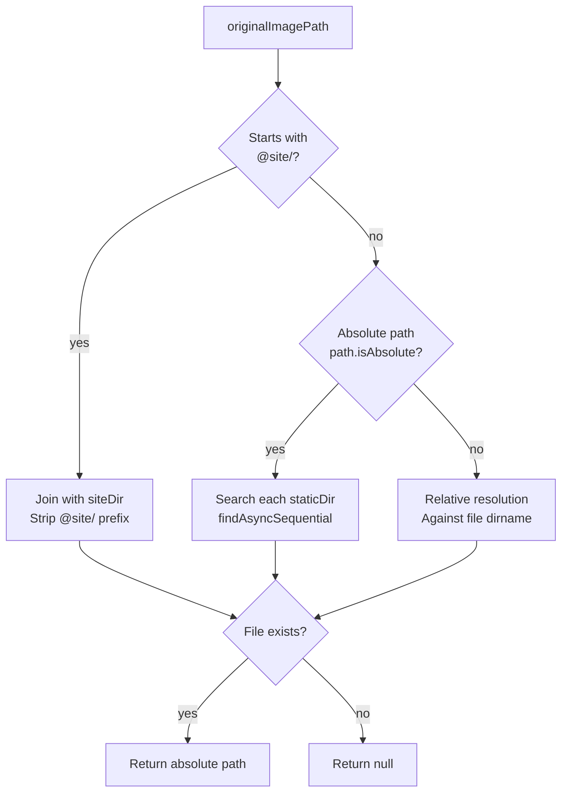
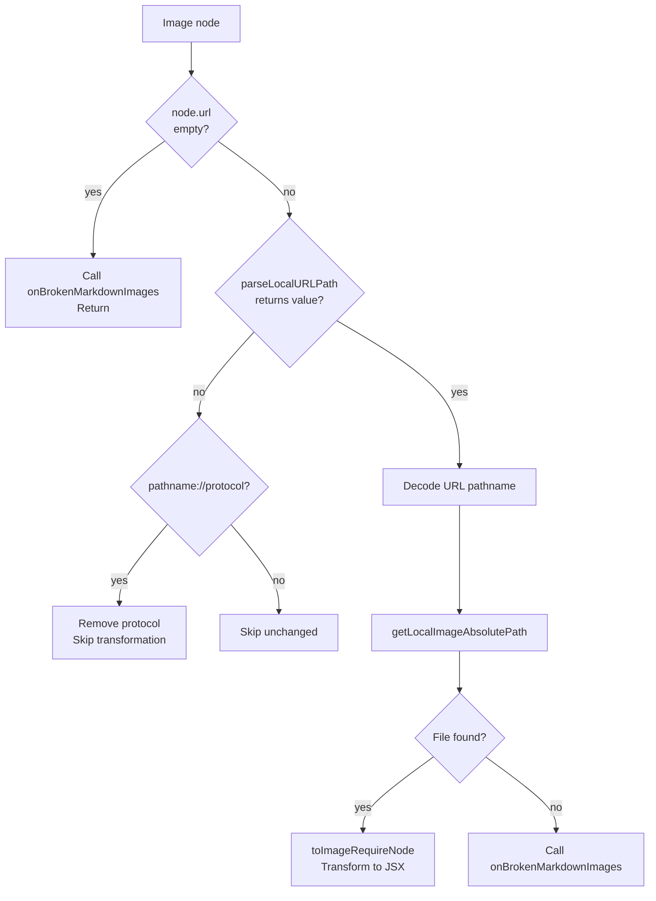
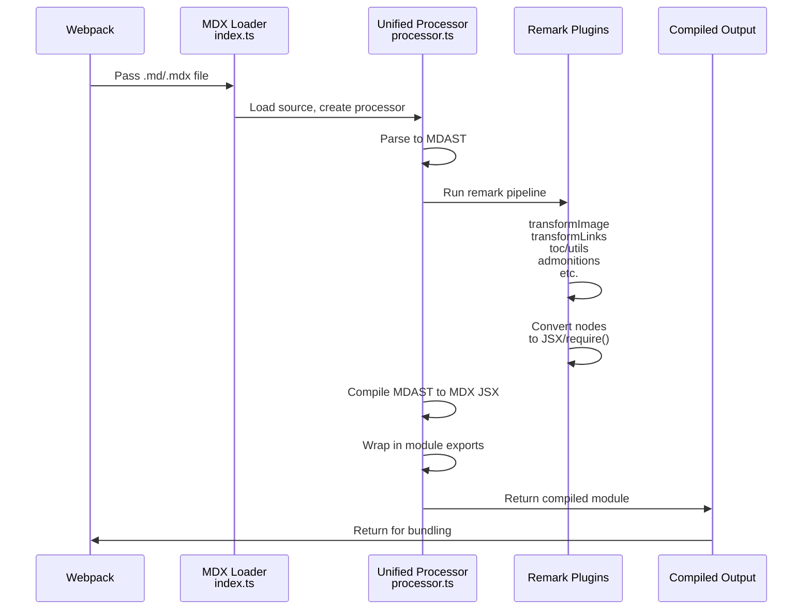

# MDX and markdown authoring internals

This document describes the internals of MDX and Markdown authoring in Docusaurus, focused on the`packages/docusaurus-mdx-loader` package. Developers extending Markdown processing, debugging asset resolution, or integrating custom remark/rehype plugins need to understand these modules, services, data flows, APIs, and extension points.

For the author-facing features this pipeline supports, see MDX & Markdown Authoring. For how this loader fits into the overall compile pipeline, see Site Building & Bundling Internals.

## Package and processing overview

The`docusaurus-mdx-loader` package hosts the Webpack-facing loader entry point plus the remark transformer plugins used during Docusaurus compilation.

Primary source files:

| File | Responsibility |
| --- | --- |
|`packages/docusaurus-mdx-loader/src/createMDXLoader.ts` | Creates the Webpack loader item and loader rule |
|`packages/docusaurus-mdx-loader/src/processor.ts` | Factory for processor instances, referenced from`createMDXLoader` |
|`packages/docusaurus-mdx-loader/src/remark/transformImage/index.ts` | Rewrites Markdown images into Webpack`require()` calls |
|`packages/docusaurus-mdx-loader/src/remark/transformLinks/index.ts` | Rewrites asset-like Markdown links into Webpack`require()` calls |
|`packages/docusaurus-mdx-loader/src/remark/toc/utils.ts` | Generates the table of contents export |
|`packages/docusaurus-mdx-loader/src/remark/utils/index.ts` | Shared node-mutation and AST helpers |
|`packages/docusaurus-mdx-loader/src/remark/contentTitle/index.ts` | Content title plugin source |
|`packages/docusaurus-mdx-loader/src/remark/mermaid/index.ts` | Mermaid diagram plugin source |
|`packages/docusaurus-mdx-loader/src/remark/admonitions/index.ts` | Admonitions plugin source |

The following diagram shows the package layout and data flow from the Webpack entry point through remark transformers:



## MDX loader creation

Location:`packages/docusaurus-mdx-loader/src/createMDXLoader.ts`

### Loader item creation

`createMDXLoaderItem(options)` returns a Webpack`RuleSetUseItem` that points Webpack to the MDX loader:

```ts
export function createMDXLoaderItem(
  options: Options & CreateOptions,
): RuleSetUseItem {
  return {
    loader: require.resolve('./index'),
    options: normalizeOptions(options),
  };
}
```

The`require.resolve('./index')` resolves to the package's main loader entry point, which Webpack invokes for each`.md` or`.mdx` file matched by the loader rule.

### Loader rule creation

`createMDXLoaderRule({ include, options })` produces the complete Webpack rule that matches and processes Markdown files:

```ts
export function createMDXLoaderRule({
  include,
  options,
}: {
  include: RuleSetRule['include'];
  options: Options & CreateOptions;
}): RuleSetRule {
  return {
    test: /\.mdx?$/i,
    include,
    use: [createMDXLoaderItem(options)],
  };
}
```

The`include` argument is a Webpack`RuleSetRule['include']` value that specifies which source directories should be compiled with this loader. Plugins control which paths are included by passing their source directories to the site builder.

### Option normalization

`normalizeOptions` applies environment-specific behaviors that control when processors are created and whether compilation results are cached:

```ts
function normalizeOptions(optionsInput: Options & CreateOptions): Options {
  if (process.env.NODE_ENV === 'test' || process.env.VITEST) {
    return optionsInput;
  }

  let options = optionsInput;

  if (!options.processors) {
    options = {...options, processors: createProcessors({options})};
  }

  if (options.useCrossCompilerCache && process.env.NODE_ENV === 'production') {
    options = {
      ...options,
      crossCompilerCache: new Map(),
    };
  }

  return options;
}
```

The normalization flow handles three key scenarios:



Key behaviors:

- In`test` or`VITEST` environments, processor creation is skipped entirely. This prevents issues when integration tests construct loader items without a full build environment.
- When`options.processors` is not supplied,`createProcessors({options})` is called eagerly. The source comment notes that lazy creation interferes with Rsdoctor's ability to measure`mdx-loader` performance during builds.
- When`useCrossCompilerCache` is`true` and`NODE_ENV` is`production`, a`Map` is created as`crossCompilerCache`. This permits the client and server MDX compilers to share compilation results, reducing build time.
- In development mode (`docusaurus start`), the cache is intentionally not created because only a single compiler runs.

The`CreateOptions` type supplies the optional`useCrossCompilerCache` flag, which the site builder sets based on build configuration.

## Remark transformer plugin architecture

The transformer plugins available in the MDX loader follow the unified plugin shape. Each plugin exports a factory that returns an async transformer:

```ts
import type {Plugin, Transformer} from 'unified';
import type {Root} from 'mdast';

const plugin: Plugin<PluginOptions[], Root> = function plugin(
  options,
): Transformer<Root> {
  return async (root, vfile) => {
    // Traverse tree, collect async operations, await all
    const promises: Promise<void>[] = [];
    visit(root, 'nodeType', (node, index, parent) => {
      promises.push(processNode(...));
    });
    await Promise.all(promises);
  };
};
```

All transformers operate on the MDAST`Root` tree. The`vfile` object carries:

-`vfile.path`: Absolute file path of the current source file.
-`vfile.data.compilerName`: Either`'client'` or`'server'`, indicating which Webpack compiler is running.

### File loader utilities

Both image and link transformers obtain loader names from`getFileLoaderUtils`:

```ts
const fileLoaderUtils = getFileLoaderUtils(
  vfile.data.compilerName === 'server',
);

const context: Context = {
  ...options,
  filePath: vfile.path!,
  inlineMarkdownImageFileLoader:
    fileLoaderUtils.loaders.inlineMarkdownImageFileLoader,
  onBrokenMarkdownImages,
};
```

The boolean argument differentiates client compilation from server compilation. The resulting loader names are inserted into the`require()` strings that the transformers embed in the rewritten AST. This ensures Webpack uses the correct asset loader for each target.

## Image transformation

Location:`packages/docusaurus-mdx-loader/src/remark/transformImage/index.ts`

This plugin rewrites Markdown`image` nodes into MDX JSX`` elements whose`src` is a Webpack`require()` expression. Webpack can then resolve and emit the image asset at build time, enabling automatic dimension detection and optimization.

### Plugin options

```ts
export type PluginOptions = {
  staticDirs: string[];
  siteDir: string;
  onBrokenMarkdownImages: MarkdownConfig['hooks']['onBrokenMarkdownImages'];
};
```

-`staticDirs`: Array of absolute paths to static asset directories (e.g.,`public/`).
-`siteDir`: Absolute path to the site root.
-`onBrokenMarkdownImages`: User-provided hook, either a string (`'throw'`,`'warn'`,`'ignore'`) or a callback function that handles unresolvable images.

### Broken image reporting

The`asFunction` helper normalizes the hook option into an invokable function. If the option is a string, it creates a logger-based reporter:

```ts
return ({sourceFilePath, url: imageUrl, node}) => {
  const relativePath = toMessageRelativeFilePath(sourceFilePath);
  if (imageUrl) {
    logger.report(
      onBrokenMarkdownImages,
    )`Markdown image with URL code=${imageUrl} in source file path=${relativePath}${formatNodePositionExtraMessage(
      node,
    )} couldn't be resolved to an existing local image file.`;
  } else {
    logger.report(
      onBrokenMarkdownImages,
    )`Markdown image with empty URL found in source file path=${relativePath}${formatNodePositionExtraMessage(
      node,
    )}.`;
  }
};
```

If the option is already a function, it wraps the invocation to normalize`sourceFilePath` through`toMessageRelativeFilePath` before passing to the user function.

### Local image path resolution

`getLocalImageAbsolutePath(originalImagePath, {siteDir, filePath, staticDirs})` implements three resolution strategies based on the image path format:



The three strategies are:

1. **`@site/` alias** (e.g.,`@site/assets/logo.png`): Strips the alias and joins with`siteDir`. Used for site-root-relative paths.
2. **Absolute path** (e.g.,`/images/diagram.svg`): Searches across all`staticDirs` sequentially until the file is found using`findAsyncSequential`.
3. **Relative path** (e.g.,`./screenshot.png`): Resolves against the directory containing the current Markdown file using`path.dirname(filePath)`.

All three branches return`null` when the file does not exist.

### Image node processing flow

`processImageNode([node, index, parent], context)` applies these checks in sequence:



The`pathname://` protocol is an escape hatch. When used, the protocol is stripped but the image URL is left as-is, preventing Webpack from processing the image.

### AST transformation to require() call

`toImageRequireNode([node], imagePath, context)` transforms the original Markdown`image` node into an`mdxJsxTextElement` named`img`. The node receives these attributes:

-`alt`: Copied from`node.alt`, HTML-escaped.
-`src`: A`require()` expression generated by`assetRequireAttributeValue`.
-`title`: Copied from`node.title`, HTML-escaped (if present).
-`width` and`height`: Populated from`imageSizeFromFile(imagePath)` when the image can be read successfully.

The`src` expression is constructed as:

```ts
let relativeImagePath = posixPath(
  path.relative(path.dirname(context.filePath), imagePath),
);
relativeImagePath = `./${relativeImagePath}`;

const parsedUrl = parseURLOrPath(node.url);
const hash = parsedUrl.hash ?? '';
const search = parsedUrl.search ?? '';
const requireString = `${context.inlineMarkdownImageFileLoader}${
  escapePath(relativeImagePath) + search
}`;
```

The final`src` attribute value becomes:

```ts
require("${requireString}").default${hash && ` + '${hash}'`}
```

The hash is appended via string concatenation if present. This preserves URL fragments like`#section` in image URLs.

## Link transformation

Location:`packages/docusaurus-mdx-loader/src/remark/transformLinks/index.ts`

This plugin rewrites asset-like Markdown links into MDX JSX`<a>` elements whose`href` is a Webpack`require()` expression. It intentionally does not rewrite route links pointing to`.md`,`.mdx`, or`.html` files, which are handled by Docusaurus's routing system.

### Plugin options and context

`PluginOptions` mirrors the image transformer:

```ts
export type PluginOptions = {
  staticDirs: string[];
  siteDir: string;
  onBrokenMarkdownLinks: MarkdownConfig['hooks']['onBrokenMarkdownLinks'];
};
```

The`Context` type extends`PluginOptions` with:

-`filePath`: Current source file path from`vfile.path`.
-`inlineMarkdownLinkFileLoader`: Loader name from`getFileLoaderUtils`.

### Asset detection logic

`processLinkNode` determines whether a link should be transformed by checking both the path format and file extension:

```ts
const hasSiteAlias = localUrlPath.pathname.startsWith('@site/');
const hasAssetLikeExtension =
  path.extname(localUrlPath.pathname) &&
  !localUrlPath.pathname.match(/\.(?:mdx?|html)(?:#|$)/);
if (!hasSiteAlias && !hasAssetLikeExtension) {
  return;
}
```

A link is treated as an asset only when **either**:

- It uses the`@site/` alias (making it explicitly asset-directed), **or**
- It has a file extension that is **not**`.md`,`.mdx`, or`.html`.

This logic intentionally ignores route-like paths that happen to resemble filenames (e.g.,`docs/install`), preventing false-positive asset transformations.

### Local asset path resolution

`getLocalFileAbsolutePath(assetPath, {siteDir, filePath, staticDirs})` parallels the image resolver. The key difference is that it uses`isExistingFile`, which calls`fs.stat` and verifies the result is a file (not a directory):

```ts
async function isExistingFile(filePath: string): Promise<boolean> {
  try {
    return (await fs.stat(filePath)).isFile();
  } catch {
    return false;
  }
}
```

Resolution order matches images:`@site/` alias, absolute paths, then relative paths.

### AST transformation to link require() call

`toAssetRequireNode([node], assetPath, context)` transforms a Markdown`link` node into an`mdxJsxTextElement` named`a`. The rewritten node receives:

-`target="_blank"`: Opens asset downloads in a new tab.
-`data-noBrokenLinkCheck=true`: Prevents Docusaurus's broken link checker from scanning the generated URL, since assets are not routes.
-`href`: A`require()` expression built by`assetRequireAttributeValue`.
-`title`: Copied from`node.title` (if present).
-`children`: Retained from the original link text.

The`requireString` construction includes special handling for JSON files:

```ts
const relativeAssetPath = `./${posixPath(
  path.relative(path.dirname(context.filePath), assetPath),
)}`;

const parsedUrl = parseURLOrPath(node.url);
const hash = parsedUrl.hash ?? '';
const search = parsedUrl.search ?? '';

const requireString = `${
  path.extname(relativeAssetPath) === '.json'
    ? `${relativeAssetPath.replace('.json', '.raw')}!=`
    : ''
}${context.inlineMarkdownLinkFileLoader}${
  escapePath(relativeAssetPath) + search
}`;
```

For`.json` files, the path is rewritten from`.json` to`.raw` and`!=` is prepended. This is a hack to prevent Webpack's built-in JSON loader from parsing the file as a data object; instead, it loads the raw JSON text.

## Table of contents generation

Location:`packages/docusaurus-mdx-loader/src/remark/toc/utils.ts`

The TOC utilities operate on both the MDAST (for heading extraction) and ESTree (for export generation) levels. They enable nested documents to export their headings so parent documents can build a complete TOC from multiple sources.

### Import inspection helpers

The module exposes utilities to inspect and manipulate MDX import statements:

-`getImportDeclarations(program)`: Filters`ImportDeclaration` nodes from an ESTree`Program`.
-`isMarkdownImport(node)`: Returns`true` when the import source ends with`.md` or`.mdx`.
-`findDefaultImportName(importDeclaration)`: Returns the local name of an`ImportDefaultSpecifier` (e.g., the name in`import Foo from 'bar'`).
-`findNamedImportSpecifier(importDeclaration, localName)`: Returns a matching`ImportSpecifier` when present, or`undefined`.

### Adding TOC slice imports

`addTocSliceImportIfNeeded` ensures an imported Markdown document exposes a named TOC slice import by mutating the import declaration:

```ts
export function addTocSliceImportIfNeeded({
  importDeclaration,
  tocExportName,
  tocSliceImportName,
}: {
  importDeclaration: ImportDeclaration;
  tocExportName: string;
  tocSliceImportName: string;
}): void {
  if (!findNamedImportSpecifier(importDeclaration, tocSliceImportName)) {
    importDeclaration.specifiers.push({
      type: 'ImportSpecifier',
      imported: {type: 'Identifier', name: tocExportName},
      local: {type: 'Identifier', name: tocSliceImportName},
    });
  }
}
```

This transforms an import like:

```ts
import Partial from 'partial';
```

into:

```ts
import Partial, {toc as __tocPartial} from 'partial';
```

The function only adds the specifier if it does not already exist, avoiding duplicates.

### Named export detection

`isNamedExport(node, exportName)` verifies that a node matches a specific named export pattern. It checks:

1. Node type is`mdxjsEsm`.
2. Carries an ESTree`Program` in`node.data.estree`.
3. The program has exactly one body entry.
4. That entry is an`ExportNamedDeclaration`.
5. The declaration is a`VariableDeclaration`.
6. The first variable's identifier name matches`exportName`.

This pattern detection ensures the export is a simple named constant, not a complex export.

### TOC export AST generation

`createTOCExportNodeAST({tocExportName, tocItems})` generates an`mdxjsEsm` node containing an ESTree program that exports a`const` array:

```ts
export const toc = [
  {value: "...", id: "heading-1", level: 2},
  {value: "...", id: "heading-2", level: 2},
  // Spread elements for TOC slices from imported documents
];
```

Each`TOCItem` in the array is either:

- A **heading object**:`{value, id, level}` where`value` is the HTML rendering of the heading text,`id` comes from`heading.data.id`, and`level` is the heading depth.
- A **spread element**:`...importedTocSlice`, which inlines the TOC from a nested imported document.

The`createTOCHeadingAST` helper uses`valueToEstree` to convert the rendered heading into valid ESTree literals. The`createTOCSliceAST` helper wraps an imported identifier in a`SpreadElement` AST node.

The source code sets`mdxjsEsm.value` to an empty string. The comment references GitHub PR 9684, explaining that this prevents unwanted raw text from being emitted into the compiled output.

### Heading HTML serialization

`toHeadingHTMLValue(node)` serializes MDAST phrasing content into HTML strings for inclusion in the TOC array. It supports:

| Node type | Output |
| --- | --- |
|`mdxJsxTextElement` | HTML via`mdxJsxTextElementToHtml` |
|`text` | HTML-escaped text |
|`heading` | Serialized children |
|`inlineCode` |`<code>` wrapping escaped value |
|`emphasis` |`<em>` wrapping serialized children |
|`strong` |`<strong>` wrapping serialized children |
|`delete` |`<del>` wrapping serialized children |
|`link` | Serialized children (link text only, no href) |
| Other nodes |`toString(node)` via`mdast-util-to-string` |

The`mdxJsxTextElementToHtml` function handles JSX elements by building HTML strings. It:

- Extracts the tag name and`className`/`class` attributes only (other attributes are ignored).
- Returns an empty string for`img` elements (images do not contribute to heading text).
- Recursively serializes children.

The source comments note that this HTML serialization is a workaround and not fully reliable; a future improvement might represent TOC with real JSX nodes.

## Shared transformation utilities

Location:`packages/docusaurus-mdx-loader/src/remark/utils/index.ts`

These utilities are used by multiple transformers to mutate AST nodes and create ESTree attribute expressions.

### Node mutation via transformNode

`transformNode(node, newNode)` mutates the original node object in place to become the new node type:

```ts
export function transformNode<NewNode extends Node>(
  node: Node,
  newNode: NewNode,
): NewNode {
  Object.keys(node).forEach((key) => {
    delete node[key];
  });
  Object.keys(newNode).forEach((key) => {
    node[key] = newNode[key];
  });
  return node as NewNode;
}
```

This is the standard mechanism by which image and link transformers convert Markdown nodes into MDX JSX elements. The original node object is reused; no new node is created. This preserves the node's position in the tree and avoids issues with visitor re-entry.

### Asset require attribute value generation

`assetRequireAttributeValue(requireString, hash)` creates an`mdxJsxAttributeValueExpression` representing:

```ts
require("${requireString}").default${hash && ` + '${hash}'`}
```

The generated ESTree is a`BinaryExpression` when a hash is present:

```ts
require("...").default + "#section"
```

When no hash is present, it's just the member expression:

```ts
require("...").default
```

This expression is suitable for embedding in MDX JSX attribute values, enabling Webpack to resolve the asset at compile time while preserving URL fragments.

### Position formatting helpers

`formatNodePosition(node)` returns a string like`"line:column"` when the node carries position information, or`undefined` otherwise.

`formatNodePositionExtraMessage(node)` wraps the position as`" (line:column)"` for easy appending to error messages. It returns an empty string if no position is available.

These helpers are used by the image and link transformers to provide developers with precise source locations of broken assets.

## Data flow from markdown to compiled output

The following diagram shows how a Markdown file flows through the MDX loader pipeline:



## Extension points for custom plugins

The MDX loader is designed to accept custom remark and rehype plugins through the processor configuration. Developers can:

1. Create a unified plugin following the`Plugin<PluginOptions[], Root>` shape.
2. Add it to the processor pipeline in`processor.ts` or through site configuration.
3. Use`visit()` to traverse MDAST nodes and apply transformations.
4. Use`transformNode()` to convert nodes in place.
5. Use`vfile.data` to access compiler context (e.g.,`compilerName`,`filePath`).

The image and link transformers serve as reference implementations of:

- **Async processing**: Collecting promises and awaiting all results.
- **Error handling**: Reporting broken assets through configurable hooks.
- **Path resolution**: Supporting multiple path formats (`@site/`, absolute, relative).
- **AST mutation**: Converting Markdown nodes to MDX JSX elements with`require()` expressions.

## Related pages

- MDX Content Loading
- Site Building & Bundling Internals
- Documentation Internals
- Blog Internals