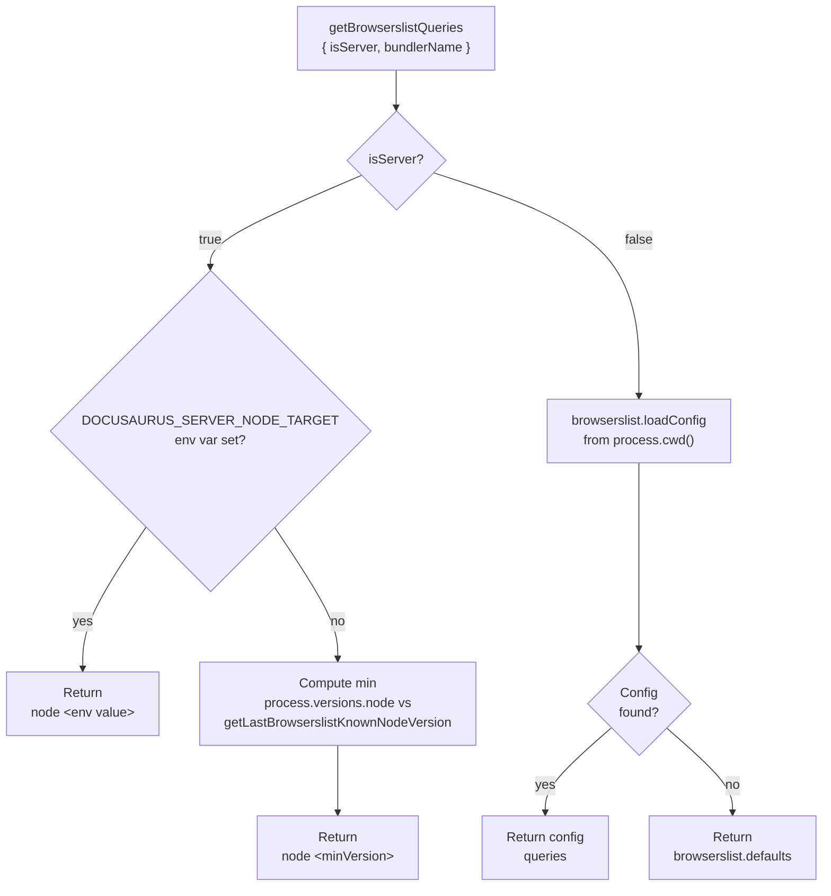
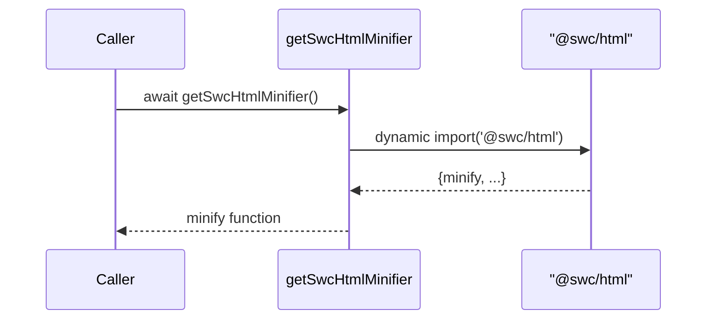
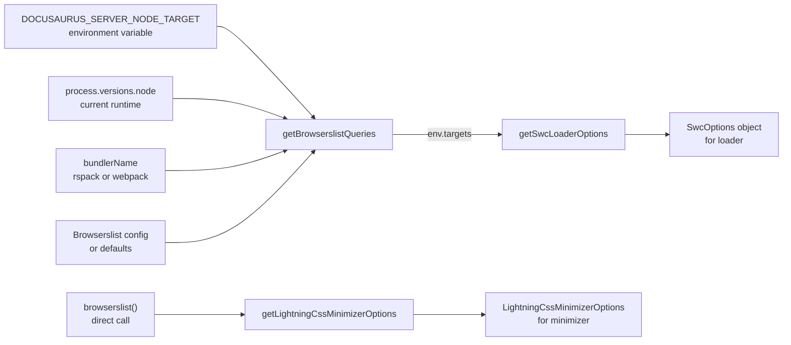

# Performance optimization internals

This page documents the implementation behind Docusaurus performance optimization as found in`packages/docusaurus-faster/src/index.ts`. The package`@docusaurus/faster` provides fast bundler primitives, SWC configuration helpers, and Lightning CSS minimizer options for Docusaurus builds.

## Package layout

The provided source contains one module:

| Path | Purpose |
| --- | --- |
|`packages/docusaurus-faster/src/index.ts` | Public API surface for fast build tooling |

The module depends on:

-`@rspack/core` for the Rspack bundler
-`@rspack/dev-server` for the Rspack dev server
-`@swc/core` for SWC options types
-`@swc/html` for HTML minification
-`lightningcss` for Lightning CSS transformation and minimizer targets
-`browserslist` for browser target resolution
-`semver` for Node version comparison
-`@docusaurus/types` for the`CurrentBundler` type

## Public API surface

### Exported values

The module exports the`swcLoader` module path:

```ts
export const swcLoader = require.resolve('swc-loader');
```

`swcLoader` is the resolved module path of`swc-loader`, exported so Docusaurus bundler code can pass it directly as a loader without resolving it separately.

The module re-exports Rspack and its dev server:

```ts
export const rspack = Rspack;
export const rspackDevServer = RspackDevServer;
```

Consumers can import them from`@docusaurus/faster` instead of depending on Rspack directly.

### Exported option builders

The module exports five configuration builder functions:

| Function | Return type | Purpose |
| --- | --- | --- |
|`getSwcLoaderOptions({isServer, bundlerName})` |`SwcOptions` | Builds SWC loader options for server or client compilation |
|`getSwcHtmlMinifier()` |`Promise<SwcHtmlMinifier>` | Lazily loads and returns the`@swc/html` minifier |
|`getSwcJsMinimizerOptions()` |`JsMinifyOptions` | Builds SWC JavaScript minifier options |
|`getBrowserslistQueries({isServer, bundlerName})` |`string[]` | Resolves Browserslist queries for server or client |
|`getLightningCssMinimizerOptions()` |`LightningCssMinimizerOptions` | Builds Lightning CSS minimizer options with current Browserslist targets |

## SWC loader configuration

`getSwcLoaderOptions` accepts parameters that control transpilation targets:

```ts
{
  isServer: boolean;
  bundlerName: CurrentBundler['name'];
}
```

It returns an`SwcOptions` object configured for TypeScript and React:

```ts
{
  env: {
    targets: getBrowserslistQueries({ isServer, bundlerName }),
  },
  jsc: {
    parser: {
      syntax: 'typescript',
      tsx: true,
    },
    transform: {
      react: {
        runtime: 'automatic',
      },
    },
  },
}
```

The loader configuration:

- Parses TypeScript and TSX through`syntax: 'typescript'` and`tsx: true`
- Uses React automatic JSX runtime through`runtime: 'automatic'`
- Targets the Browserslist queries returned by`getBrowserslistQueries`, which vary based on whether the build is for server or client

The`bundlerName` parameter influences only the Browserslist query resolution for server builds.

## Browserslist query resolution

`getBrowserslistQueries` is the central function for determining which browsers and Node.js versions a build targets:

```ts
getBrowserslistQueries({
  isServer,
  bundlerName,
}: {
  isServer: boolean;
  bundlerName: CurrentBundler['name'];
}): string[]
```

### Server builds

When`isServer` is`true`, the function returns a Node.js target string:

1. If the environment variable`DOCUSAURUS_SERVER_NODE_TARGET` is set, it returns that value directly as`["node <value>"]`.
2. Otherwise, it computes the minimum of two versions:
   - The currently running Node version from`process.versions.node`
   - The last Node version known to Browserslist, from`getLastBrowserslistKnownNodeVersion(bundlerName)`
3. It returns`["node <minVersion>"]`

The internal function`getLastBrowserslistKnownNodeVersion` encodes bundler-specific knowledge:

- For`bundlerName === 'rspack'`, it returns the hardcoded value`'22.0.0'` because Rspack does not yet expose its Browserslist data
- For other bundlers, it returns`browserslist.nodeVersions.at(-1)!`, the latest Node version in Browserslist's database

### Client builds

When`isServer` is`false`, the function loads Browserslist configuration from the project:

```ts
const queries = browserslist.loadConfig({path: process.cwd()}) ?? [
  ...browserslist.defaults,
];
```

If a Browserslist config file (such as`.browserslistrc` or a`browserslist` field in`package.json`) exists in the current working directory, those queries are used. Otherwise,`browserslist.defaults` is used as a fallback.

The following diagram illustrates the branching logic:



## SWC JavaScript minifier options

`getSwcJsMinimizerOptions` returns fixed SWC minifier configuration:

```ts
{
  ecma: 2020,
  compress: {
    ecma: 5,
  },
  module: true,
  mangle: true,
  safari10: true,
  format: {
    ecma: 5,
    comments: false,
    ascii_only: true,
  },
}
```

These options are statically defined and not configurable. The source code notes that they are similar to the options used in Docusaurus core`minification.ts`. The design goal is to prioritize speed over fine-tuning minification output.

Key settings:

-`ecma: 2020` and`compress.ecma: 5` support modern input with ES5 output
-`mangle: true` enables name mangling to reduce output size
-`safari10: true` ensures Safari 10 compatibility
-`comments: false` strips comments from output
-`ascii_only: true` escapes non-ASCII characters

## SWC HTML minifier

`getSwcHtmlMinifier` provides lazy-loaded HTML minification:

```ts
type SwcHtmlMinifier = (typeof import('@swc/html'))['minify'];

export async function getSwcHtmlMinifier(): Promise<SwcHtmlMinifier> {
  const {minify} = await import('@swc/html');
  return minify;
}
```

The function returns a promise that resolves to the`minify` function from`@swc/html`. The lazy import is intentional:

- HTML minification is not needed during development server execution, so loading`@swc/html` only when required improves dev server startup performance
- It works around upstream issues in StackBlitz playgrounds and SWC itself (see facebook/docusaurus#12008 and swc-project/swc#11833)

The following sequence diagram shows the lazy loading flow:



## Lightning CSS minimizer options

`getLightningCssMinimizerOptions` builds configuration for Lightning CSS minification:

```ts
type LightningCssMinimizerOptions = Omit<
  lightningcss.TransformOptions<never>,
  'filename' | 'code'
>;

export function getLightningCssMinimizerOptions(): LightningCssMinimizerOptions {
  const queries = browserslist();
  return {targets: lightningcss.browserslistToTargets(queries)};
}
```

The function:

1. Calls`browserslist()` to resolve the current Browserslist queries (independent of the server/client context)
2. Converts those browser queries to Lightning CSS target data with`lightningcss.browserslistToTargets`
3. Returns an object with the`targets` property

The`LightningCssMinimizerOptions` type is a local derivation of`lightningcss.TransformOptions` with`filename` and`code` omitted, because Lightning CSS does not export a public type specifically for`css-minimizer-webpack-plugin` configuration.

## Data flow and architecture

The following diagram shows how sources of configuration flow into SWC and Lightning CSS options:



`getBrowserslistQueries` is the central hub for server and client builds, feeding transpilation targets to the SWC loader. Lightning CSS uses its own independent call to`browserslist()` and does not share the resolved queries from`getBrowserslistQueries`. This separation allows each tool to resolve targets according to its own context.

## Extension points

### Server Node.js target override

Override the server build target Node.js version by setting the`DOCUSAURUS_SERVER_NODE_TARGET` environment variable:

```bash
DOCUSAURUS_SERVER_NODE_TARGET=20.0.0 docusaurus build
```

The resulting server Browserslist query is:

```ts
["node 20.0.0"]
```

This is useful when the build machine runs a newer Node version than the deployment target environment.

### Client targets via browserslist

The client SWC transpilation target and Lightning CSS minimizer targets are driven by Browserslist configuration in the project root. Create or modify`.browserslistrc`,`browserslist` in`package.json`, or another Browserslist config file to control which browsers are supported:

```json
{
  "browserslist": "> 1%, last 2 versions, not dead"
}
```

Both SWC and Lightning CSS will respect the configured browser queries.

### Bundler-specific behavior

The`getBrowserslistQueries` function accepts`bundlerName` typed as`CurrentBundler['name']`. This allows the module to encode bundler-specific knowledge. Currently, the only special case is Rspack, which uses the hardcoded last known Node version`'22.0.0'` because Rspack does not yet expose its internal Browserslist data. When Rspack exposes this data, the hardcoded value can be replaced with dynamic resolution.

### Direct consumption of option builders

All option builder functions are exported as public APIs and return plain JavaScript objects. Docusaurus build code or custom bundler configurations can consume them directly to instantiate SWC, Lightning CSS, or Rspack with consistent options:

```ts
import {
  getSwcLoaderOptions,
  getSwcJsMinimizerOptions,
  getLightningCssMinimizerOptions,
} from '@docusaurus/faster';

const swcOptions = getSwcLoaderOptions({isServer: false, bundlerName: 'rspack'});
const jsMinifyOptions = getSwcJsMinimizerOptions();
const cssMinifyOptions = getLightningCssMinimizerOptions();
```

## Related pages

- Performance Optimization
- Site Building & Bundling Internals
- How to use Rspack bundler for faster builds