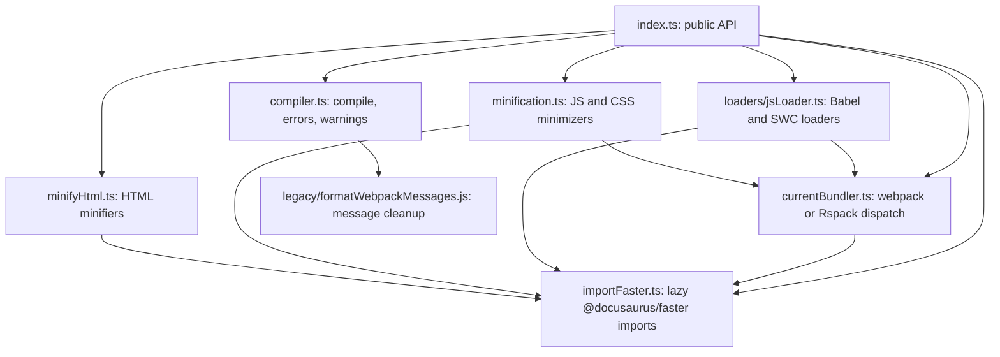
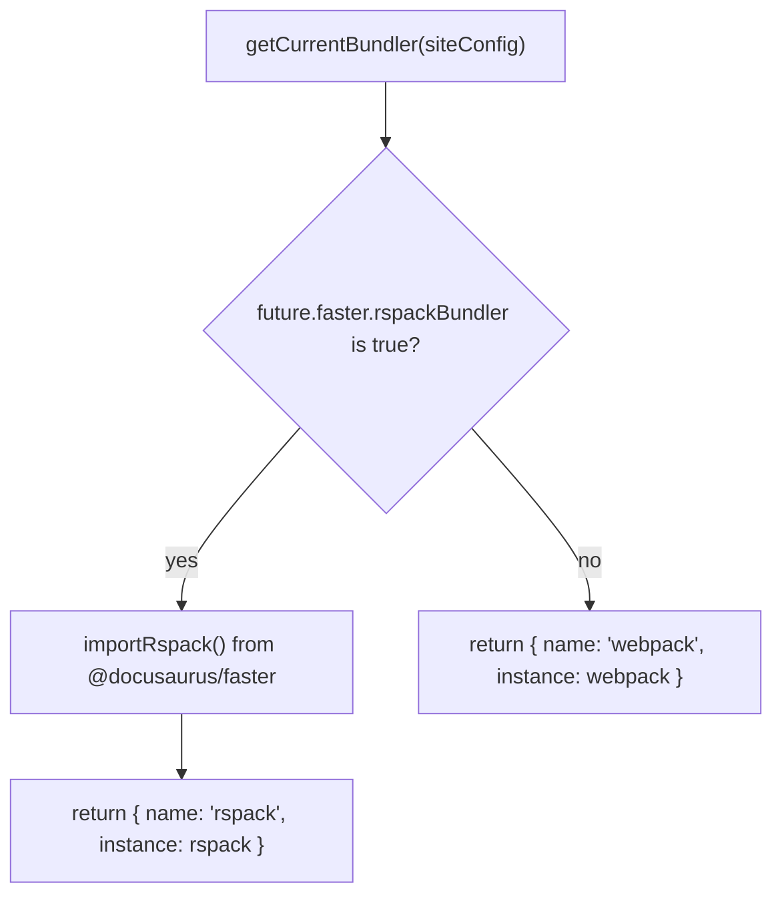
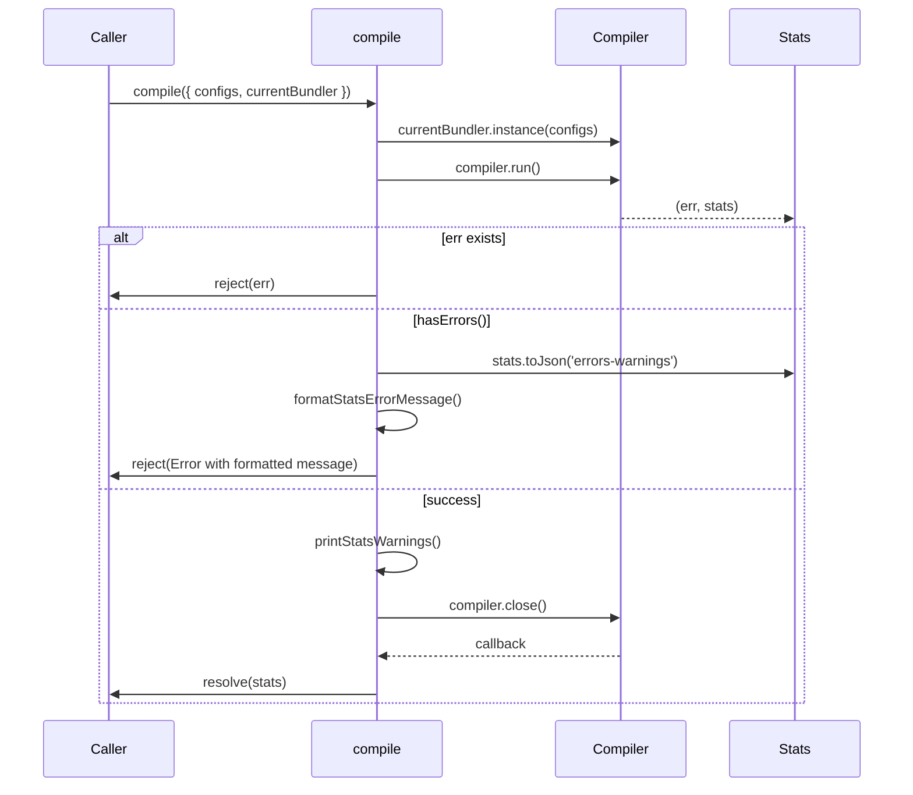
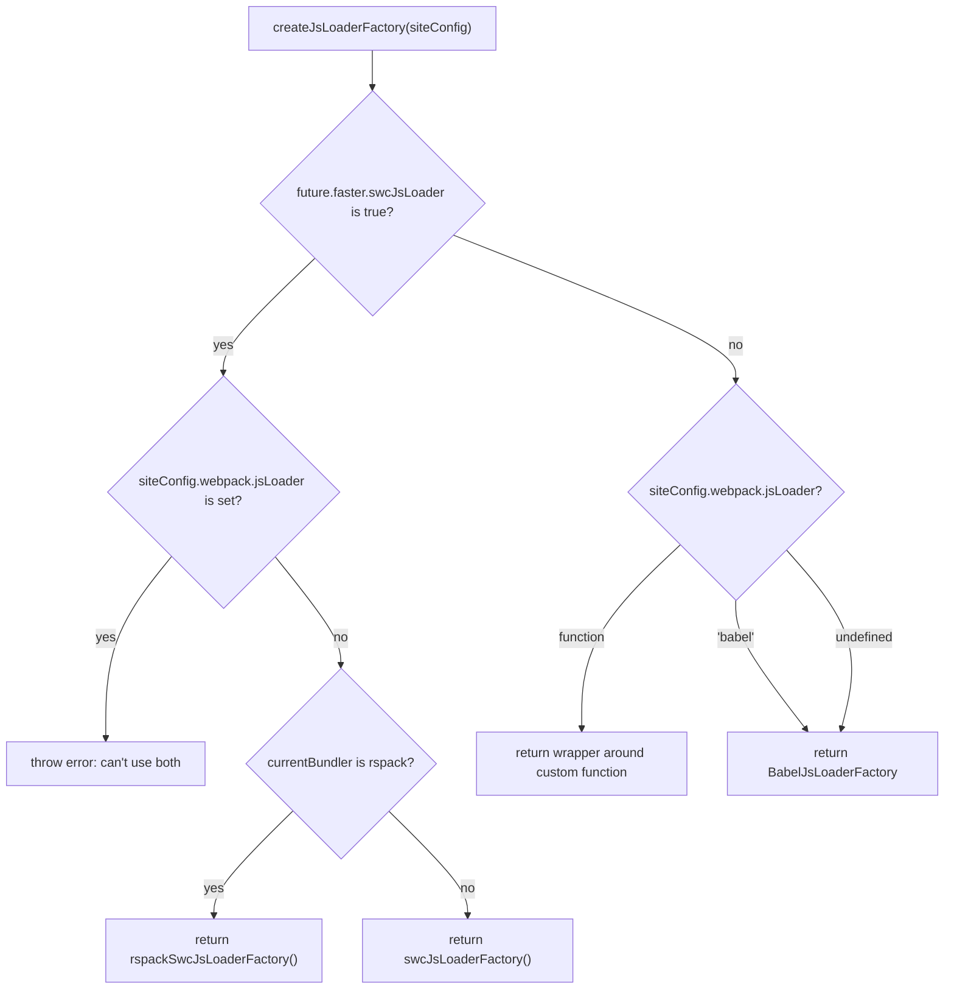
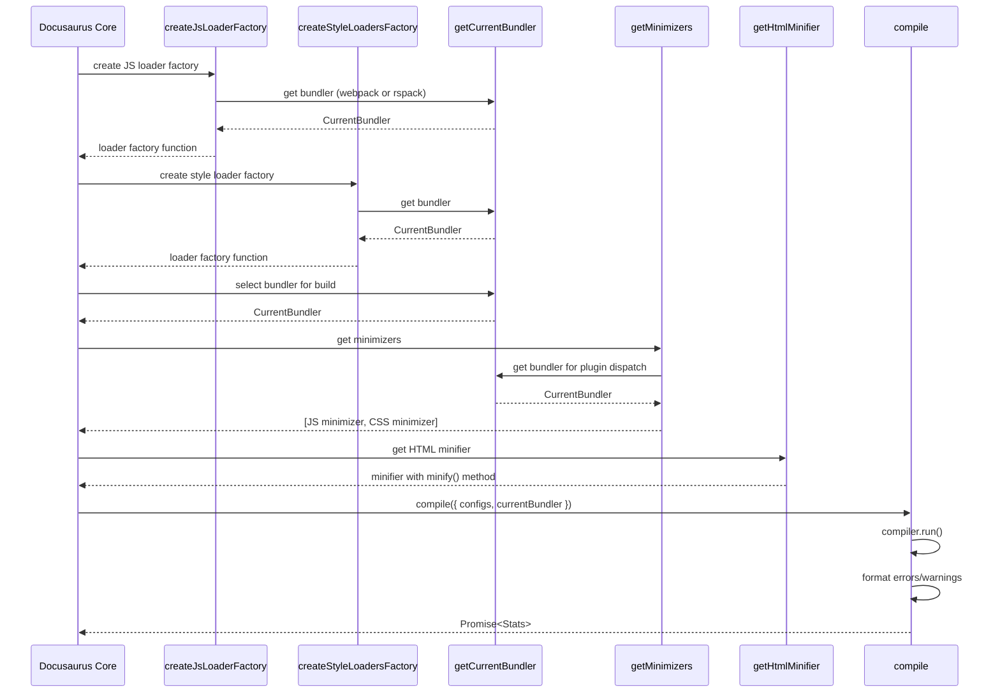

# Site building and bundling internals

This document describes the internal architecture of`@docusaurus/bundler`, the package that compiles Docusaurus sites into static HTML, CSS, and JavaScript bundles. It covers the modules, APIs, data flow, and extension points behind Site Building & Bundling.

## Overview

`@docusaurus/bundler` provides a bundler-agnostic compilation layer that supports two engines:

- **webpack**, the default engine, always available through the`webpack` dependency
- **Rspack**, an opt-in, faster engine that requires the`@docusaurus/faster` package

The package is a collection of factory and utility functions. It does not run the build by itself. Instead, Docusaurus core calls these functions during build setup to obtain loaders, plugins, minimizers, and a`compile` wrapper. Every public function is re-exported from`packages/docusaurus-bundler/src/index.ts`.

The package ships under`packages/docusaurus-bundler/src/` with this layout:

| File | Responsibility |
|------|----------------|
|`index.ts` | Public API surface; re-exports all functions |
|`compiler.ts` | Compilation lifecycle, error and warning formatting |
|`currentBundler.ts` | Bundler selection and plugin factory dispatch |
|`minification.ts` | JS and CSS minimizer creation |
|`minifyHtml.ts` | HTML minification with Terser or SWC |
|`loaders/jsLoader.ts` | JS loader selection: Babel, SWC, Rspack SWC |
|`importFaster.ts` | Lazy loading of the`@docusaurus/faster` package |
|`legacy/formatWebpackMessages.js` | Legacy Create React App error formatter |

The following diagram shows the dependency relationships between these modules:



## Bundler selection

`packages/docusaurus-bundler/src/currentBundler.ts` is the central abstraction that chooses between webpack and Rspack. The selection is based on the`future.faster.rspackBundler` flag in`docusaurus.config.js`.

###`getCurrentBundler`

```typescript
export async function getCurrentBundler({
  siteConfig,
}: {
  siteConfig: SiteConfigSlice;
}): Promise<CurrentBundler>
```

`SiteConfigSlice` is a minimal type that reads only`future.faster.rspackBundler`. The function returns a`CurrentBundler` object with:

-`name`: either`"webpack"` or`"rspack"`
-`instance`: the webpack module or the lazily imported Rspack module

For Rspack, the instance comes from`importRspack()` in`importFaster.ts`. For webpack, the function returns the statically imported`webpack` module.



###`getCurrentBundlerAsRspack`

This helper narrows a`CurrentBundler` value to the Rspack module. It throws an error if the current bundler is not Rspack:

```typescript
export function getCurrentBundlerAsRspack({
  currentBundler,
}: {
  currentBundler: CurrentBundler;
}): FasterModule['rspack'] {
  if (currentBundler.name !== 'rspack') {
    throw new Error(
      `Can't getCurrentBundlerAsRspack() because current bundler is ${currentBundler.name}`,
    );
  }
  return currentBundler.instance as unknown as FasterModule['rspack'];
}
```

## Plugin factories

`currentBundler.ts` exposes four plugin factories. Each one returns the correct plugin class for the active bundler.

###`getCSSExtractPlugin`

Returns`MiniCssExtractPlugin` for webpack or`CssExtractRspackPlugin` for Rspack:

```typescript
export async function getCSSExtractPlugin({
  currentBundler,
}: {
  currentBundler: CurrentBundler;
}): Promise<typeof MiniCssExtractPlugin> {
  if (currentBundler.name === 'rspack') {
    // @ts-expect-error: this exists only in Rspack
    return currentBundler.instance.CssExtractRspackPlugin;
  }
  return MiniCssExtractPlugin;
}
```

The Rspack variant is accessed as`currentBundler.instance.CssExtractRspackPlugin`. The type error is suppressed with`@ts-expect-error` because the property exists only in Rspack.

###`getCopyPlugin`

Returns`CopyPlugin` from webpack or`CopyRspackPlugin` from Rspack:

```typescript
export async function getCopyPlugin({
  currentBundler,
}: {
  currentBundler: CurrentBundler;
}): Promise<typeof webpack.CopyPlugin> {
  if (currentBundler.name === 'rspack') {
    // @ts-expect-error: this exists only in Rspack
    return currentBundler.instance.CopyRspackPlugin;
  }
  return currentBundler.instance.CopyPlugin;
}
```

###`getProgressBarPlugin`

Returns`WebpackBar` for webpack. For Rspack, it defines a`CustomRspackProgressPlugin` class that extends`rspack.ProgressPlugin` and customizes the progress bar output:

```typescript
export async function getProgressBarPlugin({
  currentBundler,
}: {
  currentBundler: CurrentBundler;
}): Promise<typeof WebpackBar> {
  if (currentBundler.name === 'rspack') {
    const rspack = getCurrentBundlerAsRspack({currentBundler});
    class CustomRspackProgressPlugin extends rspack.ProgressPlugin {
      constructor({name, color = 'green'}: {name?: string; color?: string}) {
        // Unfortunately rspack.ProgressPlugin does not have name/color options
        // See https://rspack.dev/plugins/webpack/progress-plugin
        super({
          prefix: name,
          template: `● {prefix:.bold} {bar:50.${color}/white.dim} ({percent}%) {wide_msg:.dim}`,
          progressChars: '██',
        });
      }
    }
    return CustomRspackProgressPlugin as unknown as typeof WebpackBar;
  }

  return WebpackBar;
}
```

###`registerBundlerTracing`

This function sets up optional performance tracing for Rspack. It returns an async cleanup function:

```typescript
export async function registerBundlerTracing({
  currentBundler,
}: {
  currentBundler: CurrentBundler;
}): Promise<() => Promise<void>>
```

For Rspack, if the environment variable`DOCUSAURUS_RSPACK_TRACE` is set, tracing is registered with the Perfetto format. The filter value defaults to`'info'` if the env var is`'true'` or`'1'`. Tracing output is written to`./rspack-tracing.pftrace`, which can be opened with the Perfetto UI at 

```typescript
if (process.env.DOCUSAURUS_RSPACK_TRACE) {
  let filter = process.env.DOCUSAURUS_RSPACK_TRACE;
  if (filter === 'true' || filter === '1') {
    filter = 'info';
  }
  await Rspack.experiments.globalTrace.register(
    filter,
    'perfetto',
    './rspack-tracing.pftrace',
  );
  console.info(`Rspack tracing registered, filter=${filter}`);
  return async () => {
    await Rspack.experiments.globalTrace.cleanup();
    console.log(`Rspack tracing cleaned up, filter=${filter}`);
  };
}
```

For webpack, the function returns a no-op cleanup function since tracing is not yet supported.

## Compilation lifecycle

`packages/docusaurus-bundler/src/compiler.ts` contains the`compile` function, which wraps the underlying webpack or Rspack compiler and manages error reporting, warning output, and cleanup.

###`compile`

```typescript
export function compile({
  configs,
  currentBundler,
}: {
  configs: Configuration[];
  currentBundler: CurrentBundler;
}): Promise<webpack.MultiStats>
```

This function:

1. Creates a compiler instance by calling`currentBundler.instance(configs)`
2. Runs the compiler with`compiler.run()`
3. Checks for errors and rejects if`stats.hasErrors()` is true
4. Prints warnings using`printStatsWarnings()`
5. Closes the compiler to persist caching (required by webpack 5)
6. Resolves with the stats object or rejects with an error

Error flow:



###`formatStatsErrorMessage`

```typescript
export function formatStatsErrorMessage(
  statsJson: ReturnType<webpack.Stats['toJson']> | undefined,
): string | undefined
```

Formats webpack error messages using`formatWebpackMessages()` from the legacy Create React App utilities. Returns undefined if there are no errors. Each error is colored red using`logger.red()`.

###`printStatsWarnings`

```typescript
export function printStatsWarnings(
  statsJson: ReturnType<webpack.Stats['toJson']> | undefined,
): void
```

Logs all warnings from the stats object using`logger.warn()`. Warnings are printed even if compilation succeeds.

### Legacy error formatting

The`legacy/formatWebpackMessages.js` module (copied from Create React App) provides:

```javascript
module.exports = function formatWebpackMessages(json) {
  const formattedErrors = json.errors.map(formatMessage);
  const formattedWarnings = json.warnings.map(formatMessage);
  const result = {errors: formattedErrors, warnings: formattedWarnings};
  if (result.errors.some(isLikelyASyntaxError)) {
    result.errors = result.errors.filter(isLikelyASyntaxError);
  }
  return result;
}
```

The`formatMessage()` function normalizes webpack error output by:

- Stripping webpack module headers
- Converting parsing errors to syntax errors
- Cleaning up export/import errors
- Removing internal stack traces (except webpack: frames)
- Removing duplicate newlines

## Minification

`packages/docusaurus-bundler/src/minification.ts` provides minimizer plugins for JS and CSS. The minimizer selection is based on the`future.faster` config flags.

###`getMinimizers`

```typescript
export async function getMinimizers(
  params: MinimizersConfig,
): Promise<WebpackPluginInstance[]>
```

Returns an array of two minimizer plugins: one for JS and one for CSS. The function dispatches to either webpack or Rspack minimizers based on`currentBundler.name`.

### JS minimization

For JavaScript, the function chooses between SWC (if`faster.swcJsMinimizer` is true) or Terser:

```typescript
async function getJsMinimizer({
  faster,
}: MinimizersConfig): Promise<WebpackPluginInstance> {
  if (faster.swcJsMinimizer) {
    const terserOptions = await importSwcJsMinimizerOptions();
    return new TerserPlugin({
      parallel: getTerserParallel(),
      minify: TerserPlugin.swcMinify,
      terserOptions,
    });
  }

  return new TerserPlugin({
    parallel: getTerserParallel(),
    terserOptions: {
      parse: { ecma: 2020 },
      compress: { ecma: 5 },
      mangle: { safari10: true },
      output: {
        ecma: 5,
        comments: false,
        ascii_only: true,
      },
    },
  });
}
```

The`getTerserParallel()` helper respects the`TERSER_PARALLEL` environment variable, defaulting to`true` for automatic parallelization.

### CSS minimization

For CSS, the function chooses between LightningCSS (if`faster.lightningCssMinimizer` is true) or CSSNano:

```typescript
async function getCssMinimizer(
  params: MinimizersConfig,
): Promise<WebpackPluginInstance> {
  return params.faster.lightningCssMinimizer
    ? getLightningCssMinimizer()
    : getCssNanoMinimizer();
}
```

CSSNano uses a custom preset at`@docusaurus/cssnano-preset` along with CleanCSS. The`USE_SIMPLE_CSS_MINIFIER=true` environment variable disables the advanced preset.

### Rspack minimizers

For Rspack, the function returns Rspack-native minimizers:

```typescript
async function getRspackMinimizers({
  currentBundler,
}: MinimizersConfig): Promise<WebpackPluginInstance[]> {
  const rspack = getCurrentBundlerAsRspack({currentBundler});
  const getBrowserslistQueries = await importGetBrowserslistQueries();
  const browserslistQueries = getBrowserslistQueries({
    isServer: false,
    bundlerName: 'rspack',
  });
  const swcJsMinimizerOptions = await importSwcJsMinimizerOptions();

  return [
    new rspack.SwcJsMinimizerRspackPlugin({
      minimizerOptions: {
        minify: true,
        ecma: swcJsMinimizerOptions.ecma,
        ...swcJsMinimizerOptions,
      },
    }),
    new rspack.LightningCssMinimizerRspackPlugin({
      minimizerOptions: {
        ...(await importLightningCssMinimizerOptions()),
        targets: browserslistQueries,
      },
    }),
  ];
}
```

## HTML minification

`packages/docusaurus-bundler/src/minifyHtml.ts` provides HTML minification via two engines: Terser or SWC.

###`getHtmlMinifier`

```typescript
export async function getHtmlMinifier({
  type,
}: {
  type: HtmlMinifierType;
}): Promise<HtmlMinifier>
```

Returns an object with a`minify(html: string)` method that returns`{code: string; warnings: string[]}`. The minifier is skipped entirely if`SKIP_HTML_MINIFICATION=true`.

### Terser HTML minifier

Uses`html-minifier-terser`:

```typescript
async function getTerserMinifier(): Promise<HtmlMinifier> {
  return {
    minify: async function minifyHtmlWithTerser(html) {
      try {
        const code = await terserHtmlMinifier(html, {
          removeComments: false,
          removeRedundantAttributes: false,
          removeEmptyAttributes: false,
          sortAttributes: false,
          sortClassName: false,
          removeScriptTypeAttributes: true,
          removeStyleLinkTypeAttributes: true,
          useShortDoctype: true,
          minifyJS: true,
        });
        return {code, warnings: []};
      } catch (err) {
        throw new Error(`HTML minification failed (Terser)`, {cause: err});
      }
    },
  };
}
```

Key settings:`removeComments: false` and`removeEmptyAttributes: false` prevent React hydration errors.

### SWC HTML minifier

Uses`@swc/html` for faster minification:

```typescript
async function getSwcMinifier(): Promise<HtmlMinifier> {
  const swcHtmlMinifier = await importSwcHtmlMinifier();
  return {
    minify: async function minifyHtmlWithSwc(html) {
      try {
        const result = await swcHtmlMinifier(Buffer.from(html), {
          removeComments: false,
          preserveComments: [],
          tagOmission: 'keep-head-and-body',
          quotes: true,
          sortSpaceSeparatedAttributeValues: false,
          sortAttributes: false,
          normalizeAttributes: false,
          removeEmptyAttributes: false,
          removeRedundantAttributes: 'none',
          minifyJs: true,
          minifyJson: true,
          minifyCss: true,
        });

        const warnings = (result.errors ?? []).map((diagnostic) => {
          return `[HTML minifier diagnostic - ${diagnostic.level}] ${
            diagnostic.message
          } - ${JSON.stringify(diagnostic.span)}`;
        });

        return { code: result.code, warnings };
      } catch (err) {
        throw new Error(`HTML minification failed (SWC)`, {cause: err});
      }
    },
  };
}
```

Critical settings:`removeComments: false` and`removeEmptyAttributes: false` prevent React hydration errors. The`quotes: true` setting preserves attribute quotes for RDFa and social media parser compatibility.

## JavaScript loaders

`packages/docusaurus-bundler/src/loaders/jsLoader.ts` creates loader factories for JavaScript transpilation.

###`createJsLoaderFactory`

```typescript
export async function createJsLoaderFactory({
  siteConfig,
}: {
  siteConfig: {
    webpack?: DocusaurusConfig['webpack'];
    future: {
      faster: DocusaurusConfig['future']['faster'];
    };
  };
}): Promise<ConfigureWebpackUtils['getJSLoader']>
```

This function returns a loader factory function that plugin authors receive via the`configureWebpack` lifecycle. The factory function accepts`{isServer}` and returns a loader object.

Loader selection priority:



### Babel loader factory

The default loader:

```typescript
const BabelJsLoaderFactory: ConfigureWebpackUtils['getJSLoader'] = ({
  isServer,
  babelOptions,
}) => {
  return {
    loader: require.resolve('babel-loader'),
    options: getBabelOptions({isServer, babelOptions}),
  };
};
```

Uses the standard`babel-loader` with options from`@docusaurus/babel`.

### SWC loader factory

When`future.faster.swcJsLoader` is true and webpack is active:

```typescript
async function createSwcJsLoaderFactory(): Promise<
  ConfigureWebpackUtils['getJSLoader']
> {
  const loader = await importSwcLoader();
  const getOptions = await importGetSwcLoaderOptions();
  return ({isServer}) => {
    return {
      loader,
      options: getOptions({isServer, bundlerName: 'webpack'}),
    };
  };
}
```

Imports the SWC loader path from`@docusaurus/faster` and uses`getSwcLoaderOptions()` to configure it for webpack.

### Rspack SWC loader factory

For Rspack, uses the built-in SWC loader:

```typescript
async function createRspackSwcJsLoaderFactory(): Promise<
  ConfigureWebpackUtils['getJSLoader']
> {
  const loader = 'builtin:swc-loader';
  const getOptions = await importGetSwcLoaderOptions();
  return ({isServer}) => {
    return {
      loader,
      options: getOptions({isServer, bundlerName: 'rspack'}),
    };
  };
}
```

Uses the string identifier`'builtin:swc-loader'` instead of requiring a module path.

## Lazy imports from @docusaurus/faster

`packages/docusaurus-bundler/src/importFaster.ts` handles optional lazy imports of the`@docusaurus/faster` package. This package is optional; if not installed, minification and SWC features are unavailable.

### Import functions

All imports go through`ensureFaster()`, which wraps the dynamic import with error handling:

```typescript
async function ensureFaster(): Promise<FasterModule> {
  try {
    return await importFaster();
  } catch (error) {
    throw new Error(
      `To enable Docusaurus Faster options, your site must add the ${logger.name(
        '@docusaurus/faster',
      )} package as a dependency.`,
      {cause: error},
    );
  }
}
```

Public functions re-export from`@docusaurus/faster`:

-`importRspack()`: returns the Rspack module
-`importRspackDevServer()`: returns the Rspack dev server
-`importSwcLoader()`: returns the SWC loader module path
-`importGetSwcLoaderOptions()`: returns a function to get SWC loader config
-`importSwcJsMinimizerOptions()`: returns SWC JS minifier options
-`importSwcHtmlMinifier()`: returns the SWC HTML minifier function
-`importGetBrowserslistQueries()`: returns a function to get browserslist queries
-`importLightningCssMinimizerOptions()`: returns LightningCSS minifier options

## Public API surface

All public functions are exported from`packages/docusaurus-bundler/src/index.ts`:

```typescript
export {printStatsWarnings, formatStatsErrorMessage, compile} from './compiler';

export {
  getCurrentBundler,
  getCSSExtractPlugin,
  getCopyPlugin,
  getProgressBarPlugin,
  registerBundlerTracing,
} from './currentBundler';

export {getMinimizers} from './minification';
export {
  getHtmlMinifier,
  type HtmlMinifier,
  type HtmlMinifierType,
} from './minifyHtml';
export {createJsLoaderFactory} from './loaders/jsLoader';
export {createStyleLoadersFactory} from './loaders/styleLoader';
export {importRspackDevServer} from './importFaster';
```

Plugin authors and Docusaurus core interact exclusively with these exports. Internal functions are not exposed.

## Data flow during build

The following sequence shows how the bundler package is used during a Docusaurus build:



## Extension points for plugin authors

Plugin authors can customize the build through the`configureWebpack` and`configureWebpackConfig` lifecycle hooks. The bundler package provides these utilities through the`ConfigureWebpackUtils` type:

-`getJSLoader({isServer, babelOptions})`: Returns a webpack loader object for JavaScript. Plugin authors can call this to include the default loader or replace it entirely.
-`getStyleLoaders(isServer, cssOptions)`: Returns an array of webpack loaders for CSS/SCSS/Less.
- Other webpack utilities like`rule`,`plugins`,`loaders`.

Example usage in a plugin:

```typescript
module.exports = function myPlugin(context, options) {
  return {
    name: 'my-plugin',
    configureWebpack(config, isServer, utils, content) {
      return {
        module: {
          rules: [
            {
              test: /\.custom$/,
              use: [utils.getJSLoader({isServer})],
            },
          ],
        },
      };
    },
  };
};
```

The loader factory returned by`createJsLoaderFactory()` is injected into`ConfigureWebpackUtils` by Docusaurus core and passed to plugin authors.

## Error handling and diagnostics

Errors at different stages are handled differently:

- **Bundler initialization errors**: Thrown immediately if the bundler instance cannot be created
- **Compilation errors**: Caught by`compile()`, formatted with`formatStatsErrorMessage()`, and rejected as a promise
- **Missing dependencies**:`ensureFaster()` throws with a helpful message if`@docusaurus/faster` is not installed
- **Configuration conflicts**:`createJsLoaderFactory()` throws if both`webpack.jsLoader` and`future.faster.swcJsLoader` are set

Warnings are always printed to the console via`logger.warn()` even if compilation succeeds.

Related documentation:
- Site Building & Bundling
- Performance Optimization Internals
- CSS Optimization Internals