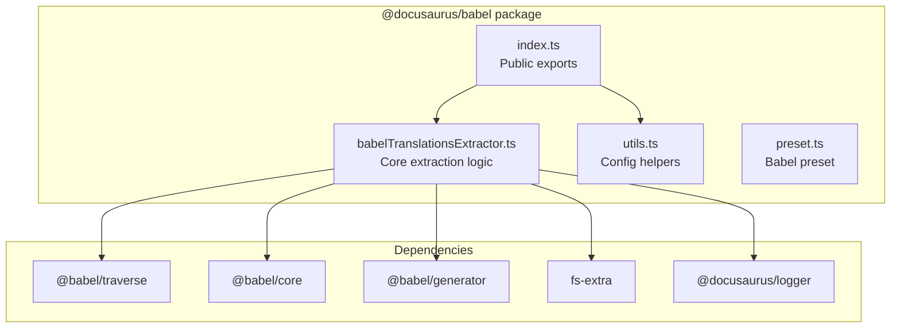
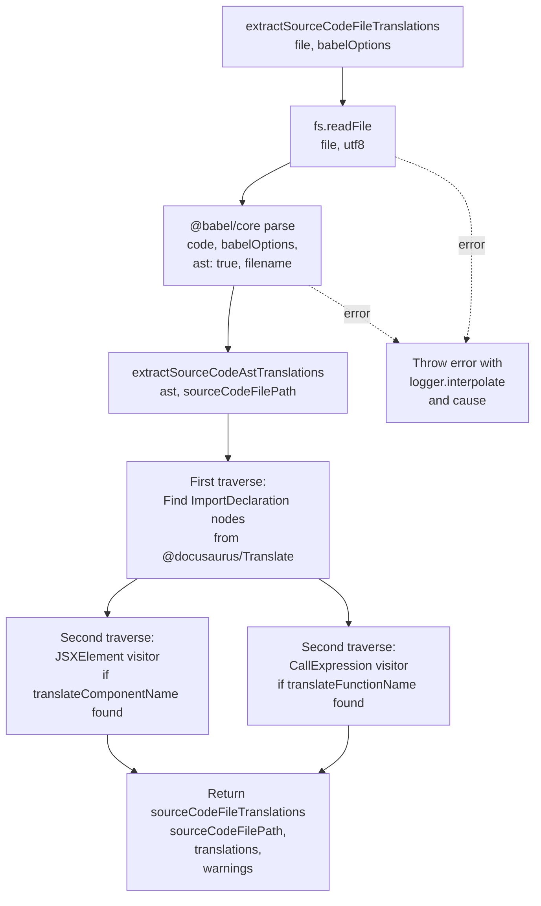

# Translation extraction internals

This document describes the modules, data flow, public API, and extension points behind Docusaurus translation extraction. Translation extraction reads source code files, identifies translatable strings that use the`@docusaurus/Translate` imports, and produces a structured`TranslationFileContent` object that can be merged into translation files.

## Package structure

Translation extraction is implemented in the`@docusaurus/babel` package, located under`packages/docusaurus-babel`. The package contains four source files:

| File | Responsibility |
|------|----------------|
|`src/index.ts` | Public exports for the package |
|`src/babelTranslationsExtractor.ts` | Core Babel-based extraction logic |
|`src/utils.ts` | Babel configuration helpers |
|`src/preset.ts` | Babel preset used during site compilation |

The extraction pipeline depends on`@babel/core`,`@babel/traverse`, and`@babel/generator` from Babel, plus`fs-extra` for file reads and`@docusaurus/logger` for error reporting.



## Public API

`src/index.ts` re-exports the functions that callers outside the package can use:

```ts
export {getCustomBabelConfigFilePath, getBabelOptions} from './utils';

export {extractAllSourceCodeFileTranslations} from './babelTranslationsExtractor';
```

###`extractAllSourceCodeFileTranslations`

**File:**`packages/docusaurus-babel/src/babelTranslationsExtractor.ts`

```ts
export async function extractAllSourceCodeFileTranslations(
  sourceCodeFilePaths: string[],
  babelOptions: TransformOptions,
): Promise<SourceCodeFileTranslations[]>
```

This is the main entry point. It accepts a list of source file paths and Babel transform options, then processes each file concurrently using`Promise.all` and`flatMap`.

The return type is defined in the same file:

```ts
export type SourceCodeFileTranslations = {
  sourceCodeFilePath: string;
  translations: TranslationFileContent;
  warnings: string[];
};
```

`TranslationFileContent` is imported from`@docusaurus/types`. The implementation treats it as an object where each key is a translation ID or message, and each value contains at least a`message` property and optionally a`description` property.

###`extractSourceCodeFileTranslations`

```ts
export async function extractSourceCodeFileTranslations(
  sourceCodeFilePath: string,
  babelOptions: TransformOptions,
): Promise<SourceCodeFileTranslations>
```

This lower-level function extracts translations from a single source file. It performs the following steps:

1. Reads the file contents with`fs.readFile(sourceCodeFilePath, 'utf8')`.
2. Parses the code into a Babel AST using`parse` from`@babel/core`, passing`ast: true` and the`filename` option.
3. Delegates AST traversal to`extractSourceCodeAstTranslations`.
4. Wraps any error in a new`Error` with`logger.interpolate` and attaches the original error as`cause`.

The`filename` option is passed explicitly to`parse` because Babel treats JavaScript and TypeScript files differently based on the file extension, as noted in a source comment referencing Nicolò Ribaudo's Twitter post.

###`getCustomBabelConfigFilePath`

**File:**`packages/docusaurus-babel/src/utils.ts`

```ts
export async function getCustomBabelConfigFilePath(
  siteDir: string,
): Promise<string | undefined>
```

Returns the absolute path to a custom Babel configuration file if`babel.config.js` exists inside`siteDir`, otherwise returns`undefined`. The function constructs the path by joining`siteDir` with the constant`BABEL_CONFIG_FILE_NAME` (imported from`@docusaurus/utils`) and checks existence with`fs.pathExists`.

###`getBabelOptions`

**File:**`packages/docusaurus-babel/src/utils.ts`

```ts
export function getBabelOptions({
  isServer,
  babelOptions,
}: {
  isServer?: boolean;
  babelOptions?: TransformOptions | string;
} = {}): TransformOptions
```

Builds a complete Babel`TransformOptions` object. The`caller` property identifies whether the current build is for server (`'server'`) or client (`'client'`).

When`babelOptions` is a string, it's treated as the path to a custom config file and returned with`babelrc: false` and`configFile: babelOptions`. Otherwise, the default preset`@docusaurus/babel/preset` is used, with`babelrc: false` and`configFile: false` to prevent Babel from searching the filesystem for configuration.

## Extraction pipeline

The extraction flow for a single source file proceeds through file reading, parsing, and two AST traversals:



## Extraction algorithm

`extractSourceCodeAstTranslations` performs two AST traversals over the parsed code.

### First pass: Import resolution

The first`traverse` call searches for`ImportDeclaration` nodes where:
- The import source is exactly`@docusaurus/Translate`
-`importKind` is not`'type'` (type-only imports are skipped)

For each matching import, the function determines:

- **`translateComponentName`**: the local binding name of the default import, if present. This is the React component (`<Translate>`).
- **`translateFunctionName`**: the local binding name of the named import called`translate`, if present. The code checks both`name === 'translate'` (identifier) and`.value === 'translate'` (string literal).

If neither import is found, the second traversal adds no visitors, preventing extraction from that file. This design prevents false positives from unrelated code.

### Second pass: JSX extraction

If`translateComponentName` was resolved, a`JSXElement` visitor extracts translations from`<Translate>` elements. For each matching element:

1. **Attribute evaluation**: Calls`evaluateJSXProp` to extract`id` and`description` props.
2. **Message determination**:
   - **No children**: The element must have an`id` prop. A warning is emitted if`id` is missing. The translation is recorded with`message: id` and optional`description`.
   - **Single non-empty child**: The child must be either a`JSXText` node (whitespace-normalized and trimmed) or a`JSXExpressionContainer` whose expression evaluates confidently to a static value. Whitespace is normalized with`.replace(/\s+/g, ' ')`. The translation key is`id ?? message`.
   - **Multiple or non-static children**: A warning is emitted indicating that content must be a static string or static expression.

The`evaluateJSXProp` helper:
- Finds an attribute by name in the opening element.
- Evaluates the attribute value using Babel's path evaluation.
- Returns the value only if evaluation is`confident` and the result is a string.
- Emits a warning if the attribute is not statically evaluable.

### Second pass: Function extraction

If`translateFunctionName` was resolved, a`CallExpression` visitor extracts translations from`translate({...})` calls. For each matching call:

1. **Argument count**: Requires exactly one or two arguments; otherwise a warning is emitted.
2. **First argument evaluation**: Evaluates the first argument. It must be a statically evaluable object with`confident === true`.
3. **Property extraction**: Reads`message`,`id`, and`description` from the evaluated object.
4. **Translation recording**: Records with key`String(id ?? message)` and value:
```ts
   {
     message: String(message ?? id),
     ...(Boolean(description) && {description: String(description)})
   }
   ```
5. **Warning emission**: If the first argument is not statically evaluable or the argument count is wrong.

## Warnings and error handling

The extractor returns warnings rather than throwing for non-fatal issues. Warnings are collected in the`warnings` array for each file and include the source file path and line number via the`sourceWarningPart` helper, which formats output as:

```
File: <sourceCodeFilePath> at line <node.loc?.start.line>
Full code: <generated code from node>
```

Examples of warnings emitted:

-`<Translate>``id` or`description` prop is not statically evaluable
-`<Translate>` without children and without`id`
-`<Translate>` content could not be extracted because it is not a static string or static expression
-`translate()` first arg is not a statically evaluable object
-`translate()` function only takes 1 or 2 args

Fatal errors (file read failure, Babel parse failure) are caught in`extractSourceCodeFileTranslations`, wrapped with`logger.interpolate` to include the file path, and rethrown with the original error attached as the`cause` property using the`Error` constructor's second argument.

## Babel preset configuration

The`src/preset.ts` file exports a Babel preset factory function used during site compilation. The preset is selected based on the build context (`isServer` flag from`api.caller`):

**Server build target:**
```ts
presets: [
  [
    '@babel/preset-env',
    {targets: {node: 'current'}},
  ],
  '@babel/preset-react',
  '@babel/preset-typescript',
],
plugins: [
  '@babel/plugin-transform-runtime',
  'babel-plugin-dynamic-import-node',
]
```

**Client build target:**
```ts
presets: [
  [
    '@babel/preset-env',
    {
      useBuiltIns: 'entry',
      loose: true,
      corejs: '3',
      modules: false,
      exclude: ['transform-typeof-symbol'],
    },
  ],
  '@babel/preset-react',
  '@babel/preset-typescript',
],
plugins: [
  '@babel/plugin-transform-runtime',
  '@babel/plugin-syntax-dynamic-import',
]
```

The preset configures the runtime plugin with`absoluteRuntime` pointing to the installed`@babel/runtime` package directory, ensuring the correct version is used.

## Extension points

Translation extraction is extensible through the Babel configuration system:

- **Custom Babel config**: Callers can pass`babelOptions` as either a`TransformOptions` object or a string path to a`babel.config.js` file via`getBabelOptions`.
- **Babel plugins and presets**: The`babelOptions` parameter is forwarded directly to`@babel/core parse`, allowing injection of custom plugins or presets that transform code before extraction.
- **Per-file processing**: The separation between`extractAllSourceCodeFileTranslations` (batch) and`extractSourceCodeFileTranslations` (single file) allows callers to implement custom batch processing, caching, or parallel strategies.

However, the core extraction visitors are hard-coded to`@docusaurus/Translate` imports and cannot be replaced or augmented without modifying the`babelTranslationsExtractor.ts` module.

## Limitations

- The extractor only recognizes imports from the exact path`@docusaurus/Translate`. Imports with a different path (e.g., aliased imports) are silently ignored.
- JSX attribute values and`translate()` arguments must be statically evaluable by Babel's`evaluate()` method. Dynamically constructed values are not extracted and generate warnings.
- The second traversal is skipped entirely if no`@docusaurus/Translate` import is found in the first pass, so files using a different import mechanism are silently ignored.
- The module does not merge, persist, or write extracted translations to disk. Other parts of Docusaurus are responsible for aggregating results and writing translation files.
- Whitespace normalization in JSX text children uses a simple regex replacement; complex whitespace scenarios may not be handled as expected.

## Related documentation

- Translation Extraction, Feature overview and usage
- Docusaurus Codebase Structure and Architecture, Monorepo organization and package relationships