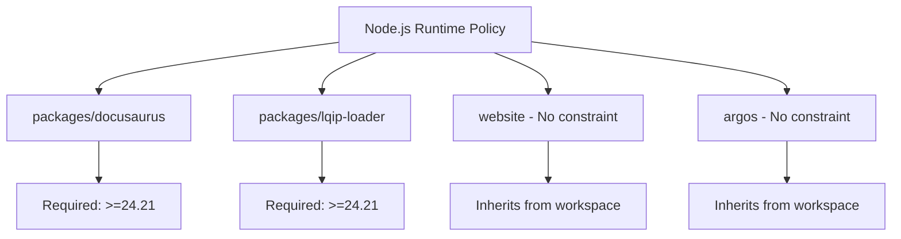

# Compliance documentation: Docusaurus repository

This document provides regulatory compliance and audit information for the`Mohita111/docusaurus` repository based on the five package manifests supplied for analysis:`argos/package.json`,`website/package.json`,`packages/docusaurus/package.json`,`packages/lqip-loader/package.json`, and`admin/test-bad-package/package.json`.

## Scope

This compliance documentation covers:

- License declarations present in package manifests
- Dependency inventory for the supplied package files
- Node.js runtime requirements
- Security-relevant scripts and environment handling
- Software Bill of Materials (SBOM) format requirements
- Audit-relevant test and verification controls

Only the package manifests listed above were available. Full CI workflow files, lockfiles, and source-level configuration are outside the evidence set.

## License compliance

The repository declares MIT licenses in public packages where the`license` field is present.

| Package manifest | License field | Status |
| --- | --- | --- |
|`packages/docusaurus/package.json` |`"license": "MIT"` | Declared |
|`packages/lqip-loader/package.json` |`"license": "MIT"` | Declared |
|`argos/package.json` |`"license": "MIT"` | Declared |
|`website/package.json` | Not present | Private package |
|`admin/test-bad-package/package.json` | Not present | Private package |

The packages marked`"private": true` (`website` and`admin/test-bad-package`) do not require individual license declarations; however, for audit completeness, the absence of an SPDX identifier in those manifests should be documented.

## Dependency inventory

The supplied manifests define the top-level dependency surface across the monorepo.

### Core package:`packages/docusaurus/package.json`

Scoped package:`@docusaurus/core` version`4.0.0`.

**Production dependencies with security implications:**

| Dependency | Version | Purpose |
| --- | --- | --- |
|`webpack` |`^5.111.0` | Module bundling |
|`webpack-dev-server` |`^6.0.0` | Development server |
|`serve-handler` |`^6.1.7` | Static file serving |
|`escape-html` |`^1.0.3` | HTML escaping utility |
|`eval` |`^0.1.8` | Code evaluation (requires review) |
|`react-router` |`^5.3.4` | Client-side routing |
|`react-router-dom` |`^5.3.4` | DOM routing bindings |
|`react-router-config` |`^5.1.1` | Routing configuration |

**Peer dependencies:**

| Peer dependency | Version | Optional |
| --- | --- | --- |
|`react` |`^19.3.0` | Required |
|`react-dom` |`^19.3.0` | Required |
|`@mdx-js/react` |`^3.1.1` | Required |
|`@docusaurus/faster` |`workspace:*` | Optional |

**Runtime engine requirement:**

```json
"engines": {
  "node": ">=24.21"
}
```

The presence of`eval` as a direct dependency warrants code-level audit to confirm it does not process untrusted input. The supplied manifests do not include call sites or usage context.

### Image optimization package:`packages/lqip-loader/package.json`

Scoped package:`@docusaurus/lqip-loader` version`4.0.0`.

**Production dependencies:**

| Dependency | Version | Purpose |
| --- | --- | --- |
|`sharp` |`^0.35.1` | Image processing |
|`file-loader` |`^6.2.0` | Webpack file handling |
|`lodash` |`^4.18.1` | Utility functions |

**Runtime engine requirement:**

```json
"engines": {
  "node": ">=24.21"
}
```

### Visual testing package:`argos/package.json`

Package:`argos` version`4.0.0` (private).

**Test and CI dependencies:**

| Dependency | Version | Purpose |
| --- | --- | --- |
|`@argos-ci/cli` |`^6.9.2` | Visual diff CLI |
|`@argos-ci/playwright` |`^7.5.0` | Argos Playwright integration |
|`@playwright/test` |`^1.63.0` | Browser automation testing |
|`cheerio` |`^1.2.0` | HTML parsing |

No`engines` field is present. This package is used only in development and testing workflows.

### Website package:`website/package.json`

Package:`website` version`4.0.0` (private).

**Security-relevant plugins and runtime dependencies:**

| Dependency | Version | Purpose |
| --- | --- | --- |
|`@docusaurus/plugin-pwa` |`workspace:*` | Progressive Web App support |
|`@docusaurus/plugin-google-gtag` |`workspace:*` | Google Analytics integration |
|`@docusaurus/theme-live-codeblock` |`workspace:*` | Interactive code execution |
|`@docusaurus/theme-mermaid` |`workspace:*` | Diagram rendering |
|`@crowdin/cli` |`^5.0.2` | Translation management CLI |
|`@crowdin/crowdin-api-client` |`^1.57.0` | Translation service API |

**Bundle optimization dependencies:**

| Dependency | Version |
| --- | --- |
|`webpack` |`^5.111.0` |
|`workbox-routing` |`^7.4.1` |
|`workbox-strategies` |`^7.4.1` |

**React framework:**

| Dependency | Version |
| --- | --- |
|`react` |`^19.3.0` |
|`react-dom` |`^19.3.0` |

The Google gtag plugin and PWA plugin perform runtime data collection and service worker registration respectively. Their configuration is not included in the supplied manifest, requiring audit of`docusaurus.config.js` to verify consent handling and data minimization.

No`engines` field is specified for this private workspace package.

### Test fixture package:`admin/test-bad-package/package.json`

Package:`test-bad-package` version`4.0.0` (private).

**Intentionally legacy dependencies:**

```json
"@mdx-js/react": "1.0.1",
"react": "16.14.0",
"react-dom": "16.14.0"
```

This package appears designed for negative testing or backwards compatibility coverage. Auditors must confirm that production builds do not reference these legacy versions.

## Node.js runtime requirements



Both`packages/docusaurus/package.json` and`packages/lqip-loader/package.json` enforce the constraint`"node": ">=24.21"`.

No`engines` field is present in`website/package.json`,`argos/package.json`, or`admin/test-bad-package/package.json`. Packages without explicit constraints inherit the workspace minimum.

## Software bill of materials (SBOM)

The provided package manifests do not contain dedicated SBOM generation fields or SPDX document declarations. To satisfy SBOM compliance requirements, generate one of the following formats from the repository lockfile (not supplied):

- **SPDX 2.3** or later (`SPDX-License-Identifier` and document format)
- **CycloneDX 1.5** or later (`bom-ref`, component metadata)

Reference the SBOM (CycloneDX) and SBOM (SPDX) documentation for format requirements.

**Package manager:** The manifests reference`pnpm` throughout build and deployment scripts:

```json
"upload": "pnpm exec -- argos upload ./screenshots/chromium",
"write-translations": "docusaurus write-translations",
"build": "docusaurus build"
```

The`pnpm` package manager is required to install and verify all declared dependencies consistently.

## Audit and verification controls

The repository includes automated verification scripts to support compliance review and regression prevention.

### Visual regression testing

`argos/package.json` defines screenshot and upload scripts:

```json
"screenshot": "playwright test",
"upload": "pnpm exec -- argos upload ./screenshots/chromium",
"upload-text-snapshots": "pnpm exec -- argos upload \"../website/build\" --build-name text-snapshots --files styles.css --files \"docs/**/*.html\" --files \"blog/**/*.html\"",
"report": "playwright show-report"
```

These controls document rendered output and detect unintended visual changes. Compliance benefit: provides evidence of UI consistency across builds.

### Type safety verification

`website/package.json` declares TypeScript checking:

```json
"typecheck": "tsc"
```

This enforces static type safety for the documentation website, reducing runtime type-related vulnerabilities.

### Theme customization testing

`website/package.json` includes four swizzle compatibility tests:

```json
"test:swizzle:eject:js": "cross-env SWIZZLE_ACTION='eject' SWIZZLE_TYPESCRIPT='false' node _dogfooding/testSwizzleThemeClassic.mjs",
"test:swizzle:eject:ts": "cross-env SWIZZLE_ACTION='eject' SWIZZLE_TYPESCRIPT='true' node _dogfooding/testSwizzleThemeClassic.mjs",
"test:swizzle:wrap:js": "cross-env SWIZZLE_ACTION='wrap' SWIZZLE_TYPESCRIPT='false' node _dogfooding/testSwizzleThemeClassic.mjs",
"test:swizzle:wrap:ts": "cross-env SWIZZLE_ACTION='wrap' SWIZZLE_TYPESCRIPT='true' node _dogfooding/testSwizzleThemeClassic.mjs"
```

These controls verify that theme ejection and wrapping do not introduce regressions across both JavaScript and TypeScript workflows.

### CSS ordering validation

`website/package.json` includes:

```json
"test:css-order": "node testCSSOrder.mjs"
```

This ensures deterministic stylesheet order in build output, which is critical for reproducible builds and audit trails.

## Credential and sensitive environment handling

`website/package.json` implements Crowdin translation workflows with explicit credential isolation:

```json
"netlify:crowdin:downloadTranslations": "pnpm netlify:crowdin:wait && pnpm --dir .. crowdin:download:website",
"netlify:crowdin:downloadTranslationsFailSafe": "pnpm netlify:crowdin:wait && (pnpm --dir .. crowdin:download:website || echo 'Crowdin translation download failure (only internal PRs have access to the Crowdin env token)')",
"netlify:crowdin:uploadSources": "pnpm --dir .. crowdin:upload:website"
```

**Compliance notes:**

- The failsafe script explicitly documents that Crowdin credentials are restricted to internal pull requests only.
- The exact Crowdin environment variable name is not disclosed in the supplied manifest.
- Auditors must verify that no Crowdin credentials appear in repository history, public CI logs, or GitHub Actions secret leakage.
- The`netlify:crowdin:wait` script (not shown in detail) may implement rate-limiting or polling logic to avoid concurrent API calls.

## Build environment configuration

`website/package.json` declares environment-gated build scripts:

```json
"start:baseUrl": "cross-env BASE_URL='/build/' pnpm start",
"build:baseUrl": "cross-env BASE_URL='/build/' pnpm build",
"start:blogOnly": "cross-env pnpm start --config=docusaurus.config-blog-only.js",
"build:blogOnly": "cross-env pnpm build --config=docusaurus.config-blog-only.js",
"build:fast": "cross-env BUILD_FAST=true pnpm build --locale en",
"profile:bundle:cpu": "DOCUSAURUS_EXIT_AFTER_BUNDLING=true node --cpu-prof --cpu-prof-dir .cpu-prof ./node_modules/.bin/docusaurus build --locale en"
```

These environment variables control:

-`BASE_URL`, deployment path configuration
-`BUILD_FAST`, optimization flag for rapid iteration
-`DOCUSAURUS_EXIT_AFTER_BUNDLING`, profiling mode for performance analysis

Auditors should confirm that environment variables do not expose sensitive configuration in build logs.

## Deployment pipeline

`website/package.json` declares Netlify deployment hooks:

```json
"netlify:build:production": "pnpm docusaurus write-translations && pnpm netlify:crowdin:delay && pnpm netlify:crowdin:uploadSources && pnpm netlify:crowdin:downloadTranslations && pnpm build",
"netlify:build:branchDeploy": "pnpm build",
"netlify:build:deployPreview": "pnpm build"
```

The production build includes translation synchronization with Crowdin before the final build step. Branch deployments and preview builds skip translation workflows to reduce build time.

## Compliance limitations and audit gaps

The evidence set consists solely of five package manifests. The following critical compliance items cannot be verified from the supplied files:

- **Full dependency tree:** Transitive dependency licenses and versions are present only in the lockfile (`pnpm-lock.yaml` not supplied).
- **Webpack security configuration:** Production bundle security (CSP headers, SRI, code splitting) depends on runtime configuration not in manifests.
- **PWA configuration:** Service worker scope, cache strategies, and offline behavior are defined in`docusaurus.config.js` (not supplied).
- **Google Analytics data handling:** gtag plugin configuration, consent flow, and data retention policy are in runtime configuration.
- **Eval usage:** The`eval` dependency in`@docusaurus/core` requires source code audit to confirm it does not process untrusted input.
- **CI/CD access controls:** GitHub Actions workflows, branch protection rules, and reviewer requirements are in`.github/workflows` (not supplied).
- **Crowdin token isolation:** The exact environment variable name and rotation policy are not documented in manifests.

A complete compliance assessment requires:

1.`pnpm-lock.yaml` for full dependency tree and license verification
2.`docusaurus.config.js` for runtime plugin and data handling configuration
3.`.github/workflows/` for CI access controls and deployment authorization
4. Source files in`packages/docusaurus/src/` for`eval` usage audit
5.`.npmignore` and file exclusion rules for artifact management

## Related documentation

For deeper security analysis of specific Docusaurus features, see the security controls documentation:

- Blog Security Controls
- Documentation Security Controls
- Site Building & Bundling Security Controls

For SBOM requirements in your compliance workflow, reference:

- CycloneDX SBOM
- SPDX SBOM