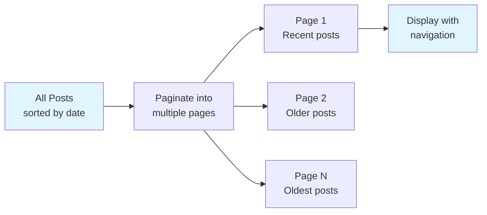
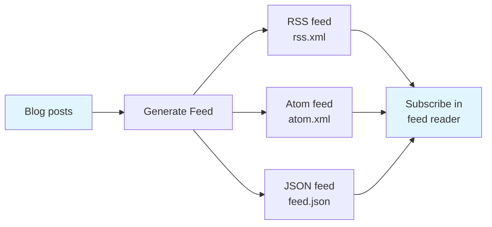

# Blog plugin

The Blog Plugin enables you to publish blog posts alongside your documentation with automatic organization, metadata management, and feed generation. It's designed for teams sharing release notes, technical articles, announcements, and other time-ordered content.

## What the blog plugin is for

You can use the Blog Plugin to:

- **Publish blog posts** with automatic date-based organization and chronological listing
- **Manage author information** including names, profiles, social links, and author-specific post archives
- **Organize content with tags** to help readers discover posts by topic
- **Subscribe to content** through RSS and Atom feeds
- **Paginate post listings** to keep pages fast and scannable
- **Extract and display metadata** like publication dates, reading time, and post descriptions automatically

The Blog Plugin is ideal for projects with active publishing schedules—open source projects sharing release notes, developer teams publishing technical articles, or organizations communicating updates to their community.

## How the blog plugin discovers and organizes posts

The plugin discovers blog posts from your blog directory and automatically extracts key information from each post.

### Post discovery

The plugin scans your blog directory for Markdown and MDX files based on file patterns you configure. It reads your`docusaurus.config.js` settings to determine which files to include or exclude from the blog.

### Date-based organization

Blog posts are organized by publication date. You can specify the date in two ways:

- **In the filename:** Use the format`YYYY-MM-DD` or`YYYY/MM/DD` in your filename (for example,`2024-01-15-my-post.md` or`2024/01/15/my-post.md`). The plugin extracts this date automatically.
- **In the post's front matter:** Add a`date` field to your post's front matter to override the filename date. You can use ISO 8601 format with or without a timezone.

If neither a filename date nor front matter date is provided, the plugin uses the file's creation date from your version control system (or the file system if version control isn't available).

### Metadata extraction

The plugin reads structured metadata from each post's front matter—the YAML section at the top of your file. Supported fields include:

-`title`: The post's headline (required unless content has a level-1 heading)
-`description`: A summary shown in post listings and feeds
-`authors`: An array of author keys linked to your authors file
-`tags`: Labels for organizing posts by topic
-`date`: Publication date (overrides filename date)
-`slug`: Custom URL path (overrides the default based on filename)
-`draft`: Mark posts as drafts to exclude them from listings and feeds
-`unlisted`: Publish a post without displaying it in main listings or feeds

Posts marked as drafts are excluded entirely and won't appear in listings, feeds, or pagination.

## Post listing and pagination

The plugin auto-generates post listing pages grouped into numbered pages, so your blog remains fast as the post count grows.



You control how many posts appear per page through the`postsPerPage` option in your configuration. You can also set`postsPerPage: 'ALL'` to display all posts on a single page. The plugin automatically generates "Previous" and "Next" links between pages.

Posts marked as unlisted are excluded from pagination and listing pages, though they remain accessible at their full URL.

## Tag-based organization

Posts can include tags in their front matter. The plugin automatically groups posts by tag and creates dedicated listing pages for each tag, with the same pagination logic applied to tag pages.

Example front matter:

```
---
title: "My Post"
tags: [announcement, release]
---
```

Readers can filter posts by clicking tags on your blog to see all posts in a category.

## Feed generation

The Blog Plugin automatically creates RSS and Atom feeds so readers can subscribe to your blog in feed readers.



The plugin includes post content, metadata, tags, and author information in each feed. You can configure:

- **Feed title and description** (defaults to your site title and "Blog" if not specified)
- **Number of recent posts included** (all posts by default, or a limited count)
- **Feed types** to generate—RSS 2.0, Atom 1.0, JSON Feed, or any combination
- **Custom feed creation logic** to transform post data before publishing

Feed URLs are automatically added to your site's HTML head so feed readers can discover them.

### Styling feeds with XSLT

You can optionally style RSS and Atom feeds with XSLT files so they display nicely when opened in a browser. Provide an XSLT file alongside a matching CSS file, and the plugin injects a reference to your stylesheet in the feed XML.

### Filtering feed content

Posts marked as draft or unlisted are automatically excluded from feeds, ensuring only published content reaches subscribers.

## Author profiles and social links

The Blog Plugin lets you maintain an authors file where you define author information once and reference it across multiple posts.

In your authors file (typically`authors.json` or`authors.yml`), define authors with:

-`name`: Author's full name
-`url`: Link to author's website or profile
-`imageURL`: Avatar or profile image
-`title`: Job title or role
-`email`: Contact email
-`description`: Short bio or description
-`page`: Enable an author page (permalink defaults to`/authors/{author-key}`)
-`socials`: Links to social media profiles (GitHub, Twitter, LinkedIn.)

When you reference an author key in a post's front matter, the plugin pulls all this information and displays it with the post. Author pages automatically list all posts by that author, with the same pagination and tag filtering applied.

Example front matter:

```
---
title: "New Features"
authors: [alice, bob]
---
```

The plugin validates author references and warns if a post references an author key that doesn't exist in your authors file.

## Configuration options

The Blog Plugin offers several configuration options in your`docusaurus.config.js`:

**Post discovery:**
-`include`: File patterns to include (default:`['*.mdx?']`)
-`exclude`: File patterns to exclude (default:`[]`)

**Pagination:**
-`postsPerPage`: Posts per listing page (default:`10`, or set to`'ALL'`)
-`pageBasePath`: URL path segment for paginated pages (default:`'page'`)

**Feed generation:**
-`feedOptions.type`: Array of feed types to generate—`['rss']`,`['atom']`,`['json']`, or combinations
-`feedOptions.title`: Feed title (defaults to site title + " Blog")
-`feedOptions.description`: Feed description (defaults to site title + " Blog")
-`feedOptions.limit`: Number of posts in feeds (default: all posts, or set a limit)
-`feedOptions.copyright`: Copyright notice in feeds
-`feedOptions.language`: Feed language (defaults to current locale)
-`feedOptions.xslt`: XSLT file paths for RSS and Atom styling
-`feedOptions.createFeedItems`: Custom function to transform posts into feed entries

**Author configuration:**
-`authorsMapPath`: Path to your authors file (default:`'authors.json'`)

**Reading time:**
-`showReadingTime`: Display estimated reading time (default:`true`)

**Content handling:**
-`editUrl`: Function or URL string for "Edit this page" links
-`editLocalizedFiles`: Use localized content paths for edit links (default:`false`)
-`sortPosts`: Sort posts in ascending or descending date order (default: descending)
-`truncateMarker`: Regex pattern for excerpt markers (default:`<!-- truncate -->`)
-`onUntruncatedBlogPosts`: Warn if posts lack excerpt markers (default:`'warn'`)

## Performance considerations

Feed generation can impact build time, especially with large numbers of posts or when using custom feed creation logic. The plugin processes each post to extract content, convert links and images to absolute URLs, and generate feed entries.

If build time becomes a concern, consider:

- Setting a`feedOptions.limit` to include only recent posts in feeds
- Disabling feed generation if not needed by setting`feedOptions.type` to an empty array
- Using the`onUntruncatedBlogPosts: 'ignore'` option if excerpt markers aren't necessary

Date-based filename organization requires consistent naming conventions. Posts without a date in the filename or front matter fall back to file creation dates, which may not match your intended publication order if files are copied or migrated.

## Related features

MDX & Markdown Authoring, Learn how to write blog post content in Markdown and MDX with interactive components.

Documentation Plugin, Explore the documentation plugin for publishing versioned technical documentation alongside your blog.
