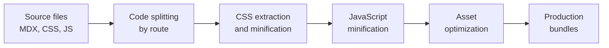

# Build bundling and optimization

Build bundling transforms your documentation source files into optimized, production-ready bundles that load quickly in the browser. Docusaurus automates the entire bundling process—from splitting code by route to minifying CSS and JavaScript—so you don't need to manage these details manually.

## What this feature is for

Build bundling and optimization is designed for developers and site administrators who want faster sites with smaller bundle sizes. If you're building a large documentation site, optimizing for users on slow networks, or aiming to reduce hosting bandwidth costs, this feature directly serves your needs.

## What you can do

Docusaurus gives you control over how your site is bundled and optimized:

- **Choose your bundler**: Select between webpack (the stable, default option) or rspack (an experimental, faster alternative)
- **Minimize code and styles**: CSS and JavaScript are automatically minified in production builds, reducing file sizes
- **Split code by routes**: Your JavaScript is split into separate chunks so browsers download only what's needed for each page
- **Optimize assets**: Images and other static files are processed for better performance
- **Remove unused code**: Tree-shaking eliminates code paths your documentation doesn't use
- **Control source maps**: Decide whether to include source maps for debugging in production

## Bundler choices

Your bundler is the tool that combines all your documentation files, assets, and dependencies into final bundles. Docusaurus supports two options:

**Webpack** is the default and thoroughly tested option. It's stable, compatible with almost all configurations, and well-documented across the web. Use webpack unless you have a specific reason to try something newer.

**Rspack** is an experimental, faster alternative built with Rust. It can significantly speed up build times, especially for large sites. However, it's newer and may not support every advanced webpack feature. If your build time is a bottleneck and you're comfortable with newer tools, rspack is worth exploring—but expect that some configurations might not work as they do with webpack.

## How optimization works

The bundling pipeline runs automatically during a production build and performs these steps in sequence:

**Code splitting** divides your JavaScript into separate chunks for each page or section. This means browsers download a shared chunk once, then smaller, page-specific chunks as users navigate—enabling better caching and faster subsequent page loads.

**CSS extraction and minification** pulls all your styles into separate files and removes redundant rules and whitespace. This keeps stylesheets out of the JavaScript bundle and reduces their file size.

**JavaScript minification** removes unnecessary characters (whitespace, comments, long variable names) and rewrites code to be as compact as possible without changing behavior.

**Asset optimization** processes images and other static files to reduce their size without visible quality loss.

**Tree-shaking** removes code that your documentation doesn't actually use—a crucial optimization for reducing bundle size when you include libraries with multiple features.

## Key configuration options

You control bundling and optimization through your site's configuration file. The main options are:

- **Bundler selection**: Choose between webpack and rspack in your build configuration
- **Code splitting strategy**: Define how pages are grouped into chunks
- **Source maps**: Enable for debugging production issues, or disable to reduce bundle size
- **CSS processing**: Configure how stylesheets are extracted, minified, and optimized
- **Minification options**: Control JavaScript and CSS minification behavior

## What gets optimized

The following are automatically optimized during production builds:

- All JavaScript (route-specific code, shared libraries, theme code)
- All CSS extracted from your documentation
- HTML output (whitespace and redundant attributes removed)
- Static assets referenced in your content
- SVG and image files

## Performance benefits

- **Smaller bundles**: Minification and tree-shaking reduce file sizes by 50–80% compared to unoptimized output
- **Faster downloads**: Smaller bundles download faster, especially important for users on 3G networks or other slow connections
- **Better caching**: Code splitting means returning visitors only download changed chunks, not entire bundles
- **Parallel loading**: Split chunks can be downloaded in parallel, reducing time-to-interactive
- **Reduced bandwidth costs**: Smaller bundles mean lower egress costs if you're charged by data transferred

## Important boundaries and limitations

**Rspack is experimental**: While rspack often builds faster, it's newer than webpack and may not support every advanced configuration. If you use highly customized webpack setups, rspack might not work without changes. Test rspack thoroughly before relying on it for production.

**Webpack expertise required for advanced configs**: If you need non-standard bundling, code splitting, or loader configurations, you'll need to understand webpack. The default configuration handles common cases well, but customization can be complex.

**Build time vs. bundle size trade-offs**: Some optimizations that reduce bundle size (like aggressive minification) can slow down builds. You can adjust these trade-offs, but not all optimizations apply to both speed and size equally.

**Source maps add file size**: While helpful for debugging, source maps can double your bundle size. Use them in development and staging, not always in production.

## Related features

- Site building & bundling provides the overall build system
- Performance optimization covers additional speed enhancements beyond bundling
- CSS optimization details stylesheet minification and optimization
- Logging & diagnostics helps you measure build performance
