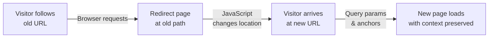

# Client-side redirects

The Client-side Redirects plugin lets you handle URL changes gracefully by automatically redirecting visitors from old paths to new ones. This is essential when you reorganize your documentation, rename pages, or move content to different sections—visitors following old links won't land on broken pages.

## Who this is for

Site administrators and maintainers managing documentation structure changes, content migrations, or legacy URL preservation. Teams with external links or bookmarks pointing to documentation that needs to be reorganized without breaking access.

## What it does

The plugin creates redirect pages during your build process that use client-side JavaScript to send visitors from old URLs to new ones. When someone follows an old link, they're automatically taken to the updated page while preserving query parameters and page anchors.

For example, if you move a page from`/docs/old-guide` to`/docs/guides/new-location`, the plugin can generate a redirect page at the old path that sends visitors to the new one.

## Key capabilities

**Define redirect rules**

You specify redirect rules in your configuration that map old paths to new ones. Each rule has a destination path (`to`) and one or more origin paths (`from`). The plugin accepts exact path matches, so you can be precise about which old URLs should redirect where.

```javascript
// In docusaurus.config.js
plugins: [
  [
    '@docusaurus/plugin-client-redirects',
    {
      redirects: [
        {
          from: '/docs/old-page',
          to: '/docs/new-page',
        },
        {
          from: ['/docs/legacy-path', '/docs/deprecated-section'],
          to: '/docs/current-location',
        },
      ],
    },
  ],
]
```

**Generate redirect pages automatically**

During the build process, the plugin creates HTML redirect pages at each old path. These pages contain client-side JavaScript that performs the actual redirect. Visitors automatically move to the new URL without seeing an error page.

**Preserve query strings and anchors**

When someone visits an old URL with query parameters (like`?search=term`) or page anchors (like`#section-heading`), those are preserved and passed along to the new page. This means analytics tracking and deep links continue to work after a redirect.

**Support pattern-based redirects**

Use the`createRedirects` callback to generate redirect rules dynamically based on your site's structure. This function is called for every path Docusaurus creates, letting you define rules programmatically instead of manually listing every redirect.

```javascript
plugins: [
  [
    '@docusaurus/plugin-client-redirects',
    {
      createRedirects(path) {
        // Redirect paths without .md extension
        if (path.endsWith('/')) {
          return path.slice(0, -1);
        }
        return undefined;
      },
    },
  ],
]
```

**Handle extension differences**

You can strip file extensions from old paths and add different extensions to new ones. Use`fromExtensions` to specify which extensions should be removed from incoming paths, and`toExtensions` to specify which extensions to append to the destination.

## How redirects work



When a visitor follows an old link:

1. Their browser requests the old URL path
2. The plugin's generated redirect page loads with client-side JavaScript
3. JavaScript automatically navigates to the new URL
4. Query strings and page anchors go along with the redirect
5. The visitor sees the new page as if they'd navigated there directly

## Key options

**Plugin ID**

Identify multiple instances of the plugin when you need different redirect configurations for different content types.

**Redirect list**

Provide an array of redirect rules. Each rule maps one or more old paths to a single new path. This is the primary way to handle known URL changes.

**Dynamic redirect function**

The`createRedirects` callback runs during the build for every path your site creates. Return a string or array of strings representing paths that should redirect to the current path. Returning`null` or`undefined` means no additional redirects for that path. This is useful for creating catch-all rules or handling URL format differences without manual configuration.

## Benefits

**Maintains external link integrity**

When external websites, documentation, or users have bookmarked your old URLs, redirects keep those links working instead of showing 404 errors.

**Smooth content reorganization**

Restructure your documentation without worrying about breaking existing links. Visitors from search engines, social media, or external references continue to find the content.

**Supports analytics tracking**

Redirects happen client-side, so your analytics tools can track which old paths are still being accessed. This helps you identify which URLs need better visibility or whether old content is still in demand.

**Flexible rule definition**

Whether you need exact matches, pattern-based rules, or dynamically generated redirects, the plugin supports all approaches.

## Important limitations

**Requires JavaScript**

Redirects happen in the visitor's browser using JavaScript. If someone has JavaScript disabled or if a web crawler doesn't execute JavaScript, the redirect won't happen. For critical URLs, consider server-side redirects as a more robust alternative.

**Client-side processing**

The redirect happens after the page loads, creating a brief delay. Server-side redirects are more efficient and happen before any content reaches the browser.

**Build-time generation**

Redirects are created during your build process. After deploying, they're static files. If you need to add new redirects, you must rebuild and redeploy your site.

## Configuration

The plugin is configured in your`docusaurus.config.js` file. At minimum, you need to add it to your plugins array and provide a list of redirects or a`createRedirects` function.

All options are validated to ensure your redirect paths are properly formatted and your rules are syntactically correct. Invalid configurations will produce clear error messages during the build.

---

**Related**: doc:0625d71b-4df8-412c-ba07-a1f469d48f5a, doc:669c7bca-56a9-416f-87cd-bb6ac8f6965a, doc:c879afa4-f14d-487c-bb0a-826b9344fadb, doc:37b830b0-eed8-4614-815b-b5bde5802453
