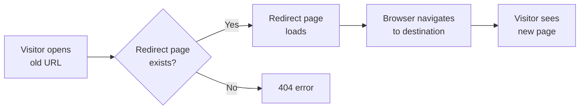

# Client-side redirects

Client-side redirects help site administrators and maintainers keep old page addresses working after pages are moved or renamed. When a visitor opens an old URL, a generated redirect page sends their browser to the new URL automatically. This protects search rankings, bookmarks, and links shared elsewhere.

## Who it's for

This feature is for anyone who manages a published site and is about to reorganize page addresses. It's especially useful when you:

- rename or move pages
- change URL extensions
- consolidate multiple old paths to one new page
- migrate content without breaking existing links

## What you can do

You can:

- Create an explicit redirect from one or more old paths to one existing new page
- Automatically redirect extension-based URLs to clean URLs (for example, redirect`/docs/guide.html` to`/docs/guide`)
- Automatically redirect clean URLs to extension-based URLs (for example, redirect`/docs/guide` to`/docs/guide.html`)
- Generate source paths programmatically using a custom function applied to every existing page
- Match the destination path to your site's trailing slash preference
- Automatically forward query strings and anchors from the original request unless the destination already has them

## How redirects work

Docusaurus creates a redirect page for each source path you define. The source path is the old address, and the destination path is an existing page on your site. When someone opens the source path, the redirect page sends them to the destination path.

Each redirect rule has:

-`from`: one or more source paths that visitors may open
-`to`: the existing page they should reach

The same`to` destination can accept multiple`from` values.

Here's how the redirect process flows:

## Redirect options

### Explicit redirect rules

Use the`redirects` configuration to define one-to-one or many-to-one redirects. Each rule contains:

-`to`: the existing destination path
-`from`: one source path or a list of source paths

When multiple rules create the same source path, Docusaurus keeps only one and reports the duplicates in your build output.

### Extension redirects

Use`fromExtensions` and`toExtensions` to handle file-extension changes without listing every path individually.

**`fromExtensions`** creates source paths by adding listed extensions to existing clean paths. For example, if`fromExtensions` includes`html`, an existing page at`/docs/guide` also receives a redirect from`/docs/guide.html`.

**`toExtensions`** creates source paths by removing listed extensions from existing paths. For example, if`toExtensions` includes`html`, an existing page at`/docs/guide.html` receives a redirect from`/docs/guide`.

Extension values must be simple suffixes such as`html` or`pdf`. They cannot:

- be empty
- contain a dot (`.`) or slash (`/`)
- include invalid URL characters

### Programmatic redirects

Use`createRedirects` to define redirects through a function. Docusaurus passes each existing route path to your function. The function can return a single source path, a list of source paths, or no value (undefined, null). Every returned source path redirects to that existing route path.

This is useful for applying a consistent path transformation across many pages without manually listing each one.

## Trailing slashes

The redirect feature respects your site's trailing slash setting. When the site requires trailing slashes, destinations are automatically adjusted to include one. When the site disallows trailing slashes, destinations are adjusted to remove them.

If a destination path doesn't match or doesn't exist with the required trailing slash style, the build reports the issue and lists valid paths you can redirect to.

## Query strings and anchors

If the destination path doesn't already include its own query string or anchor, the redirect page automatically forwards the query string and anchor from the original request. For example, a visitor opening a source path with`?utm_campaign=launch#section` still sees those parts after the redirect.

If the destination path already has a query string or anchor, the destination's own values take priority and the original request's values are not appended.

This behavior is automatic. You don't need to list query strings or anchors in your redirect rules.

## Conflicts and limits

- A source path can't redirect to multiple destinations. If a duplicate source path is configured, only one redirect is kept and duplicates are reported.
- A source path that matches an existing page is ignored, because it would override a real page.
- A destination path must point to an existing page. Invalid destinations cause the build to stop and report an error with a list of valid paths.
- Extension redirects only support simple file extensions. For more complex transformations, use`createRedirects`.
- Redirects are not available on sites that use hash-based routing. The feature disables itself automatically and reports that it isn't supported.

## Benefits

- Old URLs keep working after you move or rename pages.
- Visitors who use bookmarks or shared links reach the new location without seeing a "not found" page.
- Search engines can follow the old address to the new address, preserving search rankings.
- You can consolidate multiple old paths into one destination.
- You can enforce a consistent URL style with extension and trailing slash redirects.

---

**Related:**

- How to handle page renames without 404s
- How to redirect broken or legacy URLs
- How to configure redirect rules for localized paths
- How to generate redirect pages at build time
