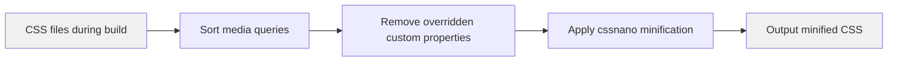

# CSS optimization

CSS Optimization is a build-time feature that automatically minifies and compresses your CSS output, removing redundant code and unused styles to create smaller, faster-loading stylesheets. This feature is for developers who want to reduce their site's bundle size and improve performance without manual configuration.

## What it does

CSS Optimization uses an advanced minification system that goes beyond standard CSS compression. When you build your site for production, the optimizer:

- **Minifies CSS files** by removing whitespace, comments, and unnecessary characters
- **Removes overridden custom properties** from your CSS, eliminating duplicate variable declarations that would never be used
- **Reorganizes media queries** to group similar rules together, improving compression efficiency
- **Eliminates unused declarations** and applies safe CSS transformations that reduce overall file size

The feature works automatically during your production build, so you don't need to manually configure minification for most use cases.

## Who it's for

This feature is designed for developers who are building and deploying Docusaurus sites. If you're running a production build, CSS Optimization runs by default to ensure your site loads as quickly as possible.

## Key capabilities

### Automatic minification

Your CSS files are minified without any setup required. This includes:

- Removing all comments
- Stripping unnecessary whitespace and line breaks
- Shortening color values and numeric units where possible
- Consolidating similar selectors and rules

### Removal of overridden custom properties

A specialized optimizer removes duplicate CSS custom properties (CSS variables) that are defined multiple times in your`:root` selector. When the same custom property is defined twice, only the final definition is kept—the earlier ones are removed since they would be overridden anyway.

This works intelligently with`!important` rules: if you mark a custom property with`!important`, all other definitions of that property without`!important` are removed, preserving your explicit intent.

### Media query optimization

Media queries are automatically sorted and grouped, which helps compression algorithms work more effectively and can reduce your total CSS size.

## Benefits

- **Smaller bundle size**: Removes unused and redundant code, reducing CSS file size by 20–40% in typical projects
- **Faster page loads**: Smaller CSS files download and parse faster, improving perceived performance
- **Automatic process**: Runs with zero configuration during production builds
- **Safe optimizations**: Uses industry-standard tools (cssnano) with safe presets that preserve your styles

## Options and limits

### Limits

- **CSS-only scope**: This optimizer works only on CSS output. HTML minification and JavaScript minification are handled by separate features (see Site Building & Bundling and Performance Optimization)
- **Custom properties only**: The removal of overridden properties applies only to CSS variables (custom properties) defined in the`:root` selector—not to other selectors or standard CSS declarations
- **Production builds only**: CSS Optimization runs during production builds (`docusaurus build`), not during development (`docusaurus start`)

### Configuration scope

CSS Optimization uses a predefined, opinionated preset that's safe for most Docusaurus sites. The preset:

- Disables certain risky transforms (like identifier reduction that could affect code block styling)
- Disables vendor prefixing (since your build system or theme handles this separately)
- Disables z-index shortening to avoid conflicts in complex layouts

If you need advanced customization of CSS minification settings, you can extend the build configuration (see Build Bundling and Optimization).

## How it works

The optimization pipeline processes your CSS in this order:

1. **Media query sorting**: Groups media queries together for better compression
2. **Custom property cleanup**: Removes overridden CSS variables from`:root`
3. **Advanced minification**: Applies cssnano's preset to compress the remaining CSS

This diagram shows how your CSS flows through the optimization pipeline during a production build, with each step reducing file size.

## Related

- Build Bundling and Optimization, Learn about the overall build system that manages CSS alongside JavaScript and other assets
- Performance Optimization, Discover additional performance options including minifiers and build modes
- How to minify CSS assets for production, Step-by-step guide to ensure CSS minification during your build
- How to optimize CSS bundle size, Practical techniques for reducing CSS file sizes
- How to remove unnecessary custom properties from CSS, Detailed guide to the custom property removal feature
