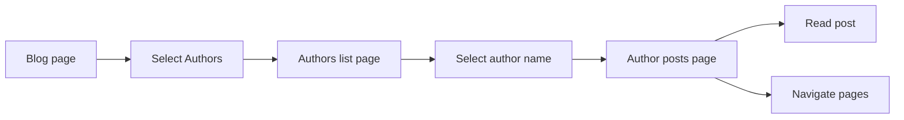

# How to browse posts by author

You can use the blog's author pages to see all published posts from a specific writer. This guide explains how to find an author and browse their posts.

## Prerequisites

- The site's blog has an **Authors** section enabled.
- The author you want to read has at least one published post assigned to them.

## Browse posts by author

The following diagram shows the steps to find and read posts by a specific author:

1. Navigate to the site's **Blog** page.
2. Select the **Authors** link to open the authors list page.
3. Review the list of authors. Each author entry displays the number of published posts they have written.
4. Select the author's name to open their dedicated author page.
5. Browse the list of posts shown on the author's page, ordered with the most recent posts first.
6. If the author has more than 10 posts (or the number configured by the site), pagination controls appear at the bottom of the page. Select **Next** to view additional pages of posts.
7. Select any post title to read the full post.

## Expected result

You see a list of published posts written by the selected author, ordered with the most recent posts first. Each post shows the title, publication date, and excerpt. If the author has more posts than fit on one page, you can navigate to additional pages using the pagination controls.

## Common issues

- **The Authors section is missing.** The site may not have author pages enabled. Contact the site owner if you expect to see authors.
- **An author appears in the list but has no individual page.** That author may be listed for reference only without a dedicated page. Check if their posts appear in the main blog listing instead.
- **An author's page shows no posts.** The author may not have any published posts yet, or their posts may be marked as unlisted. Contact the site owner if you expect to see their posts.
- **The same person appears under multiple author names.** Author names are managed separately by the site. Contact the site owner to request consolidation of duplicate author entries.

## Related guides

- How to read blog posts
- How to filter posts by tags
- How to paginate through blog listing
