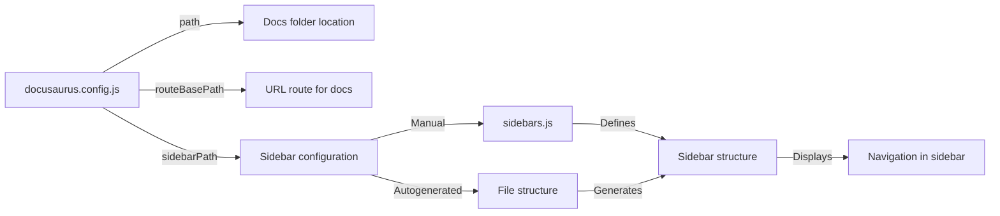

# How to configure documentation sidebar and paths

You can customize how your documentation is organized and accessed by configuring the sidebar structure and URL paths in your Docusaurus site. This guide walks you through the key configuration options available in your site's settings.

## Before you start

You'll need:
- Access to your`docusaurus.config.js` file in your project's root directory
- Your documentation files organized in a`docs` folder (or custom path)
- Optionally, a`sidebars.js` file to define sidebar structure

## Understanding sidebar and path configuration

Docusaurus offers two ways to organize your documentation navigation:

- **Manual sidebars**: You explicitly define the sidebar structure in a configuration file
- **Autogenerated sidebars**: Docusaurus automatically generates the sidebar based on your file structure (when no configuration file is present)

## Configure the documentation path

The documentation path determines where your docs appear in your site's URL structure and where the source files live.

1. Open`docusaurus.config.js` in your project root

2. Locate the`presets` or`plugins` section where you configure the docs plugin

3. Add or modify the`path` option to point to your docs directory:

```javascript
{
  path: 'docs',  // Relative to your site directory
}
```

4. Set the`routeBasePath` to control the URL prefix for your documentation:

```javascript
{
  routeBasePath: 'docs',  // Makes docs available at /docs/
  // Use '/' to display docs at the root URL instead
}
```

## Configure sidebar behavior

You can control how sidebar categories behave and whether they're expanded or collapsed.

1. In`docusaurus.config.js`, find the docs plugin configuration

2. Control whether sidebar categories can be collapsed:

```javascript
{
  sidebarCollapsible: true,  // Allows users to collapse/expand categories
}
```

3. Set whether categories are collapsed by default when the page loads:

```javascript
{
  sidebarCollapsed: true,  // Categories start collapsed
  // Use false to have categories expanded by default
}
```

## Define a manual sidebar structure

To take full control of your sidebar organization, create a sidebar configuration file.

1. Create a file named`sidebars.js` in your project root

2. Export a sidebar object that defines your structure. For example:

```javascript
module.exports = {
  docs: [
    'introduction',
    {
      type: 'category',
      label: 'Getting Started',
      items: [
        'setup',
        'installation',
        'configuration',
      ],
    },
    {
      type: 'category',
      label: 'Advanced Topics',
      items: [
        'customization',
        'api-reference',
        'troubleshooting',
      ],
    },
  ],
};
```

3. Reference this file in your`docusaurus.config.js`:

```javascript
{
  sidebarPath: require.resolve('./sidebars.js'),
}
```

## Disable manual sidebars (use autogeneration)

If you want Docusaurus to automatically generate your sidebar from your file structure instead of maintaining a manual configuration:

1. Open`docusaurus.config.js`

2. Set`sidebarPath` to`false`:

```javascript
{
  sidebarPath: false,  // Enables autogenerated sidebar
}
```

When autogeneration is enabled, Docusaurus will create the sidebar based on your folder and file organization.

## Customize individual document paths

You can override the URL path for any document using front matter at the top of your markdown file.

1. Open any documentation markdown file (`.md` or`.mdx`)

2. Add a`slug` property to the front matter section:

```markdown
---
title: My Custom Page
slug: /custom/path
---

Content goes here...
```

The document will now be accessible at`/docs/custom/path` instead of its default location based on the file structure.

## Set sidebar labels and order

Control how documents appear in the sidebar using front matter.

1. In your markdown file, add`sidebar_label` to customize the text shown in the sidebar:

```markdown
---
title: Installation Guide
sidebar_label: Install
---
```

2. Use`sidebar_position` to set the order (lower numbers appear first):

```markdown
---
title: Getting Started
sidebar_position: 1
---
```

3. To associate a document with a specific sidebar when you have multiple sidebars:

```markdown
---
displayed_sidebar: sidebar_name
---
```

## Handle multiple documentation sections

If you need separate documentation sections with different sidebars, configure multiple plugin instances.

1. In`docusaurus.config.js`, add multiple docs plugin configurations:

```javascript
plugins: [
  [
    '@docusaurus/plugin-content-docs',
    {
      id: 'guides',
      path: 'guides',
      routeBasePath: 'guides',
      sidebarPath: require.resolve('./sidebars-guides.js'),
    },
  ],
  [
    '@docusaurus/plugin-content-docs',
    {
      id: 'api',
      path: 'api',
      routeBasePath: 'api',
      sidebarPath: require.resolve('./sidebars-api.js'),
    },
  ],
],
```

2. Create separate sidebar configuration files (`sidebars-guides.js`,`sidebars-api.js`.)

## Configure sidebar item metadata

Add custom properties to sidebar items that your theme or components can use.

In your`sidebars.js`, you can add metadata to categories:

```javascript
{
  type: 'category',
  label: 'Getting Started',
  className: 'custom-class-name',
  customProps: {
    color: 'blue',
    icon: 'gear',
  },
  items: [
    'installation',
    'configuration',
  ],
}
```

These custom properties are accessible in your theme components.

## Expected results

After configuration:

- Your documentation appears at the URL path you specified
- The sidebar displays with the structure you defined or autogenerated
- Documents respect the order and labels you set
- Users can collapse and expand categories based on your settings



## Common issues and solutions

**Issue: Sidebar doesn't appear**
- Verify`sidebarPath` points to a valid file, or set it to`false` for autogeneration
- Check that your`docs` folder contains markdown files
- Ensure document IDs in the sidebar match your actual files

**Issue: Documents appear in wrong order**
- Use`sidebar_position` front matter in your markdown files to order them numerically
- In manual sidebars, list items in the order you want them to appear
- Lower position numbers appear earlier in the list

**Issue: Changes to sidebar don't appear**
- Stop your dev server and restart it:`npm run start` or`yarn start`
- Clear your browser cache or do a hard refresh

**Issue: Document not showing in sidebar**
- Verify the document ID in the sidebar matches the markdown filename (without`.md`)
- Check that the document's`displayed_sidebar` front matter isn't hiding it
- Ensure the file is in the correct docs folder path

**Issue: Sidebar categories won't collapse**
- Confirm`sidebarCollapsible` is set to`true` in your plugin configuration
- Clear your browser's local storage, as collapse state may be cached

---

## Related topics

Browse documentation by sidebar

Localize documentation paths

Navigation versioned documentation sets
