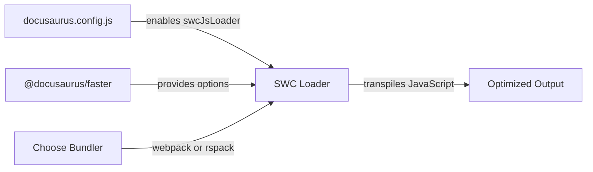

# How to configure SWC transpilation options

Configure SWC transpilation settings to control how your JavaScript code is transformed during the build process. SWC is a faster alternative to Babel that minifies and transpiles your code with improved performance.

## Prerequisites

- A Docusaurus site with the`@docusaurus/faster` package installed
- Access to your`docusaurus.config.js` configuration file
- Node.js 24.21 or later

## Configuration overview

When you enable SWC transpilation in Docusaurus, the system automatically applies optimized transpilation options through the`@docusaurus/faster` package. The transpilation configuration includes settings for:

- JavaScript minification and compression
- ECMAScript version targeting (ECMAScript 2020 and above)
- Output formatting and character encoding

The system manages these options internally based on your bundler choice (Webpack or Rspack) and applies sensible defaults for production builds.



## Steps to configure SWC transpilation

**1. Enable SWC in your configuration**

Open`docusaurus.config.js` and locate the`future.faster` section. Set the`swcJsLoader` option to`true`:

```javascript
module.exports = {
  // ... other config
  future: {
    faster: {
      swcJsLoader: true,
      swcJsMinimizer: true,
    },
  },
};
```

**2. Verify your bundler choice**

Confirm whether you're using Webpack or Rspack. For Rspack (faster builds), set:

```javascript
module.exports = {
  future: {
    faster: {
      rspackBundler: true,
      swcJsLoader: true,
      swcJsMinimizer: true,
    },
  },
};
```

**3. Build your site**

Run the production build to apply SWC transpilation:

```bash
npm run build
```

The build process automatically applies the SWC transpilation settings configured in the`@docusaurus/faster` package.

**4. (Optional) Use SWC HTML minification**

You can also enable SWC for HTML minification alongside JavaScript transpilation. SWC's HTML minifier is faster than the default Terser-based approach. This is configured separately through the build process when you use the faster options.

## What happens during transpilation

When SWC transpilation is enabled:

- Your JavaScript code is parsed and minified using SWC's high-performance engine
- Code is transpiled to target modern browsers (ECMAScript 2020+)
- Comments are preserved to prevent React hydration errors
- The output is optimized for smaller bundle sizes
- If you're using Rspack, the built-in SWC loader provides even faster transpilation

## Expected results

After enabling SWC transpilation, you should see:

- Faster build times compared to Babel (typically 20-40% faster)
- Smaller JavaScript bundle sizes in the`build/` directory
- No changes to your site's functionality or behavior
- Improved development experience with quicker builds

## Common issues and solutions

**Issue: "To enable Docusaurus Faster options, your site must add the @docusaurus/faster package" error**

*Solution:* Install the`@docusaurus/faster` package:

```bash
npm install --save-dev @docusaurus/faster
```

**Issue: React hydration errors after enabling SWC**

*Solution:* This typically happens if comments are removed or attributes are normalized. The default SWC configuration preserves comments and keeps attribute quotes to prevent this. If you encounter hydration errors, verify that your`swcJsLoader` option is set to`true` and rebuild.

**Issue: Conflicting configuration error about`webpack.jsLoader` and`swcJsLoader`**

*Solution:* Remove the`webpack.jsLoader` option from your configuration if you're using`future.faster.swcJsLoader`. You can't use both at the same time:

```javascript
// Remove this:
webpack: {
  jsLoader: customFunction,
},

// And use this instead:
future: {
  faster: {
    swcJsLoader: true,
  },
},
```

**Issue: Build process seems slow despite enabling SWC**

*Solution:* Ensure you're using the`swcJsMinimizer: true` option as well. For maximum performance gains, also consider enabling`rspackBundler: true` to use Rspack instead of Webpack.

## Advanced configuration

For most users, the defaults are sufficient. However, SWC's minification behavior is controlled by options in the`@docusaurus/faster` package, which handles:

- ECMAScript version targeting (defaults to 2020)
- Minification strictness
- Safari compatibility considerations

These options are automatically applied and don't require manual configuration in`docusaurus.config.js`.

## Related tasks

How to use SWC minifier for JS

How to build production site

How to enable faster build mode
