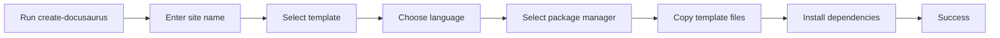

# How to generate project structure with default content

You can create a new Docusaurus website that comes with a ready-to-use starter layout, documentation section, blog, and theme styling. The generator copies a recommended template into a new folder and installs dependencies so you can start writing content right away.

## Prerequisites

Before you begin, make sure you have:

- Node.js installed (version 24.21 or higher)
- One of these package managers available:`npm`,`yarn`,`pnpm`, or`bun`
- Access to a terminal or command prompt
- An empty location where you want the new website folder to be created

The generator stops if it detects an existing folder or a non-empty folder at your chosen destination.

## Generate a new project with default content

1. Open your terminal and navigate to the folder where you want the new website folder to appear.

2. Run the project generator:

```bash
   npx create-docusaurus@latest
   ```

   You can also specify the site name and template in one command:

```bash
   npx create-docusaurus@latest my-website classic
   ```

3. When prompted with **What should we name this site?**, enter a name or press **Enter** to use the default name`website`.

4. When prompted with **Select a template below...**, choose **classic (recommended)** from the list.

5. When prompted with **Which language do you want to use?**, choose **JavaScript** or **TypeScript**.
   - **JavaScript** provides a standard configuration
   - **TypeScript** adds type safety for configuration and custom code

6. If multiple package managers are available, select one from the **Select a package manager...** prompt. The generator automatically detects and uses the package manager associated with your current environment if only one is installed.

7. Wait while the generator copies the template files and installs dependencies.

Here's how the workflow progresses:



## Expected result

A new folder is created with the name you provided. The folder contains a complete starter website including:

- **Home page**, A landing page with hero section and feature highlights
- **Documentation section**, A structured docs folder with sidebar navigation configured in`sidebars.js`
- **Blog section**, A blog folder with example posts
- **Configuration file** —`docusaurus.config.js` with default site title, navbar, footer, and theme settings
- **Package file** —`package.json` with Docusaurus dependencies and npm scripts
- **Theme styling**, Custom CSS and Prism syntax highlighting themes

The generator displays a success message similar to this:

```text
Created my-website.
Inside that directory, you can run several commands:

  npm start
    Starts the development server.

  npm run build
    Bundles your website into static files for production.

  npm run serve
    Serves the built website locally.

  npm run deploy
    Publishes the website to GitHub pages.
```

To view your new site, run:

```bash
cd my-website
npm start
```

The development server starts on`http://localhost:3000`, and you can see the default website in your browser.

## Common issues

### The destination folder is not empty or already exists

The generator validates the target location before copying files. You might see:

- **Directory not empty at path=/your/path**
- **Directory already exists at path=/your/path**

To resolve this, choose a different website name or delete the existing folder before running the generator again.

### No package manager is available

If the generator cannot detect an installed package manager, it logs:

```text
No package maintainer available? Trying with npm
```

The generator falls back to`npm`. If`npm` is not installed on your system, dependency installation will fail. Install Node.js and npm, then run the generator again.

### Dependency installation fails

If dependencies cannot be installed, the generator displays:

```text
Dependency installation failed.
The site directory has already been created, and you can retry by typing:

  cd my-website
  npm install
```

The website folder is still created with all template files. You can retry installation manually using the commands shown. If installation fails repeatedly, check your internet connection and package manager configuration.

### Invalid package manager choice

If you use the`--package-manager` flag, the value must be one of:

-`npm`
-`yarn`
-`pnpm`
-`bun`

Example:

```bash
npx create-docusaurus@latest my-website classic --package-manager yarn
```

Any other value causes the generator to stop with an error message listing valid options.

### Cannot use TypeScript with selected template

If you choose`--typescript` but the selected template doesn't provide a TypeScript variant, the generator exits with:

```text
Template classic doesn't provide a TypeScript variant.
```

Choose the JavaScript variant or select a different template that supports TypeScript.

### Invalid git repository URL

If you choose to use a git repository as your template source, the URL must start with`https://` or`git@`. The generator rejects URLs that don't match these patterns:

```text
Invalid repository URL
```

Provide a valid public git repository URL, such as`https://github.com/owner/repo.git`.

---

**Related topics:**

- Initialize a new Docusaurus project, Learn how to run the scaffolding tool with advanced options
- Choose between Classic and TypeScript templates, Understand template differences before scaffolding
- Your First Documentation Site - Quick Start, Build and deploy your site after generation
