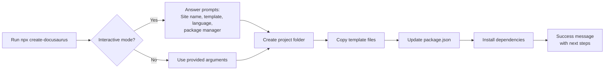

# How to initialize a new docusaurus project

This guide walks you through creating a new Docusaurus website from the official starter template. When you finish, you'll have a project folder with a working documentation site that you can preview on your computer.

## Before you begin

- Install Node.js on your computer. The creation tool checks your installed Node.js version and stops with a message if it's too old. Docusaurus requires Node.js 24.21 or later.
- Make sure you have a package manager available. npm is included with Node.js, but you can also use Yarn, pnpm, or Bun if you have one installed.
- Have an internet connection. The tool downloads a template and installs project dependencies.

## Create a new project

1. Open your terminal.

2. Run the following command, replacing`my-website` with the name of the folder you want to create:
```
   npx create-docusaurus@latest my-website classic
   ```
   The`classic` value tells the tool to use the recommended starter template.

   If you want to choose from all available options interactively, run:
```
   npx create-docusaurus@latest my-website
   ```

3. If you use the interactive command, answer the prompts:
   - **What should we name this site?**, Enter a name for your site. The default is`website`.
   - **Select a template below...**, Choose **classic (recommended)** for a complete documentation and blog site. You can also choose a Git repository URL, a local folder path, or another available template.
   - **Which language do you want to use?**, Select **JavaScript** or **TypeScript**.
   - **Select a package manager...**, Choose the package manager you want to use (npm, Yarn, pnpm, or Bun). The tool automatically detects which ones are available on your system.

4. Wait for the creation process to finish. The tool creates the project folder, copies the selected template, updates the package.json file with your site name, and installs dependencies. You'll see progress messages such as **Creating new Docusaurus project...** and **Installing dependencies with npm...**.

5. When the process is complete, the terminal prints a success message with a list of commands you can run.

The following diagram shows the initialization workflow:



## Next steps

Now that your project is initialized, you can:

- Start the development server with`npm start` to preview your site
- Build a production site when you're ready to deploy
- Explore static site generation capabilities
- Learn about the documentation plugin to organize your content
- Set up the blog plugin for time-ordered posts
