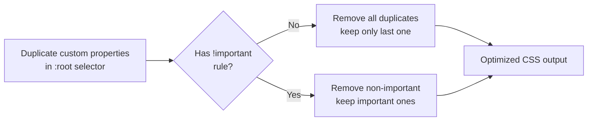

# How to remove unnecessary custom properties from CSS

Remove duplicate custom properties (CSS variables) from your stylesheet to reduce file size and improve CSS optimization during the build process.

## Goal

You want to eliminate redundant custom properties that are overridden by later declarations in your`:root` selector, so your final CSS output is cleaner and smaller.

## Prerequisites

- Your Docusaurus site is configured to use the CSSnano preset for CSS optimization
- You have custom properties (CSS variables) defined in your`:root` selector
- You're building your site for production using the build command

## How it works

When you build your site, Docusaurus automatically removes unnecessary custom properties from the`:root` selector. The plugin identifies duplicate custom properties and keeps only the ones that matter:

- **Without`!important`**: Keeps only the last declaration, removes all earlier ones
- **With at least one`!important`**: Keeps all`!important` declarations, removes duplicates without`!important`



## Steps

1. **Define your custom properties in the`:root` selector** in your CSS or theme stylesheets.

   Example of CSS with unnecessary duplicates:
```css
   :root {
     --primary-color: blue;
     --primary-color: green;
     --primary-color: red;
   }
   ```

2. **Run the production build command** to trigger CSS optimization.

```
   npm run build
   ```

3. **Verify the output** in your`build/` directory. Open the generated CSS files and confirm that duplicate custom properties have been removed.

   After optimization, your CSS becomes:
```css
   :root {
     --primary-color: red;
   }
   ```

## Expected result

When the build completes successfully, your CSS files contain:

- Only the final (effective) value for each custom property without duplicates
- Smaller CSS file sizes due to removed redundant declarations
- Correct cascade behavior preserved (the last declaration in the source wins)
- All`!important` rules respected and retained

You'll see the optimization applied automatically when you inspect the CSS in the`build/` directory.

## Common issues

**Issue: My custom properties still appear duplicated**

*Cause*: The custom properties are defined in different selectors (not`:root`), or they use`!important` in some declarations.

*Solution*: The plugin only removes duplicates from the`:root` selector. If you have the same custom property in multiple selectors (like`.sidebar` and`.header`), they're intentional and won't be removed. If you use`!important`, the plugin preserves all`!important` declarations and only removes non-important duplicates to maintain specificity rules.

**Issue: A custom property value I need was removed**

*Cause*: You had multiple declarations with the same name, and an earlier value was removed because a later one overrides it.

*Solution*: This is the expected behavior—the last declaration always wins in CSS cascade. If you need a different value in a specific context, define it in a more specific selector (like a class or media query) instead of repeating it in`:root`.

**Issue: Build doesn't seem to optimize my CSS**

*Cause*: CSS optimization might be disabled in your configuration, or your CSS isn't going through the CSSnano preset.

*Solution*: Ensure you're running the production build command (`npm run build`, not`npm run serve`), and verify your`docusaurus.config.js` hasn't disabled CSS minification or the cssnano preset.

## Related

CSS Optimization, Learn about all CSS optimization features available in Docusaurus.

How to minify CSS assets for production, Minimize your CSS file sizes with additional minification strategies.
