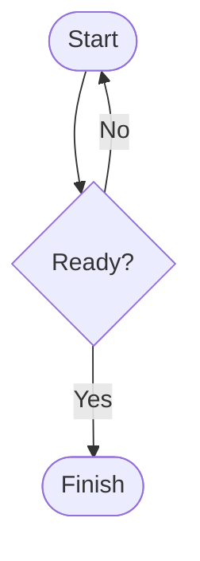

# How to Render Mermaid Diagrams

You can add a Mermaid diagram directly to a Markdown or MDX page by using a fenced code block. When the page loads, the site converts that block into a visual diagram. You don't need to export an image or embed an external file.

## Prerequisites

- You can edit the Markdown or MDX source of the page where you want the diagram to appear.
- Mermaid support is enabled for your site. If you see diagrams on other pages, Mermaid is already available.
- You know basic Mermaid syntax, such as flowcharts or sequence diagrams.

## Steps

1. Open your Markdown or MDX file.
2. Position your cursor where the diagram should appear.
3. Create a code block by typing three backticks (````), then the word `mermaid` on the same line.
4. On the following lines, write your Mermaid diagram syntax.
5. Close the code block with three backticks on a new line.
6. Save your file.
7. Build or preview your site to see the rendered diagram.

Here's an example of a simple flowchart:

````markdown

````

When you save this code block in your content file, Docusaurus processes it during the build and transforms it into an interactive visual diagram. The raw Mermaid syntax is replaced with HTML and JavaScript that renders the diagram in the browser.

## Expected result

The code block is converted into a rendered diagram with nodes, connections, and labels displayed visually. The raw code and backticks are not visible to readers. The diagram renders automatically when the page loads.

## Common issues

**The page shows raw Mermaid code instead of a diagram**

Mermaid support may not be enabled for your site. Check whether other pages display diagrams correctly. If no diagrams render anywhere, contact your site administrator to verify that Mermaid support has been configured.

**The diagram area is blank or shows a rendering error**

Your Mermaid syntax contains an error. Mermaid has strict requirements for indentation, node syntax, and connection arrows. Review the Mermaid documentation and verify that all brackets and quotes are properly matched. Start with a simple diagram and add complexity gradually to identify the problem.

**A Mermaid feature I want to use doesn't work**

Your site may be running an older version of Mermaid that doesn't support newer diagram types. Try using a basic flowchart (`graph`) or sequence diagram instead. If you need a specific feature, contact your site administrator to request an update to the Mermaid library version.

## Related

- [MDX & Markdown Authoring](doc:c6128702-ad9b-4764-a8b5-63865a1a15e1)
- [How to write Markdown content with front matter](doc:4cd4ede9-397e-4cb8-ada9-17c3589a7b15)
