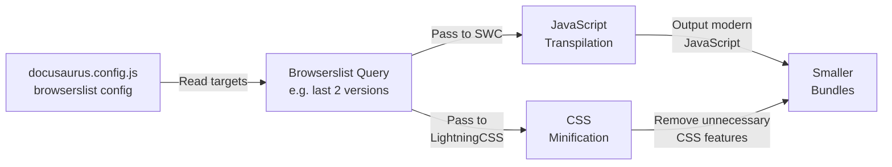

# How to target modern browsers for smaller bundles

When you build your documentation site, you can reduce bundle size by targeting only the browsers your visitors actually use. Docusaurus analyzes your browser compatibility requirements and removes unnecessary JavaScript and CSS features that older browsers need. This results in faster downloads and better performance.

## Prerequisites

- You have a Docusaurus project initialized and ready to configure
- You have access to your project's`docusaurus.config.js` file
- You understand your site's audience and which browsers you need to support

## What happens during this process

When you configure browser targets, Docusaurus uses your settings to:

1. Read your browser compatibility requirements (called a "browserslist query")
2. Adjust the JavaScript transpilation to output only modern JavaScript syntax
3. Configure CSS minification to remove vendor prefixes and properties older browsers need
4. Generate smaller, faster bundles that work across your supported browsers



## How to configure browser targets

### Step 1: Open your browserslist configuration

Create or edit a`.browserslistrc` file in your project root, or add a`browserslist` field to your`package.json`.

**Example`.browserslistrc`:**

```
last 2 versions
not dead
```

This targets the last 2 versions of each major browser (Chrome, Firefox, Safari, Edge) and excludes browsers with less than 0.5% market share.

**Example in`package.json`:**

```json
{
  "browserslist": [
    "last 2 versions",
    "not dead"
  ]
}
```

### Step 2: (optional) verify your browser queries

If you want to see exactly which browsers your configuration targets, you can use the browserslist CLI tool:

```bash
npx browserslist
```

This displays the browsers that match your configuration, helping you confirm you're targeting the right audience.

### Step 3: Build your site

Run the standard Docusaurus build command. The build process automatically reads your browserslist configuration and applies it to both JavaScript and CSS optimization:

```bash
npm run build
```

Docusaurus will now:

- Use **SWC** (the JavaScript transpiler) to target your specified browsers, removing support for older JavaScript features
- Use **LightningCSS** (the CSS processor) to remove vendor prefixes and CSS properties that your target browsers don't need

## Expected result

After targeting modern browsers, you should see:

- **Smaller JavaScript bundles**, Modern syntax requires less code than transpiled alternatives
- **Smaller CSS files**, Unnecessary vendor prefixes and fallbacks are removed
- **Faster page loads**, Smaller files download and parse more quickly
- **Same functionality**, Your site works identically for all visitors using supported browsers

You can verify the bundle size reduction by comparing the`build/` folder size before and after configuration.

## Common issues and solutions

**Issue: "My old IE11 visitors see broken content"**

If you discover you need to support older browsers, update your`.browserslistrc` or`package.json` browserslist to include them. For example, add`"IE 11"` to your queries and rebuild. This will increase bundle size but ensure compatibility.

**Issue: "I'm not sure which browsers to target"**

Check your site's analytics to see which browsers your actual visitors use. Most sites safely target`"last 2 versions"` and`"not dead"`. Start conservative and adjust if you encounter compatibility issues.

**Issue: "The build fails with a browserslist error"**

Ensure your`.browserslistrc` file syntax is correct, or verify that`package.json` has valid JSON in the browserslist field. Run`npx browserslist` to validate your configuration.

**Issue: "Bundle size didn't decrease much"**

This typically means your target browsers are already quite modern, or your code doesn't use many features that differ across browser versions. Larger improvements usually appear when you move from supporting IE11 to modern browsers only.

## How browser targeting affects your build

When you specify modern browser targets using browserslist:

- **SWC JavaScript transpilation** (via`getSwcLoaderOptions`) automatically sets its transpilation targets to match your browser requirements
- **LightningCSS CSS minification** (via`getLightningCssMinimizerOptions`) converts your browser list into LightningCSS targets, which removes browser-specific CSS that's unnecessary
- Both tools read the same browserslist configuration, ensuring consistent browser support across your entire site

---

**Related**

- Performance Optimization, Learn about other optimization techniques available in Docusaurus
- How to use SWC minifier for JS, Configure JavaScript minification for production builds
- How to use Lightning CSS minifier for CSS, Configure CSS minification for production builds
- Site Building & Bundling, Overview of how Docusaurus builds and optimizes your site
