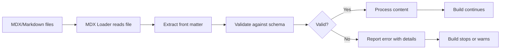

# How to validate front matter against schema

When you write content for your Docusaurus site, front matter metadata appears at the top of your Markdown or MDX files. You may want to ensure this front matter conforms to a specific schema to catch errors early and maintain consistency across your documentation.

## Goal

Validate front matter in your content files against a defined schema to catch metadata errors before your site builds.

## Prerequisites

- A Docusaurus project with MDX or Markdown content files
- Front matter defined in your content files (YAML format at the top of`.md` or`.mdx` files)
- Access to the MDX loader configuration in your project

## About front matter validation

Front matter validation happens during the content loading phase, when Docusaurus processes your Markdown and MDX files. The MDX loader—the component that reads and transforms your content files—can check your front matter against rules you define.

When validation is active, the loader examines each file's front matter metadata before building your site. If metadata doesn't match the schema, you get clear error messages that help you fix the issues.

## How the MDX loader processes content

Here's what happens when your site builds:



## Steps to validate front matter

### 1. Define your schema

In your MDX loader options (typically in`docusaurus.config.js` or a dedicated configuration file), specify what front matter fields are required and what types they should be.

The loader examines front matter when it processes each`.md` or`.mdx` file. You can specify required fields, optional fields, and the expected data types for each.

### 2. Configure validation in the loader

Add validation rules to your MDX loader configuration. The loader uses these rules when it encounters front matter in your content files.

For example, you might require that blog posts have`title`,`author`, and`date` fields with specific formats.

### 3. Run your build

When you run`docusaurus build` or`docusaurus start`, the loader validates all front matter before processing your content.

During this phase, the loader:
- Reads each Markdown or MDX file
- Extracts the front matter section (YAML at the top)
- Checks each field against your schema rules
- Reports any mismatches with file path and line number information

### 4. Review validation output

If validation finds errors, you see messages that include:
- The file path where the error occurred
- The exact line number and column where the problem is
- What the schema expected and what was found

This information helps you quickly locate and fix the issue in your content file.

## Expected result

When front matter is valid, your build proceeds normally, and your content is processed and published.

When validation detects invalid front matter, the loader halts processing of that file and displays an error. The error message tells you:
- Which file has the problem
- What field is invalid
- Why it doesn't match the schema (type mismatch, missing required field, wrong format.)

## Common issues and solutions

**Schema requires a field that's missing from front matter**

Add the missing field to your file's front matter section at the top. For example, if the schema requires`title`, ensure every file starts with:

```
---
title: Your Page Title
---
```

**Front matter value doesn't match the expected type**

Check the schema requirements. If it expects a number but you provided text, or expects a date in`YYYY-MM-DD` format but you used a different format, update the front matter to match.

**Error message references a line number you can't find**

The line number includes the`---` delimiters that mark the front matter section. Count from the very first line of the file, including the opening`---`.

**Multiple validation errors in one file**

Fix one field at a time and re-run the build to see which issues remain. This helps you understand the schema requirements incrementally.

**Validation works in development but fails in production build**

Ensure your`docusaurus.config.js` applies the same validation schema in both development and production. Check that your configuration file doesn't have environment-specific branches that disable validation in production.

## Related guides

- Write Markdown content with front matter
- MDX & Markdown Authoring
