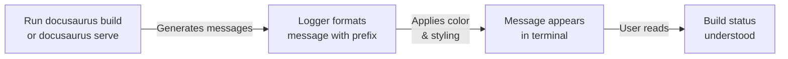

# How to view build progress and status messages

When you run Docusaurus build or serve commands, you see real-time progress updates and status messages in your terminal. These messages help you understand what's happening during the build process and identify any issues that might occur.

## Goal

View detailed build progress, performance metrics, and status messages while building or serving your Docusaurus site.

## Prerequisites

- Docusaurus project initialized and ready to build
- Node.js command line access to run build or serve commands
- Terminal or command prompt open in your project directory

## Steps

The following diagram shows how build messages flow from the build process to your terminal output:



### View standard build messages

1. Open your terminal and navigate to your Docusaurus project directory.

2. Run the build command:
```
   docusaurus build
   ```
   or the serve command for development:
```
   docusaurus serve
   ```

3. Watch your terminal as the build progresses. You'll see messages prefixed with **[INFO]**, **[SUCCESS]**, **[WARNING]**, or **[ERROR]** in different colors:
   - **[INFO]** appears in cyan (blue) to show general progress
   - **[SUCCESS]** appears in green to confirm completed tasks
   - **[WARNING]** appears in yellow to alert you to potential issues
   - **[ERROR]** appears in red to indicate problems that stopped the build

### View performance and memory usage metrics

To see detailed performance metrics for build operations and memory consumption, set the performance debugging environment variable before running your build:

1. In your terminal, set the environment variable:
```
   export DOCUSAURUS_PERF_LOGGER=true
   ```
   (On Windows, use`set DOCUSAURUS_PERF_LOGGER=true` instead)

2. Run your build command:
```
   docusaurus build
   ```

3. Observe the **[PERF]** messages in your terminal output. These show:
   - Operation name and duration
   - Heap memory usage before and after the operation
   - Total heap memory available
   - Operations faster than 5 milliseconds are hidden to reduce noise
   - Durations are color-coded: green for quick operations, yellow for moderate (over 100 ms), red for slow (over 1 second)

### Understand message formatting

Messages are formatted to help you quickly scan and understand status:

- File paths and URLs appear underlined and in cyan to stand out
- File names and identifiers appear in bold blue
- Code snippets and commands appear in backticks with cyan formatting
- Numeric values appear in yellow
- Additional context or less important information appears dimmed in gray

### Interpret common status patterns

As your build runs, you may see related messages grouped together. For example:

- A series of **[INFO]** messages showing files being processed
- A **[WARNING]** message about missing fields or deprecated usage
- A **[SUCCESS]** message at the end confirming the operation completed
- Multiple **[PERF]** messages showing nested operation timing (indicated with`>` between parent and child operation names)

## Expected result

After running your build or serve command, your terminal displays:

- Clear status messages with color-coded prefixes indicating message type
- File paths and important values highlighted for readability
- When performance debugging is enabled, detailed timing and memory statistics
- A final **[SUCCESS]** message confirming the build completed without errors, or **[ERROR]** messages listing problems that prevented completion

## Common issues

**Problem: Performance messages don't appear when`DOCUSAURUS_PERF_LOGGER=true` is set**
- The environment variable might not have been applied correctly. Try setting it again in the same terminal session before running the build command.
- Some operations complete too quickly (under 5 milliseconds) to be logged. This is expected behavior.

**Problem: Colors don't display correctly in your terminal**
- Your terminal may not support color output. Most modern terminals do, but some environments (like certain CI/CD systems) require special configuration to enable colors.
- Try running the build with the`--color` flag if available:`docusaurus build --color`

**Problem: Messages are cut off or difficult to read**
- Your terminal window may be too narrow. Try widening your terminal to see full message lines.
- Very long file paths or URLs may wrap to multiple lines. This is normal.

**Problem: Memory values show as very large or small numbers**
- Memory is displayed in megabytes (mb). Very large projects may show high memory usage, which is expected.
- Use the memory information to identify if specific operations are consuming unexpected amounts of memory.

## Related topics

Logging & Diagnostics

How to measure build performance and memory usage

How to debug errors with detailed context

Site Building & Bundling
