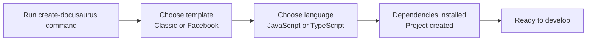
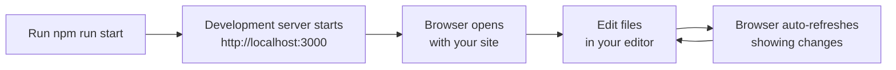

# Installation and project setup

Get Docusaurus installed and running on your local machine in a few minutes. This guide walks you through creating a new project, understanding its structure, and starting your development server.

## System requirements

Before you begin, make sure your computer meets these requirements:

- **Node.js version 24.21 or higher**, Docusaurus requires a recent version of Node.js. You can download it from nodejs.org.
- **A package manager**, You'll need one of the following to install dependencies: npm (included with Node.js), yarn, pnpm, or bun.
- **A code editor**, Any text editor works, though VS Code is popular for web development.
- **A terminal or command prompt**, You'll use this to run Docusaurus commands.

To check your Node.js version, open your terminal and run:

```bash
node --version
```

If your version is older than 24.21, download a newer version from nodejs.org.

## Create a new docusaurus project

The fastest way to start is with the`create-docusaurus` CLI tool, which scaffolds a new project for you automatically.

1. Open your terminal and navigate to where you want your project folder to live.

2. Run the following command (replace`my-website` with your desired project name):

```bash
npx create-docusaurus@latest my-website
```

3. When prompted, choose your template. You have two options:

   - **Classic**, The standard Docusaurus setup with documentation, blog, and landing page features.
   - **Facebook**, A template based on Facebook's documentation style.

4. Choose your language preference:

   - **JavaScript**, Uses JavaScript for configuration and components.
   - **TypeScript**, Uses TypeScript for better type safety and developer tooling.

The tool downloads the template, creates your project folder, and installs all dependencies. This usually takes one to three minutes depending on your internet speed.



## Understand your project structure

After creation, your project folder contains:

```
my-website/
├── blog/                      # Blog posts (optional)
│   └── 2024-01-01-hello.md   # Example blog post with date prefix
├── docs/                      # Documentation content
│   ├── intro.md              # First documentation page
│   └── tutorial-basics/      # Example tutorial section
├── src/                       # Custom React components and pages
│   ├── components/           # Reusable React components
│   ├── pages/                # Custom pages like homepage
│   └── css/                  # Global stylesheets
├── static/                    # Static assets
│   └── img/                  # Images for your site
├── docusaurus.config.js      # Main configuration file
├── package.json              # Project dependencies and scripts
├── sidebars.js               # Documentation sidebar structure
└── README.md                 # Project information
```

**Key directories:**

- **`docs/`**, Where you write your documentation in Markdown or MDX format.
- **`blog/`**, Where blog posts live, organized by date.
- **`src/`**, Custom React components and pages that extend your site.
- **`static/`**, Images, fonts, and other files copied as-is to your built site.

## Configure your project

The`docusaurus.config.js` file controls how your site looks and behaves. This is where you set your site title, description, branding, and plugin options.

After creating your project, open`docusaurus.config.js` in your code editor. You'll see a configuration object that looks something like this:

```javascript
const config = {
  title: 'My Website',
  tagline: 'A sample documentation site',
  url: 'https://yoursite.com',
  baseUrl: '/',
  // ... more configuration options
};
```

**Common settings you'll want to customize:**

-`title`, Your site's name, shown in the browser tab and header.
-`tagline`, A short description of your site.
-`url`, Your site's full web address (used for SEO and links).
-`favicon`, Path to your site's icon file.
-`themeConfig`, Navbar, footer, and appearance options.

You can make changes to this file at any time, and your development server automatically reloads to show your updates.

## Install dependencies and verify your setup

When you created your project with`create-docusaurus`, the CLI tool automatically installed all required dependencies. These are listed in your`package.json` file under`"dependencies"`.

To verify everything is installed correctly, navigate to your project folder:

```bash
cd my-website
```

Then check that the`node_modules` folder exists and contains packages. If it doesn't, or if you need to reinstall, run:

```bash
npm install
```

(Replace`npm` with`yarn`,`pnpm`, or`bun` if you prefer a different package manager.)

## Run the development server

Now you're ready to start building! The development server lets you preview your site locally as you edit.

From your project folder, run:

```bash
npm run start
```

Your terminal displays output showing that the site is being built. After a few seconds, it opens automatically in your web browser at`http://localhost:3000`. If it doesn't open, copy that address into your browser manually.

As you edit your Markdown files or configuration, the browser automatically refreshes to show your changes—no manual reload needed.



## Useful npm scripts

Your`package.json` includes several commands you can run to work with your site:

**Development:**

-`npm run start`, Start the development server with live reloading.

**Building:**

-`npm run build`, Create an optimized production build in the`build/` folder.
-`npm run serve`, Preview your production build locally before deploying.

**Maintenance:**

-`npm run clear`, Remove generated cache and build files.
-`npm run docusaurus`, Access the Docusaurus CLI directly for advanced commands.

**Deployment:**

-`npm run deploy`, Publish your site (requires additional setup based on your hosting).

Run any command with`npm run` followed by the script name. For example:

```bash
npm run build
```

## Next steps

You now have a working Docusaurus project running locally. Here's what you can do next:

- Edit the files in the`docs/` folder to add your documentation content.
- Customize the site title, colors, and navigation in`docusaurus.config.js`.
- Add blog posts by creating new files in the`blog/` folder.
- Explore the quick start guide to build a complete documentation site.
- Visit the system requirements page for more technical details.
