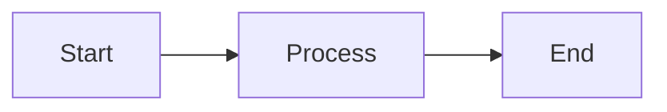

# MDX and markdown authoring

Docusaurus lets you write documentation, blog posts, and pages using Markdown and MDX. This feature is for content authors who want a simple, predictable writing experience and for developers who want to embed interactive components, diagrams, and reusable content into the same documents.

Markdown gives you familiar formatting for headings, lists, links, images, and code blocks. MDX extends Markdown by letting you use React components directly inside a document, so you can add interactive elements without leaving your writing flow.

## Who it is for

- **Content authors** can create pages, docs, and blog posts with standard Markdown. Images and links are checked automatically, and tables of contents are generated from headings.
- **Developers** can use MDX to embed React components, control how images and downloadable files are handled, and reuse smaller document parts in larger pages.

## What you can do

### Write content with markdown and MDX

You can create documentation, blog posts, and pages as`.md` or`.mdx` files. Markdown covers everyday formatting, while MDX allows you to include React components directly in the document. This means you can add interactive demos, custom UI elements, or embedded functionality next to regular text.

### Set document metadata with front matter

Each document can start with front matter—a block of YAML at the top of the file—that defines metadata such as the page title, description, and other page-level settings. Docusaurus validates this information against a schema and applies it consistently across your site.

```markdown
---
title: My Page Title
description: A description of the page
---

# Page content starts here
```

### Add images that are checked and bundled automatically

When you add an image to a Markdown file, Docusaurus finds the image file, checks that it exists, and bundles it so it appears correctly on your site. Your images are processed during the build, and width and height attributes are automatically detected and added to the image element.

Image paths can be:

- **Relative paths**: Referenced from the folder where your document file is located (for example,`./images/screenshot.png`)
- **Absolute paths**: Starting with`/` and resolved from your static folders (for example,`/images/screenshot.png`)
- **@site alias**: Referencing the site root directory (for example,`@site/static/images/screenshot.png`)

Docusaurus preserves your image alt text and title attributes exactly as you write them. When an image cannot be found, Docusaurus can either warn you or stop the build, depending on your site configuration. You can also use the`pathname://` protocol to mark a specific image so it is not processed automatically.

### Link to downloadable files and other assets

Links to downloadable files such as PDFs, JSON files, or other non-document assets are automatically converted into direct asset links that open in a new tab. Docusaurus checks whether those files exist and reports broken links in the same way it reports broken images.

Links to other Markdown (`.md`), MDX (`.mdx`), or HTML (`.html`) pages remain regular page links, so internal navigation continues to work as expected. Links without these extensions or links that use the`@site/` prefix are treated as asset links and processed accordingly.

You can reference assets with relative paths, static folder paths, or the`@site/` alias. If a link points to a file that looks like an asset but cannot be resolved, Docusaurus can warn you or fail the build according to your configuration. Use the`pathname://` protocol to prevent automatic processing of a specific link.

### Get an automatic table of contents

Docusaurus creates a table of contents from the headings (`#`,`##`,`###`, and so on) in your document. This works even when you split a long document into smaller Markdown or MDX files and import them into a parent page. Headings from imported partial documents are automatically included, so readers see a complete outline of the full page.

### Add diagrams and callouts

You can include Mermaid diagrams directly in your Markdown by using a code block with the`mermaid` language identifier. Docusaurus renders these diagrams as interactive visuals in your final site.



You can also use admonition callouts such as notes, tips, warnings, and info blocks to highlight important information in your content.

### Embed interactive react components in MDX

MDX files let you import and use React components directly in your content. You can create interactive demos, custom widgets, or any other React-based element without leaving your document.

```mdx
import MyInteractiveComponent from '@site/src/components/MyInteractiveComponent';

# My Page

<MyInteractiveComponent />
```

## Key options and behaviors

- **Broken image and link reporting** can be configured to show a warning or stop the build. Use`siteConfig.markdown.hooks.onBrokenMarkdownImages` and`siteConfig.markdown.hooks.onBrokenMarkdownLinks` to control this behavior.
- **Local images** automatically receive`width` and`height` attributes, allowing browsers to reserve space before the image loads.
- **Downloadable file links** open in a new tab with the`target="_blank"` attribute.
- **@site alias and static folder paths** are supported for both images and other assets, giving you flexible ways to reference files.
- **Tables of contents** include headings from imported Markdown and MDX partial files, providing readers with a complete page outline.
- **Remote images** remain as they are and are not processed as local asset files.
- **Escape hatch**: Use the`pathname://` protocol prefix (for example,`pathname://path/to/image.png`) to prevent Docusaurus from processing a specific image or link automatically.

## Limits

- Automatic image processing applies only to local image files. Remote images (those with`http://` or`https://` protocols) remain unchanged.
- Automatic asset link conversion applies only to links with file extensions that are not`.md`,`.mdx`, or`.html`, or to links that use the`@site/` alias. Links that reference page routes without a file extension are not converted.
- Table of contents is generated only from headings, not from other content blocks.
- Image metadata (width and height) is read only from valid local image files. If an image file cannot be read correctly, Docusaurus skips the metadata extraction but still processes the image.

## Related pages

- Embed interactive React components in MDX
- Render Mermaid diagrams
- Optimize and transform images
- Write Markdown content with front matter
- Validate front matter against schema
