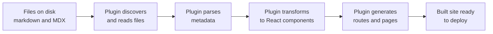

# Plugin architecture and content plugins

Docusaurus uses a plugin system to extend its core functionality and process your content. Plugins are modular components that work together to transform your markdown and MDX files into a complete, interactive documentation site.

## What plugins are

Plugins are modular extensions that hook into Docusaurus's build process to add features and transform content. Each plugin has a specific responsibility—whether that's discovering markdown files, generating navigation menus, or handling redirects when URLs change. You don't need to write plugins for basic use; Docusaurus provides built-in plugins that handle the most common documentation needs.

When you build your site, plugins work in sequence to:

1. Discover and read your content files
2. Parse metadata and front matter
3. Transform markdown and MDX into React components
4. Generate routes and pages for your site
5. Create navigation structures like sidebars
6. Generate feeds, sitemaps, and other assets

## Content plugins overview

Content plugins transform your markdown and MDX files into navigable pages on your site. Three main content plugins handle different types of content:

**Docs plugin**, Organizes your documentation into a structured hierarchy with sidebars, versions, and language translations. Use this for API documentation, user guides, and any content that benefits from clear navigation and organization.

**Blog plugin**, Manages time-ordered blog posts with author information, tags, RSS feeds, and pagination. Use this for news, announcements, and any regularly published content where readers browse posts chronologically.

**Pages plugin**, Creates standalone pages from markdown and React files. Use this for landing pages, about pages, and other content that doesn't fit into docs or blog.

Each content plugin discovers your files, extracts metadata, generates the necessary routes, and makes your content available on the built site.

## How the docs plugin works

The docs plugin powers your structured documentation. Here's what it does:

**Discovers documentation files**, It scans your docs directory for markdown and MDX files, organizing them based on folder structure and file names. Files are automatically converted into pages and URLs.

**Generates sidebars**, The plugin reads sidebar configuration and creates a navigation menu that helps readers explore your documentation. Sidebars show the hierarchy of your docs and current reader position.

**Handles versioning**, You can maintain multiple versions of your documentation simultaneously—for example, a "current" version and a "2.0" version. Readers can switch between versions using a version selector dropdown. The docs plugin manages all version-specific files and generates version-specific routes.

**Supports multiple languages**, The docs plugin can organize content by language. When enabled, it creates separate documentation sets for each language and provides language switchers so readers can choose their preferred language.

**Manages metadata**, The plugin reads front matter (metadata at the top of each file) and uses it to configure page titles, descriptions, sidebar position, and other options.

The docs plugin is the foundation for organized, scalable documentation sites.

## Blog plugin features

The blog plugin manages your blog and news content with these capabilities:

**Post pagination**, Blog posts are organized chronologically on a listing page with pagination controls. Readers can browse earlier and later posts, and the listing page shows a limited number of posts per page to keep load times fast.

**RSS and Atom feeds**, The plugin automatically generates RSS and Atom feed files so readers can subscribe to new posts in their feed readers. The feed includes post summaries and metadata.

**Author metadata**, You can assign authors to blog posts using front matter. The blog plugin generates author pages that list all posts by each author, making it easy for readers to find content from their favorite authors.

**Tag filtering**, Posts can have tags. The blog plugin generates tag pages that group and display all posts with a specific tag, helping readers find related content.

**Sidebar integration**, Recent blog posts can appear in your site sidebar, keeping readers informed about new content.

Configure the blog plugin to set where posts are stored, how many posts appear per listing page, whether to generate feeds, and other publishing options.

## Client redirects plugin

The client redirects plugin helps you manage URL changes without breaking reader bookmarks or external links.

**Redirect broken URLs**, When you rename a page or reorganize your documentation structure, readers following old links land on a 404 page. This plugin generates redirect pages that automatically forward readers to the new location.

**Handle localized paths**, If your site supports multiple languages, you can configure redirects that work correctly for each language version. For example, redirect`/docs/old-page` and`/fr/docs/old-page` to their new locations.

**Create custom redirects**, Beyond automatic redirects from renamed pages, you can define custom redirect rules for legacy URLs or external links you want to point to your site.

The plugin runs at build time, generating HTML pages that redirect using JavaScript. Readers are forwarded seamlessly to the correct page without seeing the 404 error.

## Configuring plugins

Plugins are loaded and configured in your site's`docusaurus.config.js` file. This is where you specify which plugins to enable, set their options, and customize how they work.

A typical plugin configuration looks like this:

```javascript
module.exports = {
  // ... other config
  plugins: [
    [
      '@docusaurus/plugin-content-docs',
      {
        sidebarPath: './sidebars.js',
        editUrl: 'https://github.com/your-org/your-repo/edit/main',
      },
    ],
    [
      '@docusaurus/plugin-content-blog',
      {
        blogTitle: 'Our Blog',
        blogDescription: 'Subscribe to learn about new features',
        postsPerPage: 10,
        feedOptions: {
          type: ['rss', 'atom'],
        },
      },
    ],
    [
      '@docusaurus/plugin-client-redirects',
      {
        redirects: [
          {
            from: '/docs/old-page',
            to: '/docs/new-page',
          },
        ],
      },
    ],
  ],
};
```

Each plugin entry is an array with the plugin name and its options object. Options vary by plugin—the docs plugin accepts sidebar configuration and edit URLs, the blog plugin accepts post count and feed settings, and the redirects plugin accepts redirect rules.

## Plugin execution flow

Plugins execute in a coordinated sequence during your build:



First, each plugin discovers your content files. Then plugins parse metadata from front matter and file paths. Next, content is transformed into React components. Finally, routes are generated so readers can access pages through URLs.

## Choosing plugins for your site

Start with the plugins that match your content type:

- If you're building documentation, enable the docs plugin and configure its sidebar
- If you're publishing blog posts or news, enable the blog plugin
- If you need to handle URL changes from previous versions of your site, enable the client redirects plugin
- Use the pages plugin if you need custom standalone pages beyond docs and blog

You can use multiple content plugins simultaneously—for example, both docs and blog on the same site. Each plugin operates independently on its own content directory.

Plugin configuration is flexible, allowing you to adjust paths, titles, pagination, feeds, and other options to match your workflow and audience needs.

## Related documentation

- Documentation Plugin, Dive deeper into organizing and versioning your documentation
- Blog Plugin, Learn more about publishing and managing blog content
- Client Redirects Plugin, Explore advanced redirect configuration
- MDX Content Loading, Understand how content is parsed and transformed
