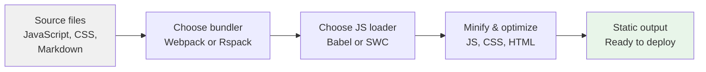

# Site building and bundling

Docusaurus bundles your site's content, scripts, styles, and assets into a fast, static set of files that you can host anywhere. This feature is for developers and site administrators who want to prepare a production-ready site and control how strongly the site is optimized.

## What it does

When you build your site for production, Docusaurus compiles everything into a static output folder. During this build, it can:

- Combine and compress all JavaScript and CSS
- Remove unnecessary whitespace, comments, and redundant code
- Produce clean, readable error messages and warnings if something goes wrong
- Let you choose between the classic bundling engine (Webpack) and a faster, experimental engine (Rspack)
- Let you choose between different optimization levels for JavaScript, CSS, and HTML

The result is a smaller, faster-loading site that works with any static hosting provider. You don't need to run a server: the output is just a set of files you can upload or deploy.

## Who it's for

- **Developers** who build and maintain a Docusaurus site and want to tune build speed and output size.
- **Site administrators** who deploy the compiled site and want predictable, optimized results.

## How it fits together

The build process transforms your source files through several stages:

## Key options

### Bundling engine

You can use one of two bundlers:

- **Webpack**, the default, mature engine that works everywhere.
- **Rspack**, an experimental engine that can build faster and applies a family of extra optimizations. To use it, you add the`@docusaurus/faster` package to your site dependencies and enable the`rspackBundler` option in your configuration.

When Rspack is active, the site automatically uses built-in SWC-based JavaScript and Lightning CSS-based CSS optimizations. Webpack uses Terser for JavaScript and cssnano/clean-css for CSS, which are more traditional but sometimes more compatible.

### JavaScript processing

You can process JavaScript with:

- **Babel**, the default, widely compatible loader.
- **SWC**, a much faster loader that can significantly speed up builds. Available through the`swcJsLoader` option in your faster configuration.

You cannot use a custom JavaScript loader and SWC at the same time; you must choose one. If you try to combine them through both`siteConfig.webpack.jsLoader` and`siteConfig.future.faster.swcJsLoader`, the build stops with an error asking you to pick one explicitly.

### HTML optimization

Your generated HTML pages are minified to reduce file size. You can choose between:

- **SWC HTML minifier**, faster, modern tool with detailed diagnostics.
- **Terser HTML minifier**, traditional tool, mature and reliable.

Minifying JavaScript, CSS, and JSON embedded in the page is enabled. Docusaurus deliberately keeps:

- HTML comments, because removing them can break dynamic page hydration in React applications.
-`<head>` and`<body>` tags, because social media preview crawlers rely on them to find Open Graph images.
- Attribute quotes, because platforms like WhatsApp and some RDFa parsers ignore metadata (like`og:image`) without quotes.

You can turn off HTML minification entirely by setting`SKIP_HTML_MINIFICATION=true` if needed for debugging.

## Benefits

- **Smaller files**, JavaScript, CSS, and HTML are compressed and cleaned up, reducing download sizes.
- **Faster page loads**, Less code to download and parse on the front end.
- **Faster builds**, Rspack and SWC can reduce build time significantly compared to the standard bundler and Babel.
- **Static hosting ready**, The build output is just static files, so it works with any file host or CDN without a running server.
- **Clear diagnostics**, Errors and warnings from the build are formatted into human-readable messages, often highlighting syntax or import problems.
- **Performance visibility**, Optional tracing (Rspack) helps you understand where build time is spent.

## Limits and boundaries

- **Rspack is experimental**, It requires the additional`@docusaurus/faster` package in your site dependencies and may change in future releases.
- **Loader exclusivity**, You cannot use a custom JavaScript loader and the SWC loader at the same time; you must choose one.
- **Tracing availability**, Bundler tracing is only available when using Rspack, not Webpack.
- **HTML hydration safety**, HTML comments are kept even with minification on, because removing them can cause React hydration errors in the browser.
- **Attribute preservation**, Attribute quotes are preserved to ensure Open Graph images render correctly on social media platforms that rely on quoted attributes.
- **Build failures**, The build stops with a clear error message if JavaScript or CSS cannot be compiled. Warnings are printed but do not stop the build.

## Related features

Learn more about optimizing your site's build and performance:

- Build Bundling and Optimization, Overview of the complete bundling system.
- Performance Optimization, Optional build optimizations for faster builds and smaller bundles.
- CSS Optimization, Detailed CSS minification and bundle size reduction.
