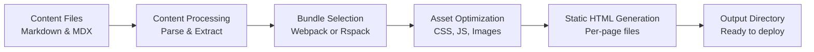

# Static site generation

Static site generation is Docusaurus's core feature that transforms your markdown and MDX content into fast, SEO-friendly HTML files at build time. Instead of serving dynamic content from a server, every page is pre-built into static files that you can deploy to any hosting platform.

## What it is and who it's for

Static site generation powers documentation sites, open source project websites, and technical knowledge bases. It's designed for documentation teams, open source maintainers, and technical writers who need to publish content without managing backend infrastructure.

This feature automatically converts all your documentation pages, blog posts, and custom pages into production-ready static files that work everywhere—from traditional web hosts to content delivery networks (CDNs) to offline environments.

## What you can do

When you build your site, Docusaurus transforms your content into:

- **Static HTML files** for every page, eliminating the need for server-side rendering
- **Optimized JavaScript bundles** that load only the code needed for each route
- **Complete offline-capable sites** that work without any network connection
- **SEO-friendly output** with automatically generated meta tags and sitemaps

The entire build process happens once, at development time. There's no runtime server needed to serve your documentation.

## Key benefits

**Performance without overhead**
Your site loads instantly because all HTML is pre-generated. Visitors don't wait for server processing—they download static files. There's no database to query or backend logic to execute.

**Automatic SEO optimization**
Search engines can instantly crawl all your content because it exists as static HTML. Docusaurus automatically generates meta tags, Open Graph tags, and XML sitemaps for better discoverability.

**Flexible deployment**
Deploy to any static hosting service—GitHub Pages, Netlify, Vercel, AWS S3, or your own web server. You're not locked into a specific platform or infrastructure.

**Build once, serve everywhere**
Once you build your site, the output is portable. The same set of static files works on any hosting provider without configuration changes.

## How the build process works

When you run a build, Docusaurus:

1. Reads all your markdown, MDX, and configuration files
2. Parses content and extracts metadata (titles, descriptions, dates)
3. Processes content through your chosen bundler (webpack by default, or rspack for faster builds)
4. Optimizes assets including CSS minification, JavaScript splitting, and image processing
5. Renders each page to static HTML with the necessary JavaScript
6. Writes all output files to your configured output directory (typically`build/`)

The entire output is a directory of static files with no server-side dependencies.

## Bundler choices

Docusaurus supports two bundlers, each with different trade-offs:

**Webpack (default)**
Webpack is the stable, battle-tested bundler included with Docusaurus. It provides reliable builds and broad compatibility. Use webpack when you prioritize reliability and have established webpack configurations you want to keep.

**Rspack (faster builds)**
Rspack is a modern Rust-based bundler that significantly speeds up the build process. Choose Rspack when build speed is critical—particularly for large documentation sites with hundreds of pages. Rspack produces identical output to webpack while building substantially faster.

Both bundlers produce the same static HTML output. The choice affects how quickly your site builds, not what it produces.

## Output and deployment

After building, Docusaurus creates an output directory containing:

- **HTML files** for every page (e.g.,`docs/index.html`,`blog/2024/my-post.html`)
- **JavaScript bundles** split by route for efficient loading
- **CSS files** minified and optimized
- **Assets** including images, fonts, and static files
- **Sitemaps and feeds** for search engines and RSS readers

This entire directory is what you deploy to your hosting provider. There's no build process on the server—just serving static files.

## Performance characteristics

**Instant page loads**
Since all HTML is pre-generated, the initial page load is limited only by network speed and browser rendering time. There's no server processing delay.

**Efficient JavaScript delivery**
Docusaurus splits JavaScript into small bundles per route. Visitors only download the code needed for the pages they visit, keeping bundle sizes small.

**Offline capability**
Because all content exists as static files, your site can work entirely offline or with service workers for progressive web app (PWA) functionality.

**Network flexibility**
Configure builds to target modern browsers for smaller bundles, or support older browsers when necessary. You have full control over the JavaScript you generate.

## Limitations and considerations

**Static content only**
This feature generates static files, so it's not suitable for real-time dynamic content like live dashboards, database-driven content, or user-generated data. Your content must be known at build time.

**Rebuild required for updates**
When you update your content, you must rebuild the site. Changes don't appear live until you rebuild and redeploy. For frequently changing content, consider using dynamic backends alongside Docusaurus.

**Static hosting only**
The output only works on static file hosting. You can't run server-side code (Node.js, PHP, Python) to handle form submissions or dynamic requests directly from your generated site.

**Build time grows with content**
Very large documentation sites with thousands of pages take longer to build. The build time scales with the amount of content you're generating.

## Configuration options

You control static site generation through your configuration:

- **Output directory**: Specify where built files are written (default:`build/`)
- **Bundler choice**: Select between webpack and Rspack in your site configuration
- **Browser targeting**: Configure which browsers to support, affecting JavaScript output size
- **Optimization options**: Enable or disable CSS minification, JavaScript minification, and HTML minification based on your performance needs
- **Image optimization**: Configure image processing and transformation during the build

## Related

- Site Building & Bundling, Learn how the build process creates optimized bundles
- Performance Optimization, Discover ways to make builds faster and bundles smaller
- MDX & Markdown Authoring, Understand the content formats that get converted to static files
