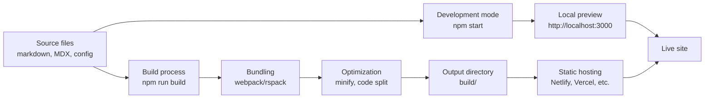

# Understanding build and deployment workflow

When you build a Docusaurus site, your content and configuration flow through a carefully orchestrated process that transforms source files into a fast, production-ready website. This guide explains what happens at each stage, from your local development environment to your live deployment.

## How the build workflow works

Docusaurus uses a two-phase approach to prepare your documentation for the web: a development phase for fast iteration and a production phase for optimization and deployment.

## Development mode: Fast iteration with hot reload

When you run`npm start`, Docusaurus starts a development server that watches your files and provides instant feedback as you write.

**What happens in development mode:**

- Your markdown and MDX files are compiled to HTML and JavaScript
- Source maps are generated, making it easy to debug issues in your browser
- The server watches for changes and automatically reloads your site in the browser (hot reload)
- No optimization or minification occurs—speed matters more than file size during development
- Assets are served directly from memory, not written to disk

This setup lets you see your changes immediately, usually within a second or two, so you can focus on content rather than waiting for builds.

### Bundling with webpack or rspack

Docusaurus uses a bundler abstraction layer that manages how your files are combined and prepared. The default bundler is webpack, a mature tool that has been industry-standard for years.

**What the bundler does:**

- Combines your JavaScript modules into optimized bundles
- Extracts CSS into separate files for parallel loading
- Loads and processes images, fonts, and other assets
- Applies Babel transformations to ensure compatibility
- Generates source maps for production debugging

You can also opt into faster builds using rspack, a modern Rust-based bundler that's compatible with webpack but significantly faster. This is especially helpful for large documentation sites.

### Image optimization with LQIP

Docusaurus includes a specialized image optimization system called Low Quality Image Placeholders (LQIP). This feature improves the perceived performance of pages with many images.

**How LQIP works:**

- When you include an image in your markdown, Docusaurus automatically generates a tiny, blurred preview version
- The preview loads instantly while the full-quality image downloads in the background
- Users see content appearing progressively, which feels faster than a blank space while waiting for large images
- The full image replaces the placeholder once it's ready

This happens automatically during the build—you don't need to configure anything special.

### Production optimization

Before your site reaches the server, Docusaurus applies several optimizations to minimize file sizes and improve load times.

**CSS minification:** Removes unnecessary whitespace, comments, and unused properties from your stylesheets, typically reducing size by 30–40%.

**JavaScript minification:** Strips comments, renames variables to single letters, and applies other transformations to reduce code size while maintaining functionality.

**Code splitting:** Breaks your JavaScript into smaller chunks that load only when needed. For example, the JavaScript for a blog archive page loads only when someone visits that page, not for every visitor.

**HTML minification:** Removes unnecessary characters from HTML files without changing how they display in browsers.

## Output directory structure

After the build completes, you'll find a`build/` directory containing your entire static website.

**What's inside the build directory:**

-`index.html`, the homepage
-`docs/`, documentation pages, one HTML file per page
-`blog/`, blog posts (if you use the blog feature)
-`_next/`, static assets including JavaScript bundles, CSS files, and images
-`sitemap.xml`, a map of all your pages for search engines
-`.nojekyll`, a marker file for GitHub Pages deployments (if applicable)

Every file in`build/` is self-contained and ready to serve. You don't need Node.js, a database, or any server-side code—just static file hosting.

## Deployment targets

The`build/` directory can be deployed to any static hosting service. Popular options include:

**Netlify:** Connect your Git repository and Netlify automatically rebuilds your site whenever you push changes. Netlify also handles HTTPS, global CDN distribution, and preview deploys for pull requests.

**Vercel:** Similar to Netlify, with tight Git integration and automatic deployments. Vercel offers edge functions if you need dynamic behavior.

**GitHub Pages:** Host your site directly from a GitHub repository with minimal configuration.

**Traditional web servers:** Copy the`build/` directory to any web server running Apache, Nginx, or similar. Static file serving is universally supported.

All of these options treat your site the same way: they serve the files from`build/` to visitors, so the build process is identical regardless of where you deploy.

## Performance metrics to understand

Several measurements help you understand how well your site is performing.

**Build time:** The duration of`npm run build`, from start to finish. Typical sites build in 10–60 seconds. Using rspack instead of webpack can cut this in half for large sites.

**Site size:** The total file size of your`build/` directory. Smaller is better, though modern compression (gzip or brotli) on your hosting provider means this is less critical than it used to be. A typical documentation site is 1–5 MB uncompressed.

**Page load performance:** How quickly a visitor sees content when they land on a page. This depends on network speed, hosting location, browser caching, and asset sizes. Docusaurus optimizes this through code splitting, image optimization, and minification.

You can measure these metrics by:

- Checking your build time in the terminal output after running`npm run build`
- Checking your site size with`du -sh build/` or a file explorer
- Using Google Lighthouse, WebPageTest, or your hosting provider's built-in tools to measure page load times

## Choosing a bundler: Webpack vs. rspack

The default webpack bundler is reliable and well-tested, suitable for nearly all sites.

**Choose rspack if:**

- Your documentation site is very large (thousands of pages)
- Build time is a bottleneck in your workflow
- You want to experiment with cutting-edge tools

**Stick with webpack if:**

- You're getting acceptable build times
- You prefer stability and broad compatibility
- You're using custom webpack plugins or loaders

Both produce the same output; the difference is speed.

## Faster builds with modern tools

Beyond bundler choice, several other features can accelerate your builds:

**SWC transpiler:** A faster JavaScript transformer written in Rust. It processes your code quicker than Babel while maintaining compatibility.

**Lightning CSS minifier:** A modern CSS minifier that's faster and sometimes produces smaller output than older tools.

**Fast build mode:** Skips certain optimizations during development to speed up iteration. You can enable this for faster feedback when you're writing content.

These tools are part of the experimental "faster" package and can be enabled in your site configuration.

## Common workflow scenarios

### Scenario 1: Writing documentation

1. Run`npm start` to start the development server
2. Edit your markdown file in your text editor
3. See the change in your browser within seconds (hot reload)
4. Repeat steps 2–3 until your content is ready
5. Commit and push to your repository

## Related topics

- Site building and bundling, detailed bundling configuration
- Build bundling and optimization, how the bundler transforms files
- Performance optimization, optional performance enhancements
- Logging & Diagnostics, understanding build messages and metrics
